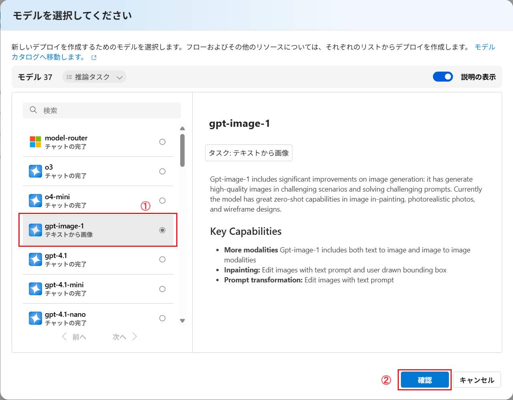
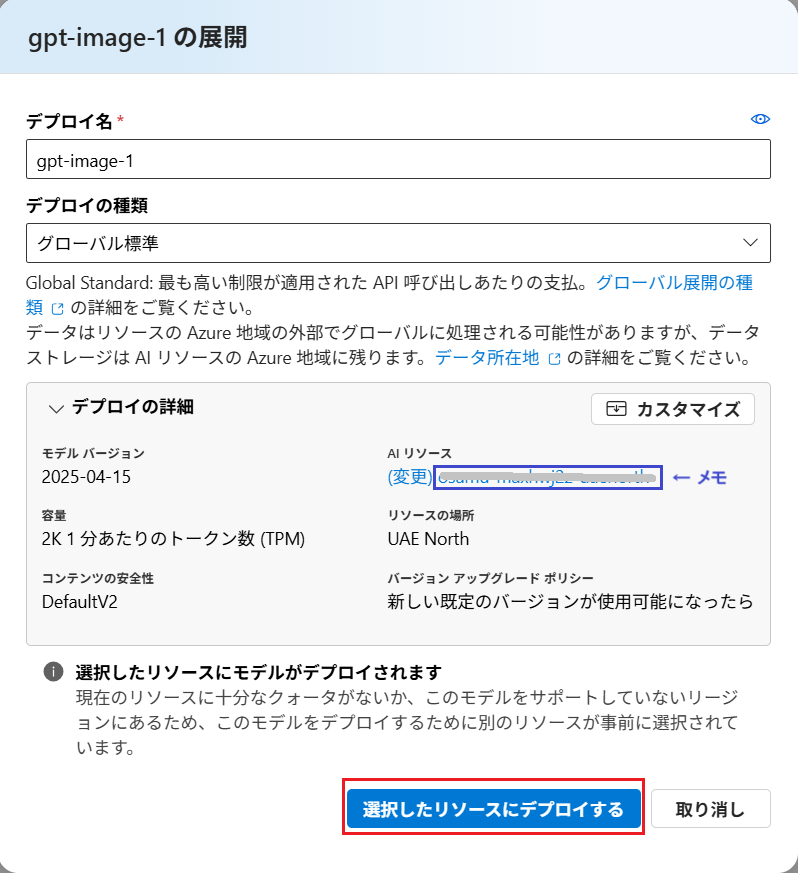
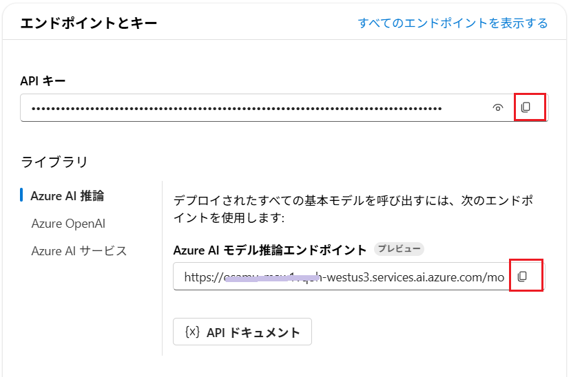
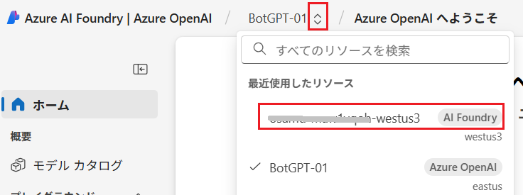
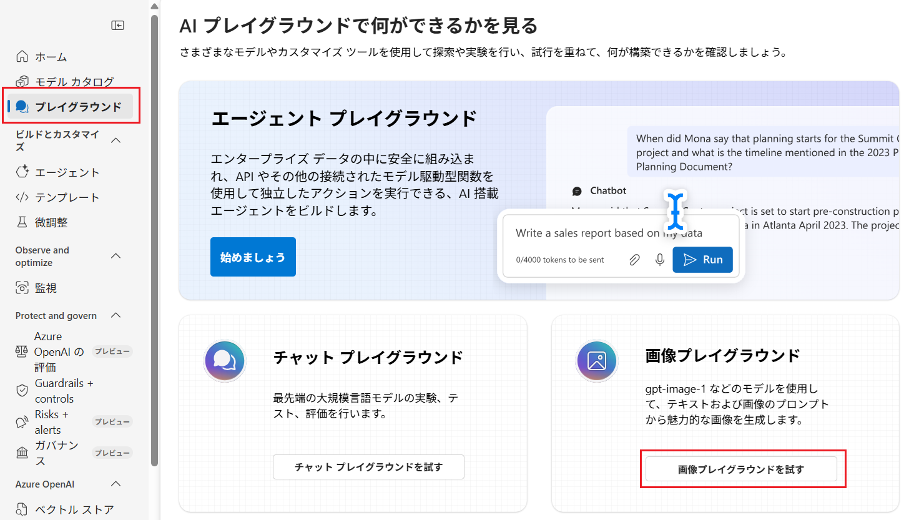
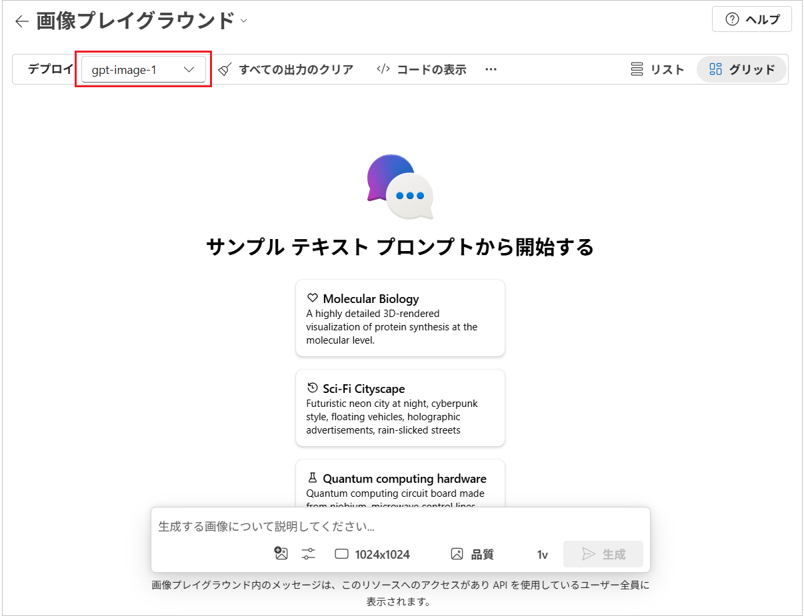
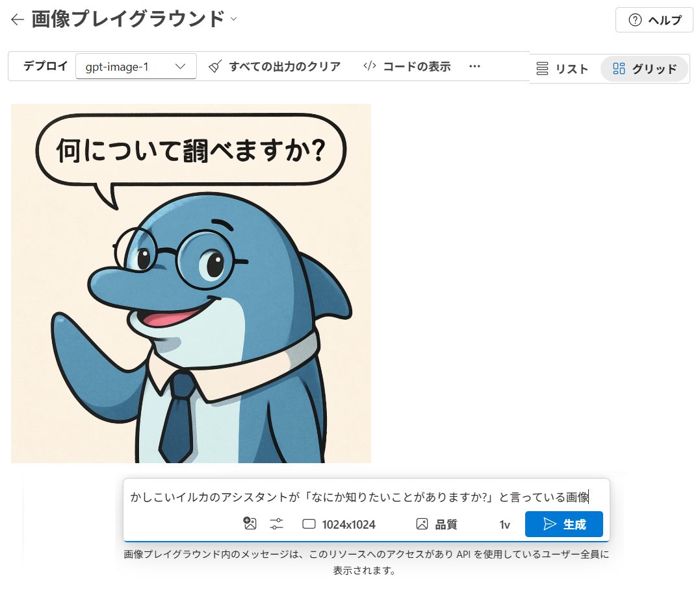
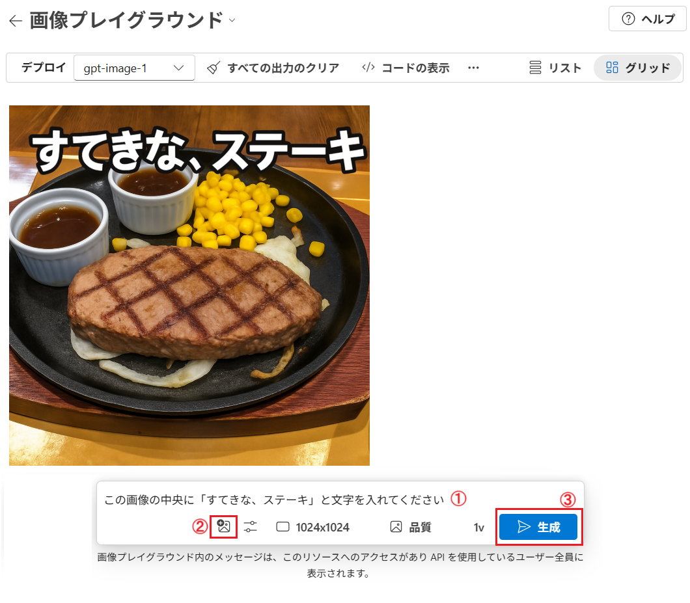

# 演習 1. 4 :  画像生成モデル gpt-image-1 のデプロイ

Microsoft Azure では [演習 1. 4 : 画像生成モデルのデプロイ](Ex01-4.md) でデプロイした DALL-E 3 モデルよりも新しい GPT-image-1 モデルがプレビュー利用可能になっています。

このモデルは  DALL-E に対して以下の点が[改善](https://azure.microsoft.com/en-us/blog/unveiling-gpt-image-1-rising-to-new-heights-with-image-generation-in-azure-ai-foundry/)されています。

* 正確な指示に応答する能力が向上
* テキストを確実にレンダリング
* テキストだけでなく画像を入力として指定して編集と描画が可能

使用するには以下のフォームより利用申請が必要です。(※2025 年 5 月時点)

* アクセスの要求: [**制限付きアクセス モデル アプリケーション**](https://aka.ms/oai/gptimage1access)

 

## 1. GPT-image-1 モデルのデプロイ 

Azure AI Foundry の画面で画像生成モデル GPT-image-1 デプロイし、API の利用に必要となる API キーとエンドポイントを取得します。

具体的な手順は以下のとおりです。

\[**手順**\]

1. [Azure AI Foundry](https://ai.azure.com/resource/deployments/) の画面左のメニューバーから \[**デプロイ**\] をクリックします

    

2. \[**モデル、アプリ、サービスのデプロイを管理する**\] 画面に遷移するので、同画面の \[モデル デプロイ\] タブ内の \[**+ モデルのデプロイ**\] ボタンをクリックし、表示されたドロップダウンメニューから \[**基本モデルをデプロイする**\] を選択します

    

3. \[**モデルを選択してください**\] ダイアログボックスが表示されるので、同ダイアログボックス画面左のモデルリストから \[**gpt-image-1**\] を選択し、\[**確認**\] ボタンをクリックします

    

4. \[**gpt-image-1 の展開**\] 画面に遷移するので、同ダイアログボックス内 **AI リソース** と書かれたラベルの下にあるリソース名をメモしておきます。これがこれからデプロイする GPT-image-1 モデルのデプロイ先のリソースになります。
   
   

    デプロイ先は、ダイアログ ボックス内の \[**カスタマイズ**\] ボタンをクリックして変更することができますが、現状、GPT-image-1 モデルが提供されているリージョンの関係もあり、ここまでの演習で使用している Azure OpenAI リソースを選択することはできません。よって今回デプロイしたモデルのエンドポイントのサブドメインは、これのでの演習でデプロイした他の AI モデルのものと異なる(※)ということを覚えておいてください。

    既定のまま、\[**選択したリソースにデプロイする**\] ボタンをクリックします。

    (※メモしたデプロイ先のリソース名.cognitiveservices.azure.com)

5. デプロイした GPT-image-1 モデルのプロパティ画面に遷移するので、画面内の API キーとエンドポイントを各テキスト ボックス右にあるコピーボタンを使用して保持します。

    

    なお再度、このページを開くには、Azure AI Foundry の画面左端の **Azure AI Foundry | Azure OpenAI** と書かれたラベルの横にあるドロップダウン ボックスからリソース名を選択します。

    

ここのでの手順で新規に gpt-image-1 モデルをデプロイし、API キーとエンドポイントを取得することができました。

 

## 2. Azure AI Foundry のプレイグラウンドでの検証

API の利用を検証する前に [Azure AI Foundry のプレイグラウンドを使用して、gpt-image-1 モデルがどのように動作するか](https://devblogs.microsoft.com/foundry/images-playground-may-2025/)を確認します。

具体的な手順は以下のとおりです。

\[**手順**\]

1. [Azure AI Foundry](https://ai.azure.com/foundryResource/overview) の画面左のメニューバーから \[**プレイグラウンド**\] をクリックします。

    プレイグラウンドのタイルが一覧表示されるので、\[画像プレイグラウンド\] タイル内の \[**画像プレイグラウンドを試す**\] ボタンをクリックします。

    

2. \[画像プレイグラウンド\] 画面に遷移するので、画面上部の \[デプロイ\] ドロップダウン ボックスでデプロイした gpt-image-1 のモデルが選択されていることを確認します。
   
    

3. \[生成する画像について説明してください\] と書かれたテキスト ボックスに、生成させる画像の説明と、その画像内に表示される何らかの文字を指定する任意のプロンプトを入力して \[**生成**\] ボタンをクリックします。

    

    生成された画像に指定した文字が含まれていることを確認します。

    これまでの DALL-E 3 モデルや他の画像生成 AI モデルでは、プロンプトから直接画像内に文字を含めることができませんでしたが、gpt-image-1 モデルでは、画像内に文字を含めることができるようになっています。

    また、gpt-image-1 モデルでは文字列のプロンプトだけでなく、画像を入力として指定して編集と描画が可能です。

4. 画像の編集と描画を試すために、プロンプト ボックスの画像のアイコン ボタンをクリックして任意の画像ファイルを選択し、任意のプロンプトを入力して \[**生成**\] ボタンをクリックします。

    

    画像が編集されていることを確認します。

ここまでの手順で、Azure AI Foundry に gpt-image-1 モデルがデプロイされ、画像プレイグランドでの動作確認が完了しました。

 

## 次へ

👉 [**演習 2 Azure OpenAI Studio からの AI モデルの利用**](Ex02-0.md) 

 

👈 [**演習 1. 3 : 埋め込みモデルのデプロイ**](Ex01-3.md) 

🏚️ [README に戻る](README.md)