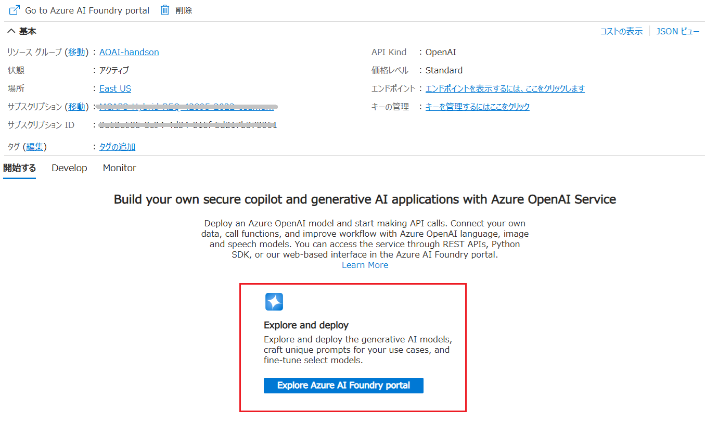

# 演習 1 ) Azure Open AI リソースの作成

Azure OpenAI Service では、OpenAI の強力な言語モデルを REST API として使用でき、開発者は、REST API、Python SDK、または Azure OpenAI Studio の Web ベースのインターフェイスを介してサービスにアクセスできます。

Azure Open AI Service については以下のドキュメントをご参照ください。

- [**Azure OpenAI Service とは**](https://learn.microsoft.com/ja-jp/azure/cognitive-services/openai/overview)

Azure OpenAI Service が提供する言語サービスは、以下のものがあります。

| サービス名          | 説明                                     |
|---------------------|------------------------------------------|
| **GPT-4 シリーズ**  | 高度な自然言語処理と生成能力を持つモデル。|
| **GPT-3.5 Turbo**   | ChatGPT で採用されているモデル。          |
| **Codex シリーズ**  | 自然言語からコードへの変換やコード生成が可能。|
| **DALL-E シリーズ** | 自然言語からオリジナル画像を生成。       |
| **Whisper**         | 音声ファイルの文字起こしや対話型音声対応。|
| **埋め込みシリーズ**| 機械学習モデルとアルゴリズムで利用できる特殊形式。|

この演習ではユーザーと会話を行うための言語モデルとして GPT-4 シリーズ ([gpt-4o-mini](https://learn.microsoft.com/ja-jp/azure/ai-services/openai/concepts/models#how-do-i-access-the-gpt-4o-and-gpt-4o-mini-models)) を使用し、ベクトル検索を行うためのインデクサーと検索文字のベクトル化を行うための埋め込みモデルとして [text-embedding-ada-002](https://learn.microsoft.com/ja-jp/azure/ai-services/openai/concepts/models#embeddings-models) を、画像生成用のモデルとして [dall-e-3](https://learn.microsoft.com/ja-jp/azure/ai-services/openai/concepts/models#dall-e) を使用します。
 

## 目次

この演習 1 で実施するタスクは以下のとおりです。

  1. [Azure ポータルから Open AI リソースを作成する](Ex01.md#%E3%82%BF%E3%82%B9%E3%82%AF-1--azure-%E3%83%9D%E3%83%BC%E3%82%BF%E3%83%AB%E3%81%8B%E3%82%89-open-ai-%E3%83%AA%E3%82%BD%E3%83%BC%E3%82%B9%E3%82%92%E4%BD%9C%E6%88%90)

2. [言語モデル gpt-4o-mini のデプロイ](Ex01.md#%E3%82%BF%E3%82%B9%E3%82%AF-2--azure-openai-studio-%E3%81%B8%E3%81%AE%E8%A8%80%E8%AA%9E%E3%83%A2%E3%83%87%E3%83%AB%E3%81%AE%E3%83%87%E3%83%97%E3%83%AD%E3%82%A4)

3. [埋め込みモデル : text-embedding-ada-002 のデプロイ](Ex01.md#%E3%82%BF%E3%82%B9%E3%82%AF-3--%E5%9F%8B%E3%82%81%E8%BE%BC%E3%81%BF%E3%83%A2%E3%83%87%E3%83%AB%E3%81%AE%E3%83%87%E3%83%97%E3%83%AD%E3%82%A4)

4. [画像生成モデル : dall-e-3 のデプロイ](x01.md#%E3%82%BF%E3%82%B9%E3%82%AF-4--%E7%94%BB%E5%83%8F%E7%94%9F%E6%88%90%E3%83%A2%E3%83%87%E3%83%AB%E3%81%AE%E3%83%87%E3%83%97%E3%83%AD%E3%82%A4)

 

## タスク 1 : Azure ポータルから Open AI リソースを作成

Azure の提供する Open AI サービスを利用するために Open AI リソースを作成します。

この手順では Azure ポータルを使用してリソースを作成しますが、Azure CLI や Azure PowerShell を使用して作成することも可能です。

具体的な手順は以下のとおりです。

\[**手順**\]

1. Azure ポータルにサインインします

    [https://portal.azure.com](https://portal.azure.com/#home)

2. ポータル画面上部の \[**+**\] リソースの作成 アイコンか、表示されていない場合は画面左上のハンバーガーメニューをクリックし、\[**リソースの作成**\] をクリックします。

    

3. 遷移した画面の検索ボックスに **OepnAI** と入力してキーボードの \[Enter\]キーを押下します

    検索結果の画面で、\[**Azure サービスのみ**\] チェックボックス にチェックを入れると **Azure OpenAI** のタイルが表示されるのでクリックします

    

4. Azure OpenAI のプランの選択画面に遷移するので、既定のまま \[**作成**\] ボタンをクリックします

5. Azure OpenAI の作成の \[**基本**\] 画面が表示されるので、各項目を以下のように入力します

    |  項目  |  値  |
    | ---- | ---- |
    |  **サブスクリプション \***  |  使用するサブスクリプションを選択  |
    |  **リソース グループ \***  |  既存のものを選択するか、「新規作成」リンクをクリックして作成  |
    |  **リージョン** | 任意のリージョン |
    |  **名前 \*** | 任意の名前 |
    |  **価格レベル \*** | **Standard S0** |

    

    もし、価格レベルが **Standard S0** が選択できない場合は、サブスクリプションの制限により、Azure OpenAI の利用が制限されています。その場合は、Azure サポートに問い合わせてください。

    

    入力が完了したら、\[**次へ**\] ボタンをクリックします

6. Azure OpenAI の作成の \[**ネットワーク**\] 画面に遷移するので、既定のまま \[**次へ**\] ボタンをクリックします

7. Azure OpenAI の作成の \[**タグ**\] 画面に遷移するので、既定のまま \[**次へ**\] ボタンをクリックします

8. Azure OpenAI の作成の \[**レビュー + 作成**\] 画面に遷移するので、入力内容を確認し、\[**作成**\] ボタンをクリックします

    ここまでの手順で、Azure OpenAI の作成が開始されます。

    Azure OpenAI の作成が完了すると、\[**デプロイが完了しました**\] というメッセージが表示されます。この画面で \[**リソースに移動**\] ボタンをクリックします

 

## タスク 2 : Azure OpenAI Studio への言語モデルのデプロイ

Azure OpenAI が提供する AI サービスを利用するには、Azure OpenAI Studio にモデルをデプロイする必要があります。

具体的な手順は以下のとおりです。

\[**手順**\]

1. 前の手順で作成した Azure OpenAI リソースの概要画面で、\[**Explore and deploy**\] ボックス内の \[**Go to Azure OpenAI Studio**\]ボタンをクリックします

    

2. Azure OpenAI Studio が開かれるので、画面左のメニューバーから \[**デプロイ**\] をクリックします

    

3. \[**モデル、アプリ、サービスのデプロイを管理する**\] 画面に遷移するので、同画面の \[モデル デプロイ\] タブ内の \[**+ モデルのデプロイ**\] ボタンをクリックし、表示されたドロップダウンメニューから \[**基本モデルをデプロイする**\] を選択します

    

4. \[**モデルを選択してください**\] ダイアログボックスが表示されるので、同ダイアログボックス画面左のモデルリストから \[**gpt-4-mini**\] を選択し、\[**確認**\] ボタンをクリックします

    

5. \[**モデル gpt-4o-mini をデプロイする**\] 画面に遷移するので、同画面の \[**1 分あたりのトークンレート制限 (数千)**\] のスライダーコントロールを使用して **対応する 1 分あたりの要求数 (RPM)** を **300** より大きい値に設定します

    なお、この値は後から変更することができるので、利用中に制限を超えた場合はさらに大きい値に変更します

    

    その他の項目は既定のまま、\[**デプロイ**\] ボタンをクリックします

6. デプロイはすぐに完了し、デプロイしたモデルの概要画面が表示されるので、\[詳細\] タブ内の \[**プレイグランドで開く**\] をクリックします

    

7. \[**チャット プレイグランド**\] の画面が表示されるので、「こんにちは」等のメッセージを入力し、キーボードの \[Enter\] キーを押下してモデルが応答することを確認します

    

ここまでの手順で、Azure OpenAI Studio に GPT-4 モデルがデプロイされ、チャットプレイグランドでの動作確認が完了しました。

<!--
チャット プレイグラウンドの使い方の詳細については以下のドキュメントご参照ください。

* [**Quickstart: Hear and speak with chat models in the AI Studio chat playground**](https://learn.microsoft.com/ja-jp/azure/ai-studio/quickstarts/hear-speak-playground)

\[**システム メッセージ**\] に設定する内容については以下のドキュメントをご参照ください。

* [**大規模言語モデル (LLM) のシステム・メッセージ・フレームワークおよびテンプレートの推奨事項**](https://learn.microsoft.com/ja-jp/azure/ai-services/openai/concepts/system-message)

\[**パラメーター**\] 画面の設定内容については、各ラベル右横にある \[**(!)**\] アイコンをクリックすると、そのパラメーターの説明が表示されるので確認してください。

AI 言語モデルから目的の回答を引き出すためのプロンプトを記述する方法については以下のドキュメントをご参照ください。

* [**プロンプトエンジニアリングの概要**](https://learn.microsoft.com/ja-jp/azure/ai-services/openai/concepts/prompt-engineering)

-->
 

## タスク 3 : 埋め込みモデルのデプロイ

独自のデータの追加とそれをベクトル検索する際に使用する埋め込みモデルをデプロイします。

具体的な手順は以下のとおりです。

\[**手順**\]

1. Azure OpenAI Studio の画面左のメニューバーから \[**デプロイ**\] をクリックします

    

2. \[**モデル、アプリ、サービスのデプロイを管理する**\] 画面に遷移するので、同画面の \[モデル デプロイ\] タブ内の \[**+ モデルのデプロイ**\] ボタンをクリックし、表示されたドロップダウンメニューから \[**基本モデルをデプロイする**\] を選択します

    

3. \[**モデルを選択してください**\] ダイアログボックスが表示されるので、同ダイアログボックス画面左のモデルリストから \[**text-embedding-ada-002**\] を選択し、\[**確認**\] ボタンをクリックします

    

5. \[**モデル text-embedding-ada-002 をデプロイする**\] 画面に遷移するので、既定のまま、\[**デプロイ**\] ボタンをクリックします

    

    デプロイはすぐに完了し、デプロイしたモデルの概要画面が表示されます。

ここまでの手順で、Azure OpenAI Studio に埋め込みモデルがデプロイされました。

この埋め込みモデルは、タスク 5 の **独自データの追加** の演習で使用します。

 

## タスク 4 : 画像生成モデルのデプロイ

ユーザーからのブロンプトに基づいて、画像を生成するためのモデルをデプロイします。

この演習では [DALL-E 3](https://learn.microsoft.com/ja-jp/azure/ai-services/openai/concepts/models#dall-e) モデルを使用します。

具体的な手順は以下のとおりです。

\[**手順**\]

1. Azure OpenAI Studio の画面左のメニューバーから \[**デプロイ**\] をクリックします

    

2. \[**モデル、アプリ、サービスのデプロイを管理する**\] 画面に遷移するので、同画面の \[モデル デプロイ\] タブ内の \[**+ モデルのデプロイ**\] ボタンをクリックし、表示されたドロップダウンメニューから \[**基本モデルをデプロイする**\] を選択します

    

3. \[**モデルを選択してください**\] ダイアログボックスが表示されるので、同ダイアログボックス画面左のモデルリストから \[**dall-e-3**\] を選択し、\[**確認**\] ボタンをクリックします

    

5. \[**モデル dall-e-3 をデプロイする**\] 画面に遷移するので、既定のまま、\[**デプロイ**\] ボタンをクリックします

    

    デプロイはすぐに完了し、デプロイしたモデルの概要画面が表示されます。

6. デプロイはすぐに完了し、デプロイしたモデルの概要画面が表示されるので、\[詳細\] タブ内の \[**プレイグランドで開く**\] をクリックします

    

7. \[**画像 プレイグランド**\] の画面が表示されるので、任意のメッセージを入力して、モデルが画像を生成することを確認します

    

ここまでの手順で、Azure OpenAI Studio に Dall-e  モデルがデプロイされ、画像プレイグランドでの動作確認が完了しました。

 

👉 [**演習 2) **Azure OpenAI Studio からの利用****](Ex02.md)

🏚️ [README に戻る](README.md)