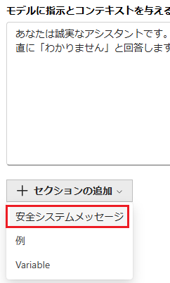
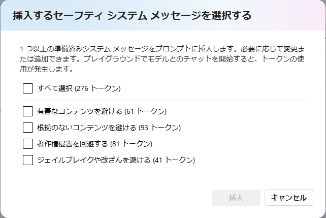
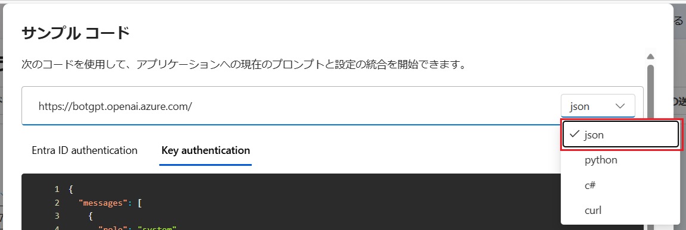
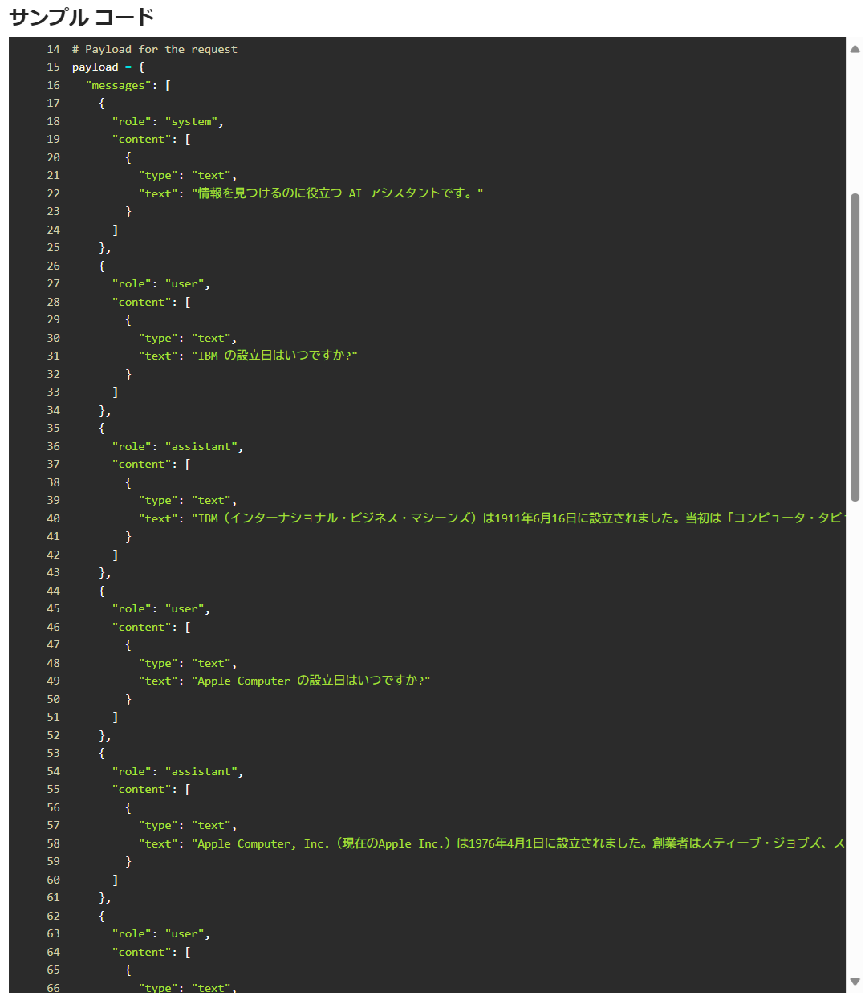
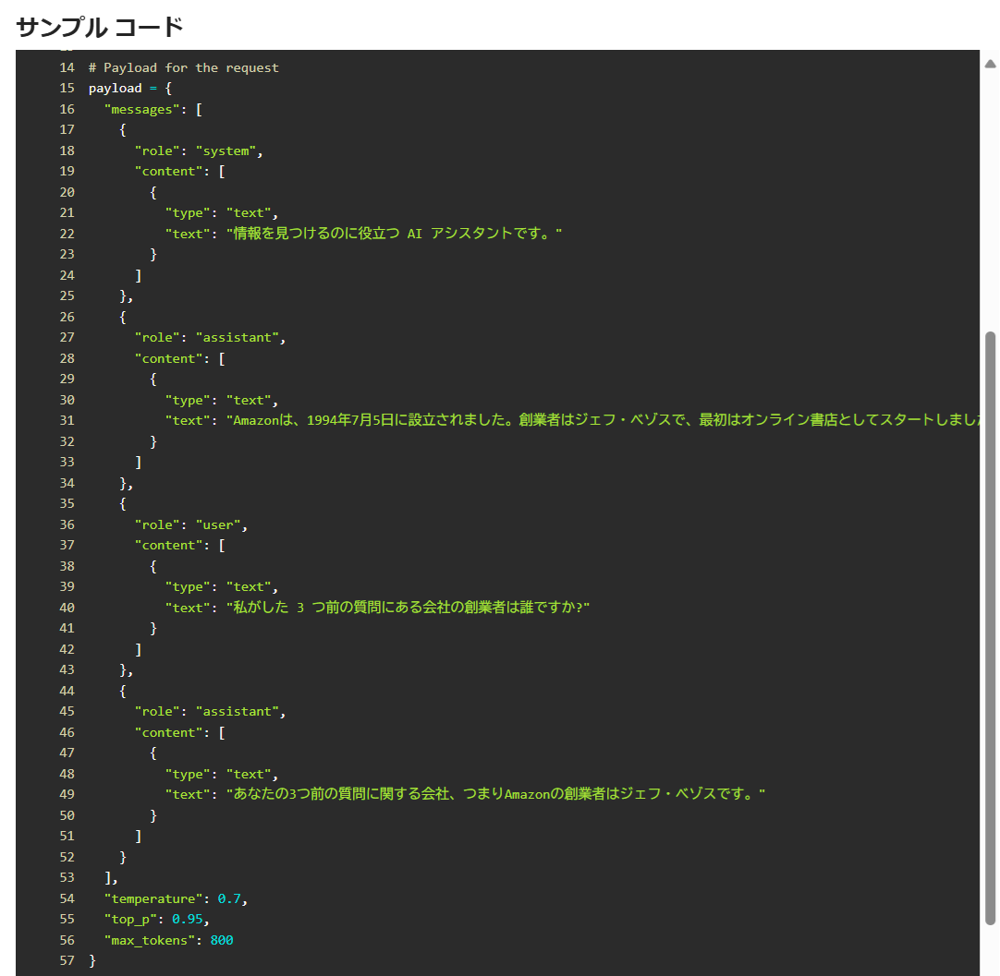

# 演習 2. 1 : システムメッセージとパラメーター設定

チャット プレイグラウンドの \[セットアップ\] パネルには GTP モデルが生成処理を行う際のパラメーターに紐づいた設定があります。このパラメーター設定を変更することで、生成されるテキストの内容を制御することができます。


## システム メッセージ

システム メッセージは LLM（大規模言語モデル）の動作をガイドするためのメタプロンプトとも呼ばれ、AI に対してどのような応答を求めるかを指定します。これにより、モデルが特定のタスクを効果的に実行し、望ましい出力を生成するように導くことができます。

システムメッセージには以下のような要素が含まれることがあります：

1. **役割の定義**：モデルがどのような役割を果たすべきかを指定
    
    例：「カスタマーサポートエージェントとして行動する」

2. **タスクの説明**：モデルがどのようなタスクを実行するかを明確に

    例：「ユーザーの質問に答える」

3. **出力形式の指定**：モデルが生成する出力の形式やスタイルを指定

    例：「重要な部分を太字にする」

4. **安全ガイドライン**：モデルが生成してはいけない内容や、避けるべき行動を明示する

    例：「有害なコンテンツを生成しない」

これにより、モデルの応答が一貫性を持ち、ユーザーにとって有用で安全なものとなります。システムメッセージは、特定のシナリオやアプリケーションに応じてカスタマイズされることが多いです。


<br>

## タスク 1 : システムメッセージの動作の確認

システム メッセージを指定することで言語モデルのふるまいがどのように変化するかを確認します。具体的な手順は以下のとおりです。

\[手順\]

1. Azure OpenAI Studio にサインインし、ここまでの手順でデプロイした言語モデルのチャット プレイグラウンド画面を開きます

2. 言語モデルとのチャット画面で以下のメッセージを入力し、送信します

    ```
    やまたのおろち製作所について教えてください
    ```
    なお、「やまたのおろち製作所」は架空の企業名で、この地球上に存在しない企業です。

    以下のように、応答として生成された正しくない情報が混じることを確認します。

    

    >このように言語モデルが事実に基づかない情報や誤った情報を生成する現象をハルシネーション(Hallucination)と言います

3. \[**システム メッセージ**\] タブの \[**システム メッセージ**\] のテキストボックスに以下の文言を入力し、\[**変更の適用**\] ボタンをクリックします

    ```
    あなたは誠実なアシスタントです。知らないことについては正直に「わかりません」と回答します。
    ```

    

    \[**システムメッセージを更新しますか?**\] と表示されるので、\[**続行**\] ボタンをクリックします

4. 再度、同じ質問を入力し、送信します

    ```
    やまたのおろち製作所について教えてください
    ```

5. 今度は回答に生成された情報が混じらないことを確認します

    

システムメッセージによって言語モデルのふるまいが変化することが確認できました。

また、\[**セクションに追加 ボタン**] - \[**安全システムメッセージ**\] をクリックすると、



言語モデルの応答の安全性を担保するためのシステムメッセージのテンプレートが提供されるので、内容を確認しておくことをお勧めします。



システムメッセージのより詳しい説明については以下のドキュメントご参照ください。

* [大規模言語モデル (LLM) のシステム メッセージのフレームワークとテンプレートに関する推奨事項](https://learn.microsoft.com/ja-jp/azure/ai-services/openai/concepts/system-message?tabs=top-techniques)
* [プロンプト エンジニアリングの技術 - システム メッセージ](https://learn.microsoft.com/ja-jp/azure/ai-services/openai/concepts/advanced-prompt-engineering?pivots=programming-language-chat-completions#system-message)

<br>    

## パラメーター

LLM（大規模言語モデル）におけるパラメーターはモデルの出力を制御するための設定です。

Azure OpenAI Studio のチャット プレイグランド画面では、以下のパラメーターを設定できます：

| パラメーター名         | 説明                                                                 |
|---|---|
| 過去のメッセージを含む | 新しい API 要求ごとに含める過去のメッセージの数を選択します。この数値を 10 に設定すると、5 つのユーザー クエリと 5 つのシステム応答が含まれます。                |
| 最大応答数 (max_tokens)| モデルが生成する応答の最大トークン(※)数を設定します。サポートされているトークンの数は、プロンプトとモデルの応答の間で共有されます。      |
| 温度 (temperature)| ランダム性を制御します。温度を下げることは、モデルがより反復的および決定論的な応答を生成することを意味します。温度を上げると、予期しない応答や創造的な応答が増えます。温度または上位 P の両方ではなくどちらかを調整してみてください。 |
| 上位 P (top_p)| 温度と同様にランダム性を制御しますが、別の方法を使用します。上位 P を下げると、モデルのトークンの選択がより可能性が高いトークンに絞り込まれます。上位 P を上げると、確率が高いトークンと低いトークンの両方からモデルが選択できるようになります。温度または上位 P の両方ではなくどちらかを調整してみてください。 |
| シーケンスの停止 (stop)| モデルが応答を生成する際に、特定のトークンやシーケンスで出力を停止するように設定します。      |
| 頻度のペナルティ (frequency_penalty)| モデルが同じトークンを繰り返し使用する頻度を減少させるためのペナルティを設定します。          |
| プレゼンスのペナルティ (presence_penalty)| モデルが新しいトピックやトークンを導入する頻度を増加させるためのペナルティを設定します。      |

> ※ **トークン :** LLM（大規模言語モデル）における「トークン」は、テキストデータを処理するための基本単位です。トークンは単語、部分的な単語、または文字のような小さな単位に分割されます。例えば、「cat」という単語は1つのトークンですが、「unbelievable」は「un」「believ」「able」のように複数のトークンに分割されることがあります。トークン化のプロセスは、モデルがテキストを理解し、生成する際に重要です。トークンの数は、モデルが処理するテキストの長さや複雑さに影響を与えます。トークンの数が多いほど、モデルの計算負荷が増加します。また、サービスの利用料金も増加します。なお、このトークンの計算方法は言語やモデルによって異なり、実際の数は OpenAI 社が提供しているツール [**Tokenizer**](https://platform.openai.com/tokenizer) で確認できます。


<br>

## タスク 2 : パラメーターの動作の確認

パラメーターの \[**過去のメッセージを含む**\] の値を変更し、言語モデルのふるまいがどのように変化するかを確認します。

具体的な手順は以下のとおりです。

\[**手順**\]

1. [Azure OpenAI Studio](https://oai.azure.com/resource/playground) にサインインし、ここまでの手順でデプロイした言語モデルのチャット プレイグラウンド画面を開きます

2. 言語モデルとのチャット画面で以下のメッセージをそれぞれ順に入力し、各回答が各質問に対するものであることを確認します

    ```plaintext
    Microsoft の設立日はいつですか?
    ```

    ```plaintext
    IBM の設立日はいつですか?
    ```

    ```plaintext
    Apple Computer の設立日はいつですか?
    ```

    ```plaintext
    Google の設立日はいつですか?
    ```

3. 以下のメッセージを送信し、言語モデルから回答された内容が、これまでに返された回答と矛盾がないことを確認します

    ```plaintext
    私がした 3 つ前の質問にある会社の創業者は誰ですか?
    ```
    ```plaintext
    これまで私はいくつの質問をしましたか?
    ```

4. 画面上部のメニューバーから \[\</\> コードの表示\] をクリックします

     

5. \[**サンプル コード**\] ダイアログボックスが表示されるので、画面右下のドロップダウンボックスから \[**json**\] をクリックします

    

6. 表示された JSON の **messages** 配列にこれまでの会話の内容がすべて保持されていることを確認します

    

    確認が終わったら、\[**閉じる**\] ボタンをクリックしてダイアログボックスを閉じます

7. \[**パラメーター**\] タブの \[**過去のメッセージを含む**\] の内容を \[**3**\] に変更し、チャット画面の \[**チャットをクリアする**\] ボタンをクリックします

    

    「**チャットをクリアしますか?**」とメッセージボックスが表示されるので、\[**クリア**\] ボタンをクリックします

8. 再度、この手順 2 の質問を順に入力し、各回答が各質問に対するものであることを確認します

9. 以下のメッセージを送信し、言語モデルから回答された内容が、**これまでに返された回答の内容とあっていない**ことを確認します

    ```plaintext
    私がした 3 つ前の質問にある会社の創業者は誰ですか?
    ```

    ```plaintext
    これまで私はいくつの質問をしましたか?
    ```

10. 画面上部のメニューバーから \[\</\> コードの表示\] をクリックします

     

11. \[**サンプル コード**\] ダイアログボックスが表示されるので、画面右下のドロップダウンボックスから \[**json**\] をクリックします

    

12. 表示された JSON の **messages** 配列には、システムメッセージを含まない過去の会話の内容が 3 件しか保存されていないことを確認します

    


これは GPT モデルが会話において \[**過去のメッセージを含む**\] に設定された数だけ過去の会話を保持し、過去の会話の内容も含んで推論を行い回答を生成していることを示しています。

またこれは会話の**状態(状態)をクライアント側で保持している**ということであるため、GPT モデルのサービスの前にロードバランサーなどを配置して負荷分散を行う場合でもサーバーサイドでの状態管理は仕組み的には不要であることを示しています。


その他、パラメーターの詳細については以下のドキュメントをご参照ください。


* [**Azure OpenAI Service の REST API リファレンス**](https://learn.microsoft.com/ja-jp/azure/ai-services/openai/reference)

<br>

## 次へ

👉 [**演習 2. 2 : プロンプト エンジニアリング**](Ex02-2.md)

<br>

<hr>

👈 [**演習 2 : Azure OpenAI Studio からの AI モデルの利用**](Ex02-0.md)

🏚️ [README に戻る](README.md)