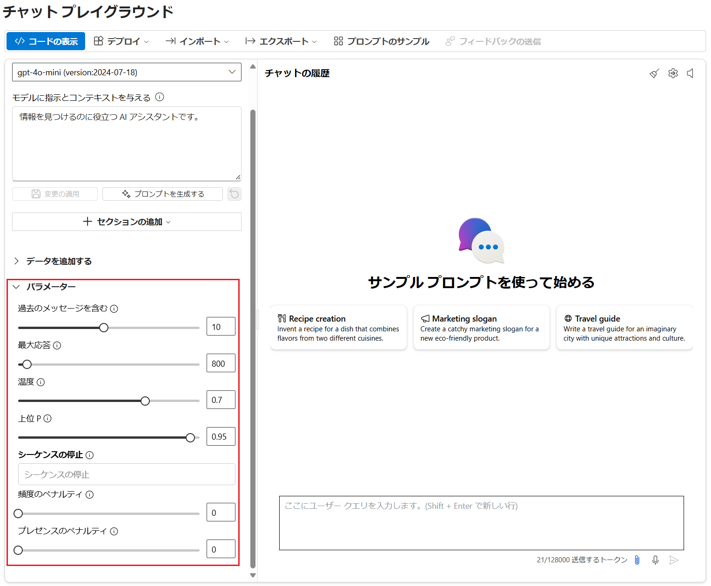
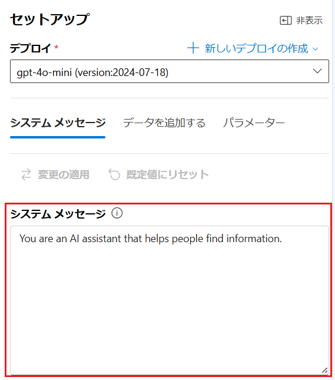
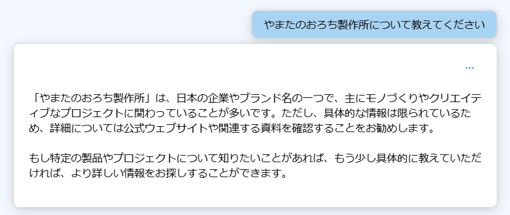
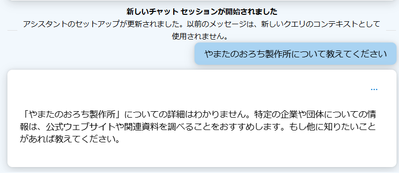
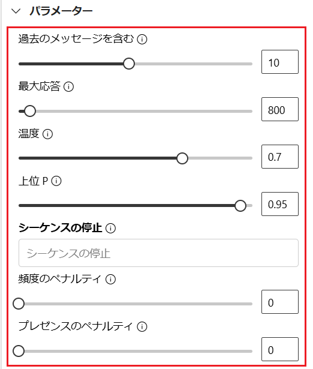
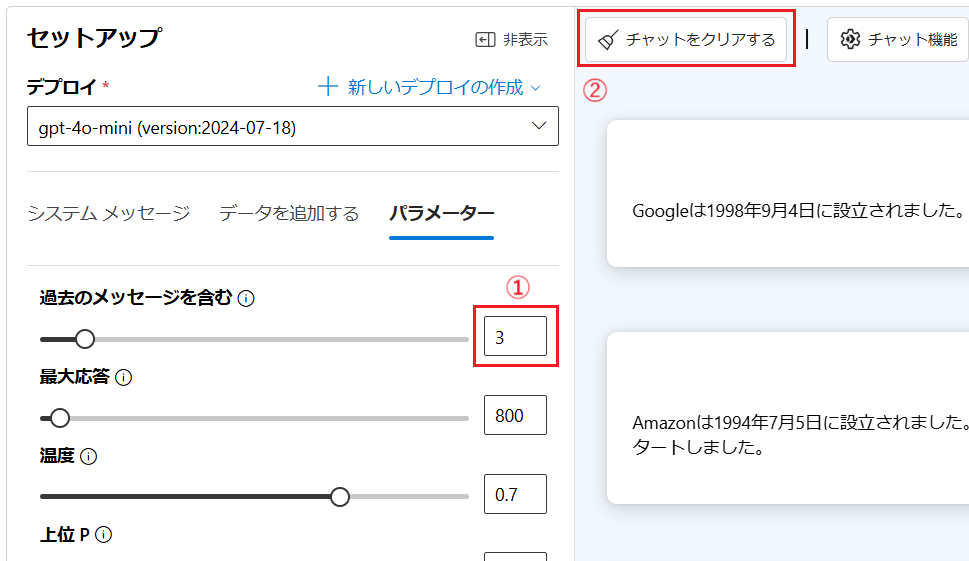

# 演習 2) Azure OpenAI Studio からの AI モデルの利用 (1/2)

この演習では前の演習でデプロイした Azure OpenAI サービスの言語モデル、画像生成モデルについて Azure OpenAI Studio のプレイグランド画面からの利用方法を体験します。埋め込みモデルについては、タスク 3 の[独自データの追加]()で使用します。

## 目次

この演習 2 で実施するタスクは以下のとおりです。

1. [チャット プレイグラウンドのパラメーター設定]()
2. [ブロンプト エンジニアリング ]()
3. [独自データの追加]()
4. [Azure OpenAI Studio で作成したチャットボットを Azure App Service にデプロイ]()\(オプション\)

## タスク 1 : システムメッセージとパラメーター設定

チャット プレイグラウンドの \[セットアップ\] パネルには GTP モデルが生成処理を行う際のパラメーターに紐づいた設定があります。このパラメーター設定を変更することで、生成されるテキストの内容を制御することができます。




### システム メッセージ

システム メッセージは LLM（大規模言語モデル）の動作をガイドするためのメタプロンプトとも呼ばれ、AI に対してどのような応答を求めるかを指定します。これにより、モデルが特定のタスクを効果的に実行し、望ましい出力を生成するように導くことができます。

システムメッセージには以下のような要素が含まれることがあります：

1. **役割の定義**：モデルがどのような役割を果たすべきかを指定
    
    例：「カスタマーサポートエージェントとして行動する」

2. **タスクの説明**：モデルがどのようなタスクを実行するかを明確に

    例：「ユーザーの質問に答える」

3. **出力形式の指定**：モデルが生成する出力の形式やスタイルを指定

    例：「重要な部分を太字にする」

4. **安全ガイドライン**：モデルが生成してはいけない内容や、避けるべき行動を明示する

    例：「有害なコンテンツを生成しない」

これにより、モデルの応答が一貫性を持ち、ユーザーにとって有用で安全なものとなります。システムメッセージは、特定のシナリオやアプリケーションに応じてカスタマイズされることが多いです。




#### システムメッセージの動作の確認

システム メッセージを指定することで言語モデルのふるまいがどのように変化するかを確認します。具体的な手順は以下のとおりです。

\[手順\]

1. Azure OpenAI Studio にサインインし、ここまでの手順でデプロイした言語モデルのチャット プレイグラウンド画面を開きます

2. 言語モデルとのチャット画面で以下のメッセージを入力し、送信します

    ```
    やまたのおろち製作所について教えてください
    ```
    なお、「やまたのおろち製作所」は架空の企業名で、この地球上に存在しない企業です。

    以下のように、応答として生成された正しくない情報が混じることを確認します。

    

    >このように言語モデルが事実に基づかない情報や誤った情報を生成する現象をハルシネーション(Hallucination)と言います

3. \[**システム メッセージ**\] タブの \[**システム メッセージ**\] のテキストボックスに以下の文言を入力し、\[**変更の適用**\] ボタンをクリックします

    ```
    あなたは誠実なアシスタントです。知らないことについては正直に「わかりません」と回答します。
    ```

    \[**システムメッセージを更新しますか?**\] と表示されるので、\[**続行**\] ボタンをクリックします

4. 再度、同じ質問を入力し、送信します

    ```
    やまたのおろち製作所について教えてください
    ```

5. 今度は回答に生成された情報が混じらないことを確認します

    

システムメッセージによって言語モデルのふるまいが変化することが確認できました。

システムメッセージのより詳しい説明については以下のドキュメントご参照ください。

* [プロンプト エンジニアリングの技術 - システム メッセージ](https://learn.microsoft.com/ja-jp/azure/ai-services/openai/concepts/advanced-prompt-engineering?pivots=programming-language-chat-completions#system-message)

<br>    

### パラメーター

LLM（大規模言語モデル）におけるパラメーターはモデルの出力を制御するための設定です。

Azure OpenAI Studio のチャット プレイグランド画面では、以下のパラメーターを設定できます：

| パラメーター名         | 説明                                                                 |
|---|---|
| 過去のメッセージを含む | 新しい API 要求ごとに含める過去のメッセージの数を選択します。この数値を 10 に設定すると、5 つのユーザー クエリと 5 つのシステム応答が含まれます。                |
| 最大応答数 (max_tokens)| モデルが生成する応答の最大トークン(※)数を設定します。サポートされているトークンの数は、プロンプトとモデルの応答の間で共有されます。      |
| 温度 (temperature)| ランダム性を制御します。温度を下げることは、モデルがより反復的および決定論的な応答を生成することを意味します。温度を上げると、予期しない応答や創造的な応答が増えます。温度または上位 P の両方ではなくどちらかを調整してみてください。 |
| 上位 P (top_p)| 温度と同様にランダム性を制御しますが、別の方法を使用します。上位 P を下げると、モデルのトークンの選択がより可能性が高いトークンに絞り込まれます。上位 P を上げると、確率が高いトークンと低いトークンの両方からモデルが選択できるようになります。温度または上位 P の両方ではなくどちらかを調整してみてください。 |
| シーケンスの停止 (stop)| モデルが応答を生成する際に、特定のトークンやシーケンスで出力を停止するように設定します。      |
| 頻度のペナルティ (frequency_penalty)| モデルが同じトークンを繰り返し使用する頻度を減少させるためのペナルティを設定します。          |
| プレゼンスのペナルティ (presence_penalty)| モデルが新しいトピックやトークンを導入する頻度を増加させるためのペナルティを設定します。      |



> ※ **トークン :** LLM（大規模言語モデル）における「トークン」は、テキストデータを処理するための基本単位です。トークンは単語、部分的な単語、または文字のような小さな単位に分割されます。例えば、「cat」という単語は1つのトークンですが、「unbelievable」は「un」「believ」「able」のように複数のトークンに分割されることがあります。トークン化のプロセスは、モデルがテキストを理解し、生成する際に重要です。トークンの数は、モデルが処理するテキストの長さや複雑さに影響を与えます。トークンの数が多いほど、モデルの計算負荷が増加します。なお、このトークンの計算方法は言語やモデルによって異なり、実際の数は OpenAI 社が提供しているツール [**Tokenizer**](https://platform.openai.com/tokenizer) で確認できます。

## パラメーターの動作の確認

パラメーターの \[**過去のメッセージを含む**\] の値を変更し、言語モデルのふるまいがどのように変化するかを確認します。

具体的な手順は以下のとおりです。

\[手順\]

1. Azure OpenAI Studio にサインインし、ここまでの手順でデプロイした言語モデルのチャット プレイグラウンド画面を開きます

2. 言語モデルとのチャット画面で以下のメッセージをそれぞれ順に入力し、各回答が各質問に対するものであることを確認します

    ```plaintext
    Microsoft の設立日はいつですか?
    ```

    ```plaintext
    IBM の設立日はいつですか?
    ```

    ```plaintext
    Apple Computer の設立日はいつですか?
    ```

    ```plaintext
    Google の設立日はいつですか?
    ```

    ```plaintext
    Amazon の設立日はいつですか?
    ```

3. 以下のメッセージを送信し、言語モデルから回答された内容が、これまでに返された回答と矛盾がないことを確認します

    ```plaintext
    私がした 3 つ前の質問にある会社の創業者は誰ですか?
    ```

4. \[**パラメーター**\] タブの \[**過去のメッセージを含む**\] の内容を \[**3**\] に変更し、チャット画面の \[**チャットをクリアする**\] ボタンをクリックします

    

    「**チャットをクリアしますか?**」とメッセージボックスが表示されるので、\[**クリア**\] ボタンをクリックします

5. 再度、この手順 2 の質問を順に入力し、各回答が各質問に対するものであることを確認します

6. 以下のメッセージを送信し、言語モデルから回答された内容が、**これまでに返された回答の内容とあっていない**ことを確認します

    ```plaintext
    私がした 3 つ前の質問にある会社の創業者は誰ですか?
    ```

これは ChatGPT が会話において \[**過去のメッセージを含む**\] に設定された数だけ過去の会話を保持し、過去の質問に基づいて回答を生成することができることを示しています。

なお、この仕組みとメッセージの構造については、演習 3 のタスク 1 で詳しく説明します。

その他、パラメーターの詳細については以下のドキュメントをご参照ください。

* [**Azure OpenAI Service REST API reference**](https://learn.microsoft.com/ja-jp/azure/ai-services/openai/reference#request-body)

<br>

## タスク 2 : プロンプト エンジニアリング

言語モデルを使用するには、ユーザーはモデルに対し、人間と会話するように自然言語で命令を行います。この命令を含んだメッセージをプロンプトと言います。

自然言語で対話可能な AI モデルはこれまでにもありましたが、LLM が従来のものと異なる点として、命令された自然言語を認識するのに個別のトレーニングを必要とせず、即時に理解し、適切な応答を生成することができる点が挙げられます。

たとえば、以下のプロンプトでは文章の中から指示された"場所"と"時間"と"天気"といったエンティティを抜き出すことができます。

```plaintext
以下の文章の中から"場所"と"時間"と"天気"の情報を抜き出してください : 
明日は AM 7:00 から高尾山に登山に向かいます。天気予報は晴れですが、念のために雨具の準備をお願いします。
```

従来の言語理解モデルで同様のことを行うには、事前に発話のサンプルを複数用意し、目的のエンティティに対しラベルを付けてトレーニングを行うといった処理が必要でした。

また単にテキストの応答の生成だけでなく、プロントによってモデルに対して特定のタスクを実行させることも可能です。

たとえば、以下のプロンプトでは、会話の応答はもちろん、ランダムな数字の生成、会話のカウント、素数の判断を行っています。

```plaintext
私たちは交互にランダムな数字を答えていきます
お互いの回答数が 5 回を超えたら会話を終了し、あなたはお互いの会話の中で出てきた素数を列挙してください
```
(※)このプロントを演習の環境で試すには **過去のメッセージを含む** のパラメーターを 10 より大きく設定してください

つまり、プログラムを構成する処理の要素である入力、出力、演算、繰り返し、条件分岐などを自然言語で記述し、モデルに対して実行させることができます。

また、以下のような機能も提供します

* **要約**

    *例*
    ```plaintext
    以下の文章を要約してください :
    (ここに要約したい文章を入力)
    ```
* **抽出**

    *例*
    ```plaintext
    以下の文章から○○についての情報を抜き出してください :
    (ここに抜き出したい情報をもつ文章を入力)
    ```
* **翻訳**

    *例*
    ```plaintext
    以下の文章を英語に翻訳してください :
    (ここに翻訳したい文章を入力)
    ```
* **フォーマット変換**

    *例*
    ```plaintext
    以下のマークダウンの表を HTML の table タグにしてください :
    | 項目 | 値 |
    | --- |--- |
    | **Subscription** | TrainingSub |
    | **Resource group** | AOAI Bot |
    | **Region** | japan east |
    ```
* **コード生成**

    *例*
    ```plaintext
    以下の説明をもとに JavaScript の関数を生成してください :
    引数 url を受け取り HTTP Request を送信し、response された内容を返す callAPI という名前の関数
    ```

    つづけて以下のようにプロンプトを使用すると他の開発言語に変換することもできます。

    *例*
    ```plaintext
    回答にある関数を Python で記述してください
    ```

    また以下のようにテキストで表せる様々なものを生成することもできます。

    *例*
    ```plaintext
    以下の絵文字を svg のタグで表現してください :
    😃
    ```
* **画像認識**

    GPT-4 Turbo with Vision のようなマルチモーダルモデルを使用する場合は OCR によるテキストの抽出や画像の認識なども行うことができます。

    *プロンプト例*
    ```plaintext
    添付した画像の設定画面をもとに貼り付け可能なマークダウンの表のタグを生成してください
    (Azure の設定画面などの画面を貼り付ける)
    ```

上記のようにプロンプトを効果的に使用することで、生成するテキストの品質を上げるだけでなく、より複雑なタスクをモデルに実行、生成などを行うことができます。

プロンプト エンジニアリングは、モデルが生成するテキストの品質を向上させるための手法で、モデルに対して適切なプロンプトを提供することで、モデルが特定のタスクを効果的に実行し、望ましい出力を生成するように導くことができます。

<br>

### プロンプトの構造

言語モデルに対するプロンプトを構成す要素はさまざまなドキュメントで説明されており、それぞれ微妙な差異がありますが、多くに共通して挙げられているものには以下です：

* **指示**: モデルに対する具体的なタスクや指示

* **コンテキスト**: モデルがより良い応答を生成できるように、外部情報や追加の文脈を提供

* **入力データ**: 質問や解決したい問題を含むデータ

* **出力形式の指定**: 期待する出力の形式やスタイルを明示

* **具体例**: モデルに期待する出力の例を提供し、理解を補助

### 効果的なプロンプトを作成するためのヒント

<br>

言語モデルからより正確で適切な応答を得るための一般的なヒントとしては以下のものがあります：

* **明確な指示**: モデルに対して明確な指示を提供し、タスクの目的を明確にする
* **指示の書式**:  最新性バイアスがモデルに影響する可能性があり、プロンプトの末尾近くにある情報の方が、先頭にある情報よりも出力に与える影響が大きい可能性があるのでそれを考慮する
* **セクション マーカーを使う**: プロンプトの先頭に指示を配置し、### または """ 、--- を使用して指示とコンテキストを区切る
* **例を提供して目的の出力形式を明確にする**: モデルに期待する出力の例を提供し、理解を補助する 

* **抽象的で不正確な説明を減らす**: モデルに対して可能な限り正確で具体的な情報を提供し、不正確な情報を生成する可能性を減らす

プロンプトの構造やヒントについては以下のドキュメントをご参照ください。

<br>

### プロンプト エンジニアリングの代表的な手法

プロンプト エンジニアリングの手法についてはさまざまなものが提唱されています。

その中でもこれまでの機械学習のコミュニティの論文等から提唱された代表的な手法について、実際に言語モデルとの対話を通じて動作を確認します。

具体的な手順は以下のとおりです。

\[手順\]

1. Azure OpenAI Studio にサインインし、ここまでの手順でデプロイした言語モデルのチャット プレイグラウンド画面を開きます

2. 言語モデルとのチャット画面で各ステップのプロンプトを順に入力し、プロンプトと回答内容を確認します

3. [**Zero-shot prompting**](https://cdn.openai.com/better-language-models/language_models_are_unsupervised_multitask_learners.pdf) : この手法はモデルに対して特定のタスクを実行するための具体的な例を提供せずに、直接指示を与える手法です。これにより、モデルがそのタスクを初めて実行する際にどのように対応するかを評価できます。

    プロンプトの例は以下の通りです：

    ```plaintext
    以下の文章を日本語に翻訳してください : 
    "Hello, how are you?"
    ```

    ```plaintext
    以下の文章が感情的に Positive なものか Negative なものか判定してください :
    昨日は雨が降っていてがっかりしました
    ```
    この手法は言語モデルがあらかじめ持っている学習内容を元に自由な回答を生成させる手法であるため学習していない内容に対しては正確な回答が得られないことがあります。

3. [**Few-shot Learning**](https://arxiv.org/abs/2005.14165) : この手法はモデルに対して少数の具体例を提供することで、特定のタスクを実行する能力を向上させる手法です。プロンプトにいくつか実際の質問と回答例のペアを記載します。

    プロンプトの例は以下の通りです：

    ```plaintext
    動物の種別について対応するものを回答してください : 
    例1: "鮪"
    答え1: "魚類"
    例2: "牛"
    答え2: "哺乳類"
    質問: "トカゲ"
    ```

    明確な指示のない以下のシンプルなプロンプトにも回答が得られることを確認します：

    ```plaintext
    犬 : ワン
    猫 : ニャー
    牛 : モー
    羊 : 
    ```

    1 つだけの例を提供する場合 One-Shot と呼ぶこともあります。

    この手法は例を提示するものの、言語モデルがあらかじめ持っている学習内容を元に自由な回答を生成させる手法であるため言語モデルが学習していない内容に対しては正確な回答が得られないことがあります。

4. [**Chain-of-Thought（CoT）**](https://arxiv.org/abs/2201.11903) : この手法は複雑な問題を解決する際に、問題解決に至るまでの思考過程を自然言語で明示する手法です。これにより、モデルがどのように結論に至ったかを理解しやすくなります。

    たとえば、以下のプロンプトの回答が正しく返らない場合(※)：

    ```plaintext
    12 個のリンゴを 3 人で均等に分けると、1 人あたり何個のリンゴを持つことになりますか？
    ```
     > (※)実際はこの程度の問題は正しい回答が返りますが例として使用しています

    以下のように CoT プロンプトを使用して回答を求めることができます：

    ```plaintext
    12 個のリンゴを 3 人で均等に分けると、1 人あたり何個のリンゴを持つことになりますか？
    ステップ 1: まず、12個のリンゴを3人で分けるために、12を3で割ります。
    ステップ 2: 12 ÷ 3 = 4
    ステップ 3: したがって、1人あたり4個のリンゴを持つことになります。
    答え : 4 個
    
    問題 : 18 個のリンゴを3人で均等に分けると、1 人あたり何個のリンゴを持つことになりますか？
    ```

5. **[Zero-shot COT Prompting](https://arxiv.org/abs/2205.11916)** : これはプロンプトに「ステップバイステップで考えてみましょう」という文言を追加することで回答の精度を上げるという手法です

    たとえば、以下のプロンプトの回答が正しく返らない場合(※)：

    ```plaintext
    私は農家から10個のリンゴをもらいました。2 人の同級生に 1 ずつ、隣の家の兄と弟に 1つずつあげました。
    それからまた5つのリンゴを貰って1つ食べました。
    残りは何個ですか？
    ```

    以下のように「ステップバイステップで考えてみましょう」と文言を追加することで精度を高めることができます：

    ```plaintext
    私は農家から10個のリンゴをもらいました。2 人の同級生に 1 ずつ、隣の家の兄と弟に 1つずつあげました。
    それからまた5つのリンゴを貰って1つ食べました。
    残りは何個ですか？
    ステップバイステップで考えてみましょう
    ```

     > (※)実際はこの程度の問題は正しい回答が返ります。最近のモデルは指定しなくてもステップバイ ステップの回答を返すようですが例として使用しています

6. **Generate Knowledge prompting** : これはプロンプトに情報を含めることで、言語モデルの推論能力を向上させる手法です。知識が足りず上手く回答できない問題に対し、情報を追加して正しい回答を得られやすくします。

    実際に以下のプロンプトを入力し、回答を確認します：

    ```plaintext
    以下の配列の変数があり、1 から n までの数字が順番に格納されています。:
    array[n]

    質問 : 以下の変数に格納されている数字はいくつですか?
    array[7]
    ```

    プログラムの配列のインデックスは 0 から開始されるため正しい回答は 8 ですが言語モデルは 7 と回答することがあります。このような場合には以下のプロンプトのように一文を追加することで正しい回答を求めることができます：

    ```plaintext
    前提 : 配列のインデックスは 0 から開始されます。
    以下の配列の変数があり、1 から n までの数字が順番に格納されています。:
    array[n]

    質問 : 以下の変数に格納されている数字はいくつですか?
    array[7]
    ```

ここまで、チャット プレイグラウンド画面で動作が確認でする代表的なプロンプト エンジニアリングの手法について確認しました。

プロンプト エンジニアリングの手法については多種多様なものがあり、視点やとらえ方も異なるものがあるので、さまざまな手法を試し目的にあったものを使用することが重要です。

プロンプト エンジニアリングの手法については以下のドキュメントをご参照ください。

* [**プロンプト エンジニアリングの技術**](https://learn.microsoft.com/ja-jp/azure/ai-services/openai/concepts/advanced-prompt-engineering)

* [**Azure OpenAI Service を使用してプロンプト エンジニアリングを適用する**](https://learn.microsoft.com/ja-jp/training/modules/apply-prompt-engineering-azure-openai/)

* [**Best practices for prompt engineering with the OpenAI API**](https://help.openai.com/en/articles/6654000-best-practices-for-prompt-engineering-with-the-openai-api)

* [**Prompt Engineering Guide**](https://www.promptingguide.ai/jp)

<br>

### アプリケーションからのプロンプトの利用

プロンプト エンジニアリングの手法は、プロンプトを記述するための技術であるためこの効果は利用者のスキルに左右されることになり、サービスやアプリケーションの提供者側からの制御は難しいものがあります。

また、アプリケーションにユーザーが言語モデルと対話するためのチャット UI を提供する場合、ユーザーがプロンプトを入力する際に、ユーザー敵対的なプロンプトを入力されるリスクもあります。

こういった状況を回避するアイディアのひとつとして、ユーザーにはアプリケーションのメニューやボタンを操作させ、アプリケーションの内部でプロンプトを生成する方法があります。

たとえば以下の GitHub リポジドリで公開されているアプリケーションは(※LLM ではなく SML を使用していますが)

* [**AI Powered Notes app \[Sample\]**](https://github.com/microsoft/ai-powered-notes-winui3-sample)

以下のようなメニューのイベント ハンドラー内でプロンプトを生成し、言語モデルに処理を行わせ結果を出力しています。


実際に処理を行っている部分は以下のようになります：

* **Summarize (要約)**

    ```csharp
    return InferStreaming("", $"Summarize this text in three to five bullet points:\r {userText}", ct);
    ```
* **Fix and clean (誤字脱字、文法チェック)**

    ```csharp
    var systemMessage = "Your job is to fix spelling, and clean up the text from the user. Only respond with the updated text. Do not explain anything.";
    ```
* **To-Dos (タスクリスト)**

    ```csharp
     var system = "you are a helper that reads text and responds in json array format with any todo items in that text. If no todo items, respond with <no-todo>";
    ```
上記のようにユーザーの指定した文字列とアプリケーション内で用意したプロンプトを組み合わせることで、ユーザーに直接プロンプトを入力させなくても言語モデルを利用した様々な機能を提供することができます。

言語モデルを利用することで、これまで個別に機能を開発する必要があった以下のような機能がプロンプトを記述するだで実現することができます：

* **要約**
* **抽出**
* **翻訳**
* **フォーマット変換**
* **オートコンプリート**
* **コード生成**
* **画像認識** (マルチモーダルモデルを使用する場合)
* **文章チェック**
    - メールの文面作成
    - 誤字脱字、文法チェック
    - 文章へのレビュー

上記以外にも言語モデルに処理内容を説明することで、わざわざ新規にコードを記述しなくてもアイディア次第でアプリケーションにさまざまな機能を実装することができます。

また、言語モデルを利用するアプリケーションは必ずしも UI を持つアプリケーションである必要はありません。たとえば「旧来のシステムから定期的に送られてくる XML のデータを JSON に変換する」といった人間の操作が発生しない処理にも使用することもできます。

その際に言語モデルからの応答に自然言語が混じることなく、かつ任意の JSON スキーマを指定することができる [Structured Outputs](https://openai.com/index/introducing-structured-outputs-in-the-api/) や [JSON mode](https://platform.openai.com/docs/guides/structured-outputs/json-mode) が用意されています。

これらの指定方法については演習 3 のタスク 3 で詳しく説明します。


ここまでの説明でプロンプト全体について説明は終了です。

プロンプトを適切に利用することで、言語モデルの性能を向上させるだけでなく、利用の可能性も大きく広げることができます。
<br>

<hr>

👉 [**演習 2) Azure OpenAI Studio からの利用(2/2)**](Ex02-2.md)

👈 [**演習 1) Azure Open AI リソースの作成**](Ex01.md)

🏚️ [README に戻る](README.md)