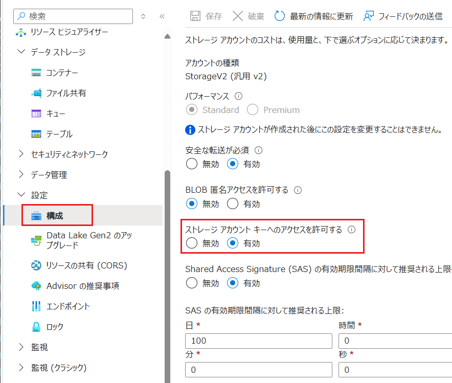
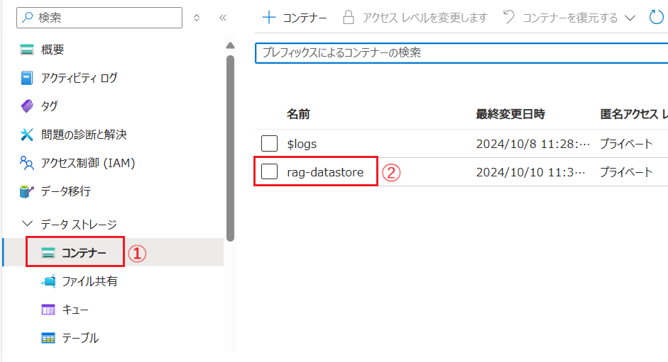
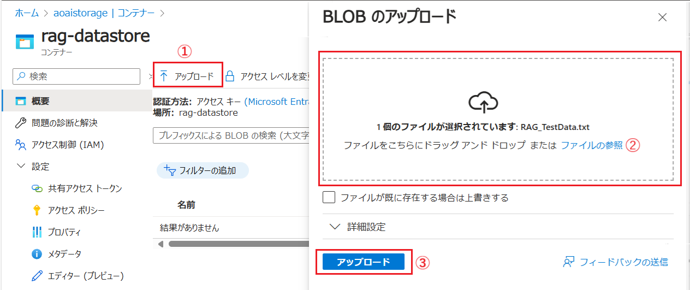
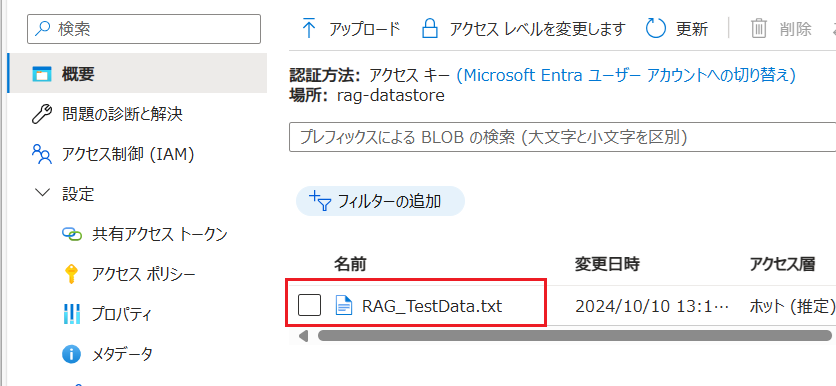
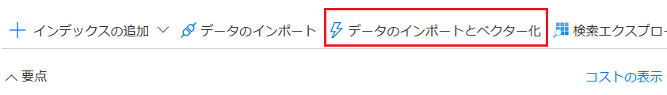
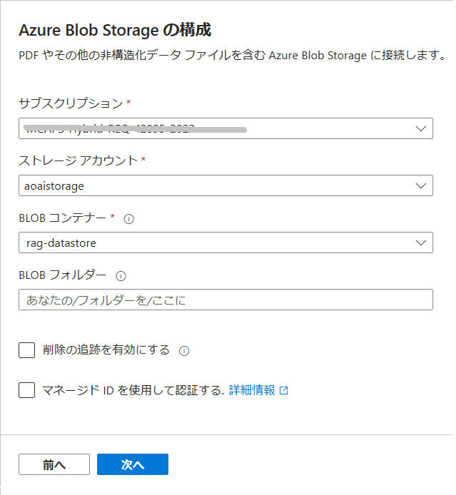
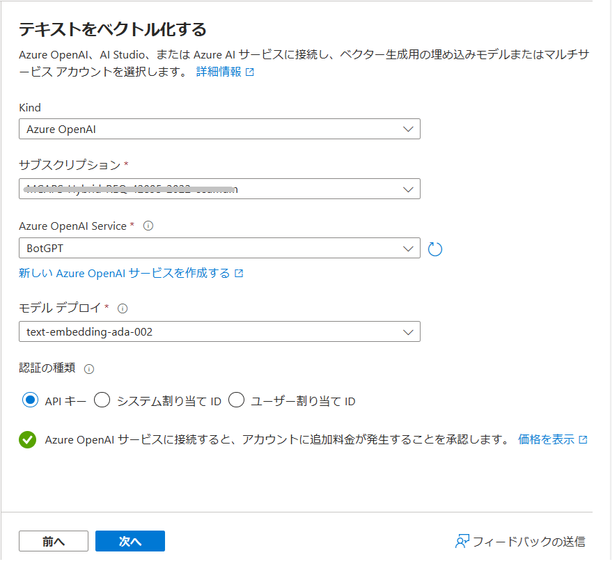
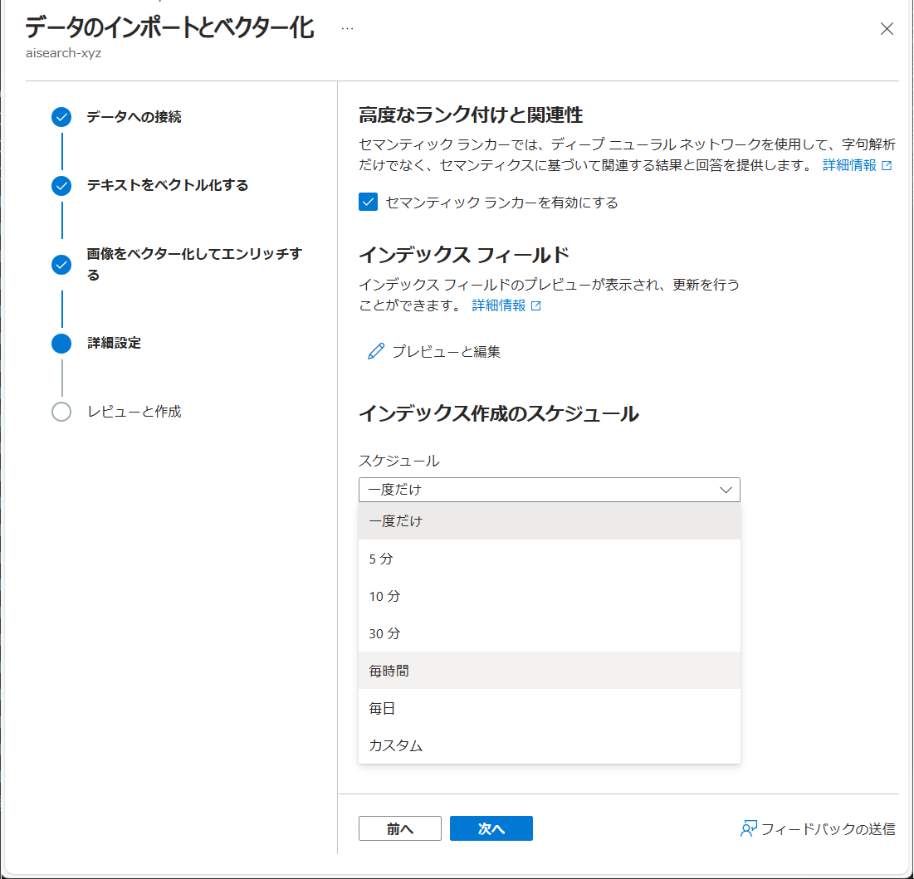
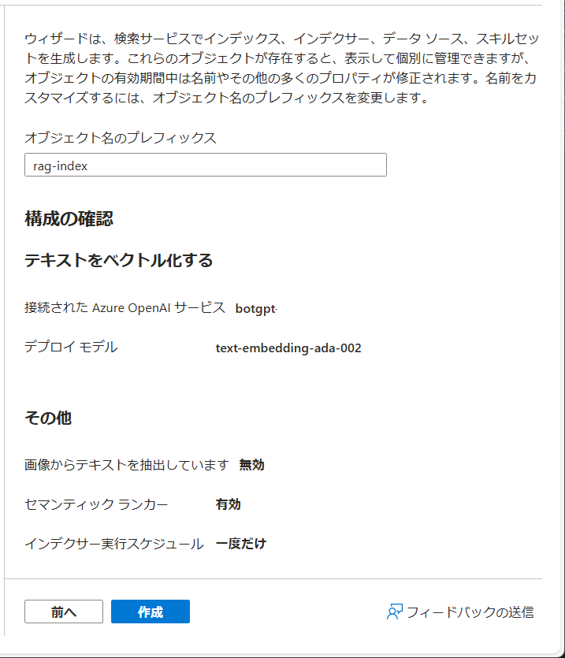

# 演習 2. 3 - オプション : Azure AI Search インポート ウィザードを使用したインデックスの作成

Azure AI Search の Azure ポータル画面にはインポート ウィザードが用意されており、これを使用してシームレスなワークフローでインデックスを作成することができます。

この演習では、 \[**データのインポートとベクトル化**] ウィザードを使用します。これを使用すると指定したソース上のコンテンツを自動的にチャンクし、埋め込みモデルを呼び出して、インデックス作成中およびクエリ時にコンテンツをベクトル化します。また、インジェストのスケジュールを設定し、定期時にデータを追加することもできます。

具体的な作業は、Azure Storage アカウントにファイルをアップロードし、そのファイルをインポート ウィザードで指定することでインデックスを作成します。

 

## タスク 1 : ファイルを Azure Storage アカウントにアップロード

具体的な手順は以下の通りです。

\[**手順**\]

1. [Azure portal](http://portal.azure.com) にログインします

2. 演習 2.3 [準備 1 : Azure Storage アカウントの作成](Ex02-3.md#%E6%BA%96%E5%82%99-1--azure-storage-%E3%82%A2%E3%82%AB%E3%82%A6%E3%83%B3%E3%83%88%E3%81%AE%E4%BD%9C%E6%88%90) で作成した Azure Storage アカウントの画面を開きます

3. 画面左のメニュー \[データス トレージ\] - \[**コンテナー**\] をクリックし、遷移した画面の上部にある \[**+ コンテナー**\] ボタンをクリックします

    \[**新しいコンテナー**\] ブレードが表示されるので、\[**名前 \***\] ボックスに任意の名前を入力し、ブレード下部の \[**作成**\] ボタンをクリックします

    

4. 画面左のメニュー \[設定\] - \[**構成**\] をクリックし、遷移した画面上部の \[**ストレージ アカウント キーへのアクセスを許可する**\] の設定が \[**有効**\] になっていることを確認します

    

    \[**無効**\] になっている場合は、\[**有効**\] に変更し、画面上部の \[**保存**\] ボタンをクリックします

5. 画面左のメニュー \[データス トレージ\] - \[**コンテナー**\] をクリックし、表示されたコンテナーのリストから、作成したコンテナーをクリックします
   
    

6. 遷移した画面上部の \[**アップロード**\] ボタンをクリックすると \[**BLOB のアップロード**\] ブレードが表示されるので、同ブレード内のファイルアップロード用の枠内にファイルをドラッグアンド ドロップするか、同枠内の \[**ファイルの参照**\] リンクをクリックしてアップロードするファイルを選択します

    

    なお、アップロードするファイルは以下の検証用ダミーデータ ファイルを使用してください。
    
    - [**RAG 検証用ダミーデータ**](assets/RAG_TestData.txt)

    ファイルを選択後、\[**アップロード**\] ボタンをクリックします。

    アップロードが完了すると、アップロードしたファイルがコンテナー内にリストされます。

    
    
ここまでの手順で Azure Storage アカウントにコンテナーを作成し、ファイルをアップロードする作業が完了しました。

 

## タスク 2 : Azure AI Search インポート ウィザードを使用したインデックスの作成

Azure AI Search のインポート ウィザードを使用して、Azure Storage アカウントにアップロードしたファイルをベクトル化し、インデックスを作成します。

具体的な手順は以下の通りです。

\[**手順**\]

1. [Azure portal](http://portal.azure.com) にログインします

2. 演習 2.3 [準備 2 : Azure AI Search サービスの作成](Ex02-3.md#%E6%BA%96%E5%82%99-2--azure-ai-search-%E3%82%B5%E3%83%BC%E3%83%93%E3%82%B9%E3%81%AE%E4%BD%9C%E6%88%90) で作成した Azure AI Search の \[**概要**\] 画面を開き、画面上部の \[**データのインポートとベクター化**\] ボタンをクリックしますデータ

    

3. \[データのインポートとベクター化\] ウィザードが開始され、\[**データ接続の設定**\] 画面が表示されるので、\[**Azure Storage**\] のタイルをクリックします

    

4. \[**Azure Blob Storage の構成**] の画面に遷移するので、各項目を以下のように設定します

    |  項目  |  設定値  |
    | ---- | ---- |
    |  サブスクリプション \* |  現在お使いのサブスクリプション  |
    |  ストレージ アカウント \* |  演習 2.3 [準備 1 : Azure Storage アカウントの作成](Ex02-3.md#%E6%BA%96%E5%82%99-1--azure-storage-%E3%82%A2%E3%82%AB%E3%82%A6%E3%83%B3%E3%83%88%E3%81%AE%E4%BD%9C%E6%88%90) で作成した Azure Storage アカウント  |
    |  BLOB フォルダー |  指定しない  |
    |  削除の追跡を有効にする |  任意  |
    |  マネージド ID を使用して認証する |  チェックしない  |

     

    すべての設定が完了したら、\[**次へ**\] ボタンをクリックします

    接続の検証が開始され、完了すると次の画面に遷移します。

5. \[**テキストをベクトル化する**\] の画面に遷移するので、各項目を以下のように設定します

    |  項目  |  設定値  |
    | ---- | ---- |
    |  Kind |  **Azure OpenAI**  |
    |  サブスクリプション \* |  現在お使いのサブスクリプション  |
    |  Azure OpenAI Service \* |  [演習 1.1](Ex01-1.md) で作成した Azure OpenAI Service リソース |
    |  モデル デプロイ \* |  [演習 1.3](Ex01-3.md) でデプロイした埋め込みモデル  |
    |  認証の種類 |  \[**API キー**\]  |
    | Azure OpenAI サービスに接続すると、アカウントに追加料金が発生することを承認します。| チェック |

    

    すべての設定が完了したら、\[**次へ**\] ボタンをクリックします

4. \[**画像をベクター化してエンリッチする**\] 画面に遷移しますが、今回は画像は使用しないので、既定のまま \[**次へ**\] ボタンをクリックします

5. \[**高度なランク付けと関連性**\] 画面に遷移するので、各項目を以下のように設定します

    |  項目  |  設定値  |
    | ---- | ---- |
    |  セマンティック ランカーを有効にする |  **チェック**  |
    |  インデックス作成のスケジュール |  任意 (※)  |

    (※)　データを追加するスケジュールを設定できます。設定したスケジュールに従って、ストレージ アカウント上のファイルが読み取られデータが追加されます。

    

    すべての設定が完了したら、\[**次へ**\] ボタンをクリックします

6. \[構成の確認\] 画面に遷移するので、\[**オブジェクト名のプレフィックス**\] に作成するインデックスの名前を入力し、各設定を確認して問題なけば \[**作成**\] ボタンをクリックします

    

    作成が開始され、完了すると \[**作成に成功しました**\] とメッセージボックス表示されるので、\[**検索の開始**\] ボタンをクリックします

7. Azure AI Search のインデックスの画面が表示されます。インデックスの作成が完了している場合は \[**ドキュメント**\] と \[**ストレージ**\] に 0 より大きい数字がセットされています。また、\[**クエリ文字列**\] に **\*** (アスタリスク) を入力して\[**検索**\] ボタンをクリックすると、インデックスに登録されているデータが表示されます。

    

    もし \[**ドキュメント**\] と \[**ストレージ**\] の値が 0 の場合は、しばらく待って \[**最新の情報に更新**\] ボタンをクリックしてください。

ここまでの作業で Azure AI Search インポート ウィザードを使用して、Azure Storage アカウントにアップロードしたファイルをベクトル化し、インデックスを作成する作業が完了しました。

>[!INPORTANT]
> 正しく作業が完了したら作成した **インデックス名** と、検索結果からベクトル データが確認されているフィールド名を確認し、メモしてください。
> Azure AI Studio の **データの追加** 機能でインデックスを生成した場合、ベクトル データのフィールド名は **contentVector** ですが、今回の手順で作成したインデックスの場合は **text_vector** となっています。
>よって、[演習 3.4 の タスク 4-1](Ex03-4.md#%E3%82%BF%E3%82%B9%E3%82%AF-4-1--http-client-%E3%83%84%E3%83%BC%E3%83%AB%E3%81%AB%E3%82%88%E3%82%8B%E5%95%8F%E3%81%84%E5%90%88%E3%82%8F%E3%81%9B%E3%83%A1%E3%83%83%E3%82%BB%E3%83%BC%E3%82%B8%E3%81%AE%E3%83%99%E3%82%AF%E3%83%88%E3%83%AB%E5%8C%96%E3%81%A8%E3%83%99%E3%82%AF%E3%83%88%E3%83%AB%E6%A4%9C%E7%B4%A2) 以降の作業は、サンプルコード内のベクトル フィールド名 **contentVector** をこのフィールド名に変更して使用してください。

 

## まとめ

このタスクでは Azure portal の **データのインポートとベクトル化** ウィザードを使ってテキスト データーをベクトル化し、インデックスを作成しました。

今回実施した手順のより詳しい内容については以下のドキュメントを参照してください。

* [**クイックスタート: Azure portal を使用してテキストと画像をベクトル化する**](https://learn.microsoft.com/ja-jp/azure/search/search-get-started-portal-import-vectors?tabs=sample-data-storage%2Cmodel-aoai%2Cconnect-data-storage)

 

## 次へ

👉 [**演習 3: Azure Open AI サービスとアプリケーションの統合**](Ex03-0.md)

 

👈 [**演習 2. 3 : 独自データの追加**](Ex02-3.md)

🏚️ [README に戻る](README.md)