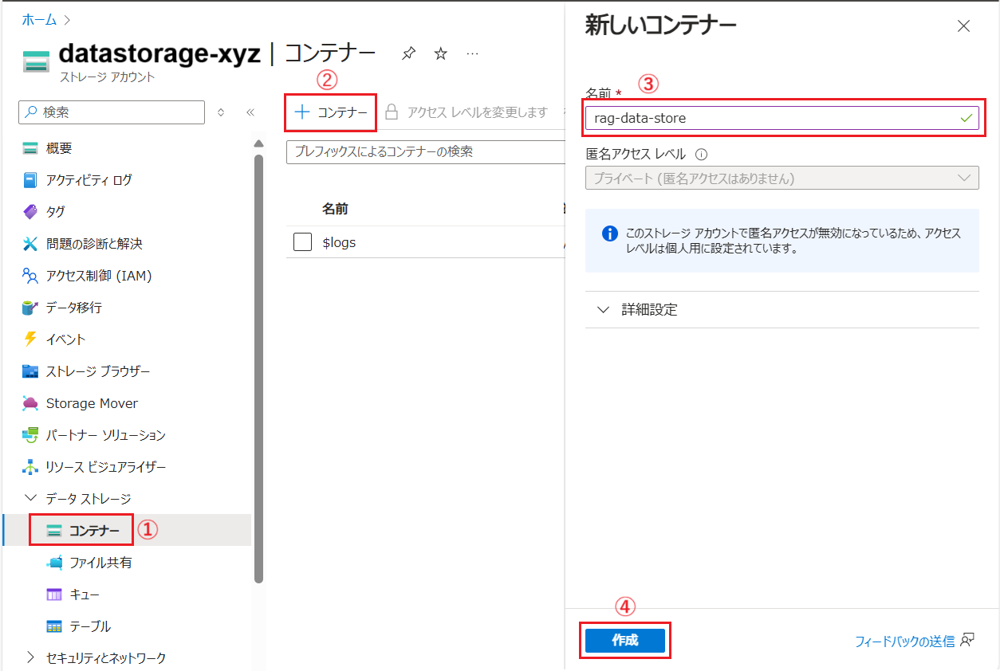
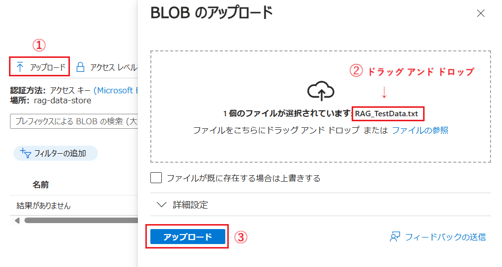
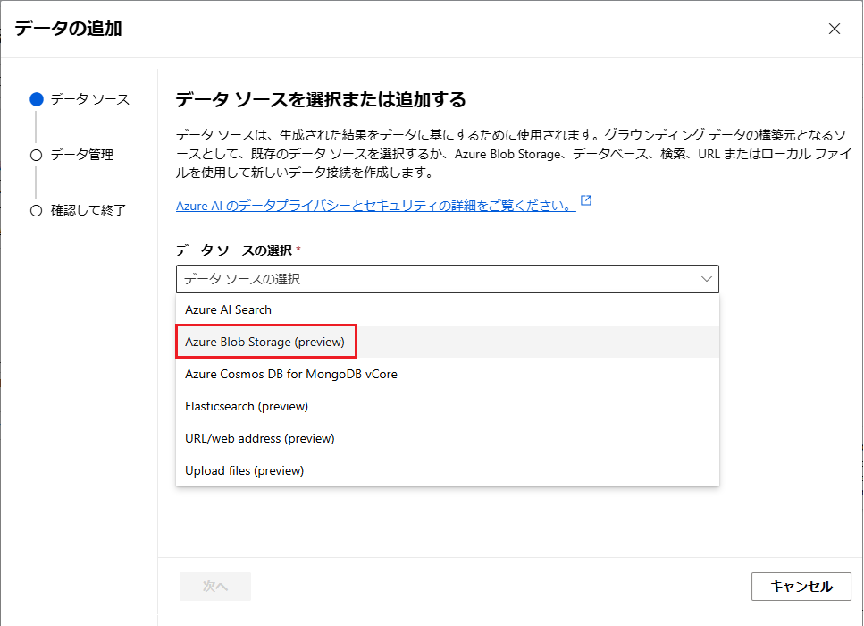
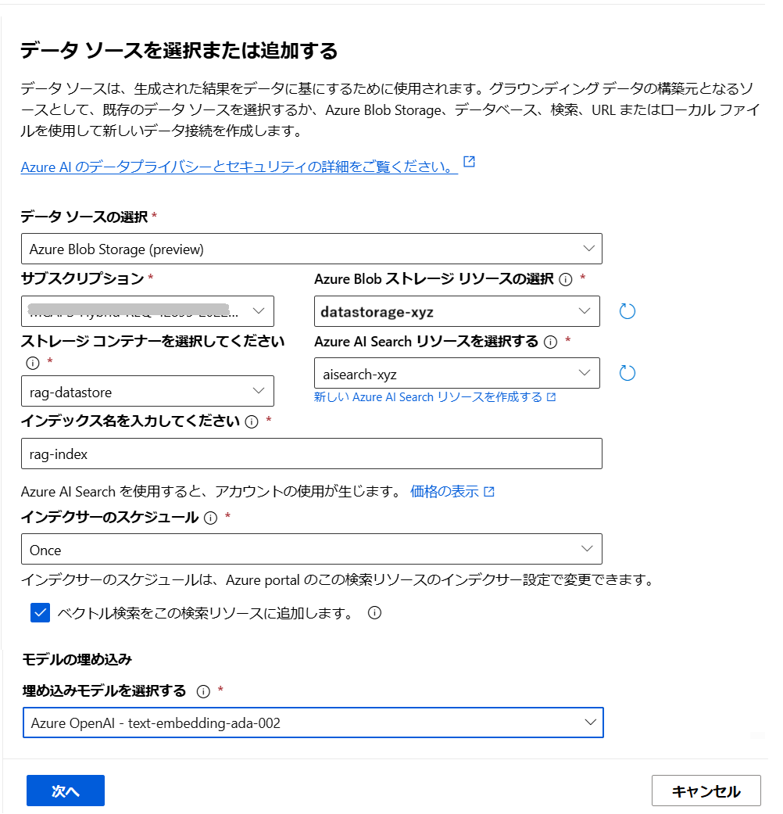
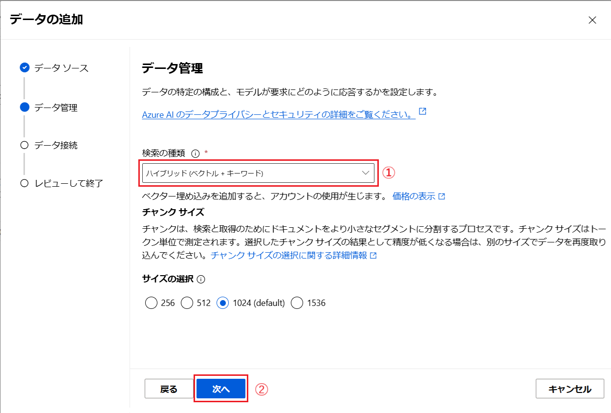
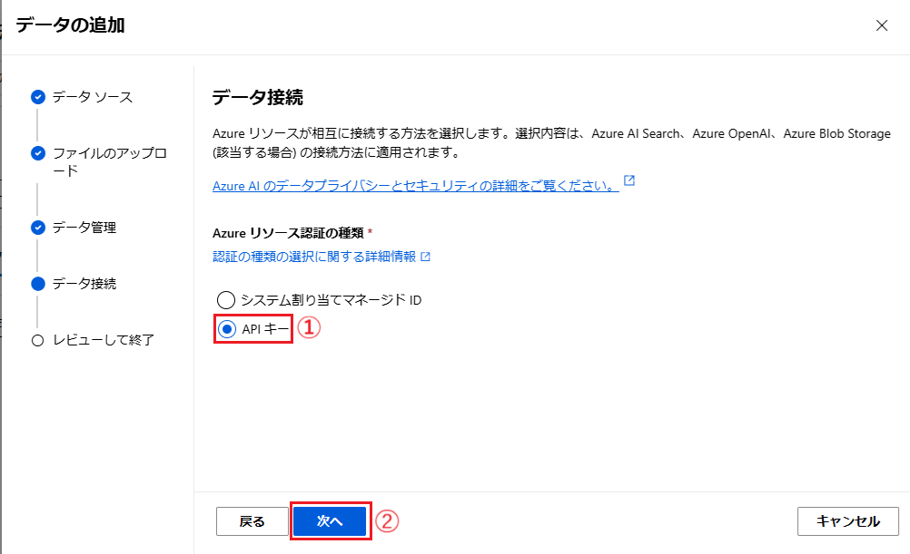

# 演習 2. 3 : 独自データの追加

Azure OpenAI Studio の UI を操作して独自のデータを追加して Azure OpenAI モデルとチャットすることができます。

これは簡易的な RAG(Retrieval-Augmented Generation) の実装であり、検索に必要なストレージ設定や検索エンジンの設定、データのチャンク、インデックスの作成などは自動で行われます。

このタスクでは、この機能を利用してここまでの演習でデプロイした言語モデルに独自のデータを追加(※厳密には RAG 用のアプリケーション層を追加)し、チャットする方法を体験します。

なお、このタスクを実施する前に以下の Azure リソースを作成しておく必要があります。

- [Azure Storage アカウント](https://learn.microsoft.com/ja-jp/azure/storage/common/storage-account-overview)
- [Azure AI Search サービス](https://learn.microsoft.com/ja-jp/azure/search/search-what-is-azure-search)

上記 2 つのリソースの作成方法は以下のとおりです。

## 準備 1 : Azure Storage アカウントの作成

ファイルをアップロードするための Azure Storage アカウントを作成します。

具体的な手順は以下のとおりです。

\[**手順**\]

1. [Azure Portal](http://portal.azure.com) にログインします

2. ポータル画面上部の \[**+ リソースの作成**\] アイコンか、表示されていない場合は画面左上のハンバーガーメニューをクリックし、\[**リソースの作成**\] をクリックします。

    

3. 遷移した画面の検索ボックスに `ストレージ アカウント` と入力してキーボードの \[**Enter**\]キーを押下します

4. 検索結果の画面で、\[**Azure サービスのみ**\] チェックボックス にチェックを入れると **ストレージ アカウント** のタイルが表示されるのでクリックします

    


5. Azure ストレージ アカウントのプランの選択画面に遷移するので、既定のまま \[**作成**\] ボタンをクリックします

6. Azure ストレージ アカウントの \[**基本**\] 画面が表示されるので、各項目を以下のように入力します

    |  項目  |  値  |
    | ---- | ---- |
    |  **サブスクリプション \***  |  使用するサブスクリプションを選択  |
    |  **リソース グループ \***  |  既存のものを選択するか、「新規作成」リンクをクリックして作成  |
    |  **ストレージ アカウント名 \***  |  任意の名前  |
    |  **地域\*** | 任意のリージョン(*) |
    |  **パフォーマンス \*** | 既定のまま |
    |  **プライマリ サービス** | 既定のまま |
    |  **冗長性 \*** | **ローカル冗長ストレージ (LRS)** |

    (*) 参照される OpenAI サービスのインスタンスと同じリージョンを選択することをお勧めします

    入力が完了したら \[**確認と作成**\] ボタンをクリックし、レビュー画面で \[**作成**\] ボタンをクリックします。
    
    ストレージ アカウントの作成が完了すると、\[**リソースに移動**\] ボタンが表示されるので、クリックして作成したストレージ アカウントの概要画面に遷移します。

7. ファイルをアップロードするためのコンテナーを作成します

    画面左側のメニューから \[データ ストレージ\] をクリックして展開し、\[**コンテナー**\] をクリックします。遷移した画面上部の \[**+ コンテナー**\] ボタンをクリックします。

8. 画面右に \[**新しいコンテナー**\] ブレードが表示されるので、\[**名前**\] に任意の名前を入力し、画面下部の \[**作成**\] ボタンをクリックします

    

    作成が完了すると作成したコンテナーが一覧に表示されるので、コンテナー名をクリックします。

9. 遷移した画面上部の \[**↑ アップロード**\] ボタンをクリックすると、画面右に \[**Blob のアップロード**\] ブレードが表示されます

    「**ファイルをこちらにドラッグ アンド ドロップまたはファイルの参照**」と書かれた灰色のボックス内に以下の検証用のダミーデータのファイルをドラッグ アンド ドロップするか、\[**ファイルの参照**\]リンクをクリックしてファイルを選択します

    - [**RAG 検証用ダミーデータ**](assets/RAG_TestData.txt)

    アップロード エリアにファイル名が表示されたら、\[**ファイルのアップロード**\] ボタンをクリックします

    

    アップロードが完了すると、アップロードしたファイルが一覧に表示されます。
    

ここまでの手順で Azure Storage アカウントへのデータのアップロードが完了しました。

Azure AI Search 検索可能とするためのデータのインデックスの作成は Azure OpenAI Studio の UI が行ってくれるのでここでは行いません。


<br>

## 準備 2 : Azure AI Search サービスの作成

投稿された独自のデータを検索するための Azure AI Search サービスを作成します。

具体的な手順は以下のとおりです。

\[**手順**\]

1. [Azure Portal](http://portal.azure.com) にログインします

2. ポータル画面上部の \[**+ リソースの作成**\] アイコンか、表示されていない場合は画面左上のハンバーガーメニューをクリックし、\[**リソースの作成**\] をクリックします。

    

3. 遷移した画面の検索ボックスに `Azure AI Search` と入力してキーボードの \[**Enter**\]キーを押下します

4. 検索結果の画面で、\[**Azure サービスのみ**\] チェックボックス にチェックを入れると **Azure AI Search** のタイルが表示されるのでクリックします

    

5. Azure AI Search のプランの選択画面に遷移するので、既定のまま \[**作成**\] ボタンをクリックします

6. Azure AI Search の \[**基本**\] 画面が表示されるので、各項目を以下のように入力します

    |  項目  |  値  |
    | ---- | ---- |
    |  **サブスクリプション \***  |  使用するサブスクリプションを選択  |
    |  **リソース グループ \***  |  既存のものを選択するか、「新規作成」リンクをクリックして作成  |
    |  **サービス名 \***  |  任意の名前  |
    |  **場所\*** | 任意リージョン(※1) |
    |  **価格レベル \*** | 既定のまま(※2) |

    (※1) 参照される OpenAI サービスのインスタンスと同じリージョンを選択することをお勧めします

    (※2) **Free** を選択した場合 OpenAI のサービスとの連携はできませんので、既定の **Standard** を使用してください 

    入力が完了したら \[**確認および作成**\] ボタンをクリックし、レビュー画面で \[**作成**\] ボタンをクリックします

ここまでの手順で Azure AI Search サービスが作成は完了です。

Azure Storage アカウントへの接続、インデックスの作成、データのチャンク分割などは Azure OpenAI Studio の UI が行ってくれるのでここでは行いません。

<br>

## 演習 : Azure OpenAI チャット ボットへの独自データの追加
>[!IMPORTANT]
>この演習で作成した Azure AI Search のインスタンスとインデックスは演習 3 でも使用しますので、この演習はがならず実施してください。
>もし、Azure AI Studio のデータの \[**データを追加する**\] 機能が正常に動作せず、インデックスが作成できない場合は [**演習 2. 3 - オプション : Azure AI Search インポート ウィザードを使用したインデックスの作成**](Ex02-3-op1.md) の手順を実施してインデックスを作成してください。

Azure OpenAI チャット ボットに独自のデータを追加するには、Azure OpenAI の UI を使用します。

この手順では、事前準備が比較的簡単な Azure OpenAI の画面からファイルをアップロードする方法で行います。

### 独自のデータを追加する前のリクエスト内容の確認　

Azure OpenAI チャット ボットに独自のデータを追加する前とした後のリクエストの違いを比較するために、以下の手順でエンドポイントを確認します。

具体的な手順は以下のとおりです。

\[**手順**\]

1. [Azure OpenAI Studio](https://oai.azure.com/) にサインインし、ここまでの手順でデプロイした言語モデルのチャット プレイグラウンド画面を開きます

2. 画面上部のメニューバーから \[**\</\> コードの表示**\] をクリックします

    

3. \[**サンプル コード**\] ダイアログボックスが表示されるので、画面右下のドロップダウンボックスから \[**curl**\] をクリックします。

    表示された画面で \[**キー認証**\] タブをアクティブにし、同画面のコードをコピーしてメモ帳などに貼り付けて保持します

    

    この内容は演習 3 で使用します。

<br>

### チャット プレイグランド画面から独自のデータを追加する

Azure OpenAI Studio の UI を操作して独自のデータを追加します。

この操作では RAG を構築する際に必要となるさまざまな作業がバックグラウンドで実行されるため手軽に RAG を構築することができます。

具体的な手順は以下のとおりです。

\[**手順**\]

1. [Azure OpenAI Studio](https://oai.azure.com/) にサインインし、ここまでの手順でデプロイした言語モデルのチャット プレイグラウンド画面を開きます

    

2. \[**セットアップ**\] パネルの \[**+ データソースを追加する**\] ボタンをクリックします

    

3. \[**データの追加**\] ダイアログが表示されるので、同ダイアログボックス中の \[**データソースを追加する \***\]　ドロップダウンリストから **Upload files(review)** を選択します

    

4. 必要な追加設定項目の入力欄が表示されるので、各項目を以下のように設定します

    |  項目  |  値  |
    | ---- | ---- |
    |  **データソースを選択する\***  | **Azure Blob Sotage(Preview)** が選択されているはずなのでそのまま  |
    |  **サブスクリプション\***  | 使用するサブスクリプションを選択 |
    |  **Azure Blob ストレージ リソースの選択\***  |  前の手順で作成したストレージ アカウント|
    |  **ストレージ コンテナーを選択してください\***  |  前の手順で作成したストレージ コンテナー|
    |  **Azure AI Search リソースを選択する\***  |  前の手順で作成した Azure AI Search  |
    |  **インデックス名を入力してください\***  |  任意のインデックス名  |
    |  **インデクサーのスケジュール\***  |  \[**Once**\] (※) |
    |  **ベクトル検索をこの検索リソースに追加します**  |  チェック  |
    |  **埋め込みモデルを選択する**  | [演習 1.3](Ex01-3.md) でデプロイした埋め込みモデルを選択 |

    (※) あとからデータの追加、変更がある場合は Hourly、Daily を選択しますが、ここでは Once を選択します。

    すべての設定が完了したら、\[**次へ**\] ボタンをクリックします

    

5. **データ管理** 画面に遷移するので、各項目を以下のように設定し、\[**次へ**\] ボタンをクリックします

    |  項目  |  値  |
    | ---- | ---- |
    |  **検索の種類\***  | **ハイブリッド(ベクトル + キーワード)** |
    |  **チャンク サイズ゜\***  | **1024(default)** (※) |

    (※) Micsoft Azure の無料の試用アカウントを使用している場合は、チャンク サイズを **512** に設定してください。

    

7. **データ接続** 画面に遷移するので、\[**Azure リソース認証の種類 \***\]を \[**API キー**\]設定し、\[**次へ**\] ボタンをクリックします

    

8. **レビューして終了** 画面に遷移するので、\[**保存して閉じる**\] ボタンをクリックします

9. \[**セットアップ**\] パネルの \[**データを追加する**\] タブ内に「**インジェストが進行中です**」と表示されるので完了するまで待ちます

    

10. インジェストが完了すると、\[**データを追加する**\] タブ内にインデックス名のリンクが表示されるのでクリックします

    

     Web ブラウザーの新しいタブが開き、Azure AI Search のインデックスの画面が表示されます。インデックスの作成が完了している場合は \[**ドキュメント**\] と \[**ストレージ**\] に 0 より大きい数字がセットされています。また、\[**クエリ文字列**\] に **\*** (アスタリスク) を入力して\[**検索**\] ボタンをクリックすると、インデックスに登録されているデータが表示されます。

    

    もし \[**ドキュメント**\] と \[**ストレージ**\] の値が 0 の場合は、しばらく待って \[**最新の情報に更新**\] ボタンをクリックしてください。

11. Azure AI Search のインデックスの画面が表示されたら、ボットがここまでの手順で追加情報を使用して質問に回答できるかを確認します

    言語モデルが知識にない情報を生成しないように、チャット プレイグラウンド画面の \[**システム メッセージ**\] タブの\[**システム メッセージ**\] のテキストボックスに[演習 2.1 : システムメッセージとパラメーター設定](Ex02-1.md#%E3%82%B7%E3%82%B9%E3%83%86%E3%83%A0%E3%83%A1%E3%83%83%E3%82%BB%E3%83%BC%E3%82%B8%E3%81%AE%E5%8B%95%E4%BD%9C%E3%81%AE%E7%A2%BA%E8%AA%8D)と同じく以下の文言を入力し、\[**変更の適用**\] ボタンをクリックします

    ```
    あなたは誠実なアシスタントです。知らないことについては正直に「わかりません」と回答します。
    ```
     

    \[**システムメッセージを更新しますか?**\] と表示されるので、\[**続行**\] ボタンをクリックします

    次にチャット画面で以下のメッセージを入力し、送信します

    ```
    やまたのおろち製作所の所在地について教えてください
    ```

    さらに、以下のメッセージを入力し、送信します

    ```
    代表者は誰ですか?
    ```

12. 応答の内容がここまでの手順でアップロードした [ダミーデータ](assets/RAG_TestData.txt) の内容であることを確認します

<br>

## 独自のデータを追加した後のリクエスト内容の確認　

独自のデータを追加した後、リクエストの内容がどのように変化したかを確認します。

1. チャット プレイグランドの画面上部のメニューバーから \[**\</\> コードの表示**\] をクリックします

    

2. 表示された\[**サンプル コード**\] ダイアログボックスの画面右下のドロップダウンボックスから \[**curl**\] をクリックし、表示されたコードをコピーしてメモ帳などに貼り付けて独自のデータを追加する前のリクエスト内容と比較します

    

    以下の変数に加え、さまざまなパラメータが追加されていることを確認します

    ```
    search_endpoint="https://yourinstancename.search.windows.net"
    search_key="***"
    search_index="yourindexname"
    ```
    これらの情報は言語モデルにではなく、言語モデルの手前に配置されたアプリケーションによって使用され RAG を実現しています。

    RAG の仕組みについては[演習 3.4 : RAG (Retrieval-Augmented Generation) の実装](Ex03-4.md)で詳しく説明します。

    最後に、この [**データの追加**] で作成した RAG 機能は OpenAI Studio を終了すると削除(※)されます。引き続きこの手順で作成した RAG 機能を使用する場合は、次の [**オプション : Azure OpenAI Studio で作成したチャットボットを Azure App Service にデプロイ**](Ex02-op1.md)の手順を実行してください。
    
    (※ Azure AI Search のインスタンスとインデックスは削除されず Azure ポータルや API を介して引き続き使用することができます。)
<br>

# まとめ

演習 2 では[システムメッセージとパラメータ](Ex02-1.md)や[プロンプトエンジニアリング](Ex02-1.md)、独自データの追加など、コーディングを必要とせず Azure OpenAI Studio の UI から言語モデルを操作する方法を学びました。

次の[演習 3]((Ex03-0.md)) ではここまでの演習でデプロイした言語モデルを含むさまざまなリソースを外部のアプリケーションから利用する方法について学びます。


<br>

## 次へ

👉 [演習 2. オプション : Azure OpenAI Studio で作成したチャットボットを Azure App Service にデプロイ](Ex02-op1.md)

👉 [**演習 3: Azure Open AI サービスとアプリケーションの統合**](Ex03-0.md)

<br>

<hr>

👈 [**演習 2. 2 : プロンプト エンジニアリング**](Ex02-2.md)

🏚️ [README に戻る](README.md)