# 演習 2. 3 : 独自データの追加

Azure OpenAI Studio の UI を操作して独自のデータを追加して Azure OpenAI モデルとチャットすることができます。

これは簡易的な RAG の実装であり、検索に必要なストレージ設定や検索エンジンの設設定、データのチャンク、インデックスの作成などは自動で行われます。

このタスクでは、この機能を利用してここまでの演習でデプロイした言語モデルに独自のデータを追加(※厳密には RAG 用のアプリケーション層)し、チャットする方法を体験します。

なお、このタスクを実施する前に以下の Azure リソースを作成しておく必要があります。

Azure Storage アカウント
Azure Cognitive Search サービス
上記 2 つのリソースの作成方法は以下のとおりです。

- Azure Storage アカウント
- Azure Cognitive Search サービス

上記 2 つのリソースの作成方法は以下のとおりです。

### 準備 1 : Azure Storage アカウントの作成

ファイルをアップロードするための Azure Storage アカウントを作成します。

具体的な手順は以下のとおりです。

\[**手順**\]

1. Azure Portal にログインします

2. ポータル画面上部の \[**+**\] リソースの作成 アイコンか、表示されていない場合は画面左上のハンバーガーメニューをクリックし、\[**リソースの作成**\] をクリックします。

    

3. 遷移した画面の検索ボックスに `ストレージ アカウント` と入力してキーボードの \[**Enter**\]キーを押下します

4. 検索結果の画面で、\[**Azure サービスのみ**\] チェックボックス にチェックを入れると **ストレージ アカウント** のタイルが表示されるのでクリックします

    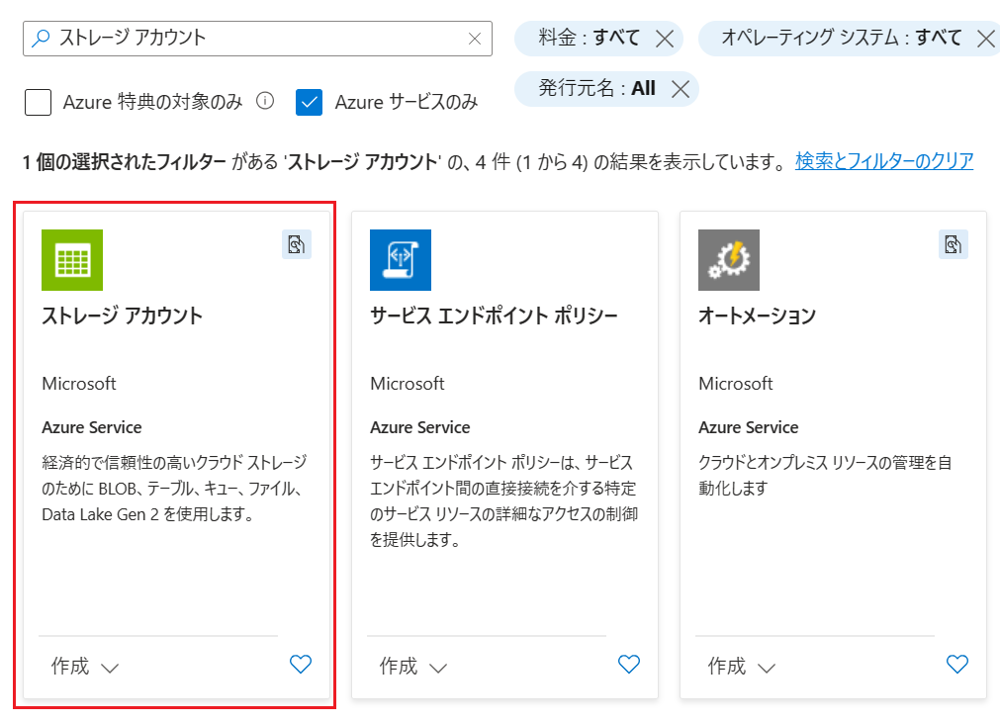


5. Azure ストレージ アカウントのプランの選択画面に遷移するので、既定のまま \[**作成**\] ボタンをクリックします

6. Azure ストレージ アカウントの \[**基本**\] 画面が表示されるので、各項目を以下のように入力します

    |  項目  |  値  |
    | ---- | ---- |
    |  **サブスクリプション \***  |  使用するサブスクリプションを選択  |
    |  **リソース グループ \***  |  既存のものを選択するか、「新規作成」リンクをクリックして作成  |
    |  **ストレージ アカウント名 \***  |  任意の名前  |
    |  **地域\*** | 任意リージョン(*) |
    |  **パフォーマンス \*** | 既定のまま |
    |  **プライマリ サービス** | 既定のまま |
    |  **冗長性 \*** | **ローカル冗長ストレージ (LRS)** |

    (*) 参照される OpenAI サービスのインスタンスと同じリージョンを選択することをお勧めします

    入力が完了したら \[**確認と作成**\] ボタンをクリックし、レビュー画面で \[**作成**\] ボタンをクリックします

ここまでの手順で Azure Storage アカウントが作成は完了です。

アップロードされるファイルを格納するためのコンテナーや Cognitive Search がアクセスするのに必要な CORS 設定などは Azure OpenAI Studio の UI が行ってくれるのでここでは行いません。


<br>

### 準備 2 : Azure AI Search サービスの作成

投稿された独自のデータを検索するための Azure AI Search サービスを作成します。

具体的な手順は以下のとおりです。

\[**手順**\]

1. Azure Portal にログインします

2. ポータル画面上部の \[**+**\] リソースの作成 アイコンか、表示されていない場合は画面左上のハンバーガーメニューをクリックし、\[**リソースの作成**\] をクリックします。

    

3. 遷移した画面の検索ボックスに `Azure AI Search` と入力してキーボードの \[**Enter**\]キーを押下します

4. 検索結果の画面で、\[**Azure サービスのみ**\] チェックボックス にチェックを入れると **Azure AI Search** のタイルが表示されるのでクリックします

    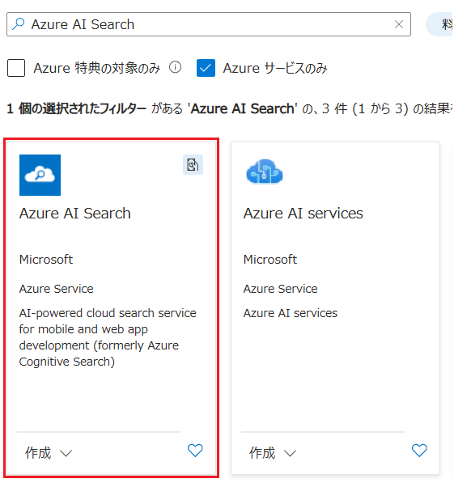

5. Azure AI Search のプランの選択画面に遷移するので、既定のまま \[**作成**\] ボタンをクリックします

6. Azure AI Search の \[**基本**\] 画面が表示されるので、各項目を以下のように入力します

    |  項目  |  値  |
    | ---- | ---- |
    |  **サブスクリプション \***  |  使用するサブスクリプションを選択  |
    |  **リソース グループ \***  |  既存のものを選択するか、「新規作成」リンクをクリックして作成  |
    |  **サービス名 \***  |  任意の名前  |
    |  **場所\*** | 任意リージョン(※1) |
    |  **価格レベル \*** | 既定のまま(※2) |

    (※1) 参照される OpenAI サービスのインスタンスと同じリージョンを選択することをお勧めします

    (※2) **Free** を選択した場合 OpenAI のサービスとの連携はできませんので、既定の **Standard** を使用してください 

    入力が完了したら \[**確認および作成**\] ボタンをクリックし、レビュー画面で \[**作成**\] ボタンをクリックします

ここまでの手順で Azure AI Search サービスが作成は完了です。

Azure Storage アカウントへの接続、インデックスの作成、データのチャンク分割などは Azure OpenAI Studio の UI が行ってくれるのでここでは行いません。

<br>

## Azure OpenAI チャット ボットへの独自データの追加

Azure OpenAI チャット ボットに独自のデータを追加するには、Azure OpenAI の UI を使用します。

この手順では、事前準備が比較的簡単な Azure OpenAI の画面からファイルをアップロードする方法で行います。

> この演習で作成する Azure AI Search のインスタンスとインデックスは演習 3 でも使用しますので、この演習を完了した後も削除しないでください。

### 独自のデータを追加する前のリクエスト内容の確認　

Azure OpenAI チャット ボットに独自のデータを追加する前とした後のリクエストの違いを比較するために、以下の手順でエンドポイントを確認します。

具体的な手順は以下のとおりです。

\[**手順**\]

1. [Azure OpenAI Studio](https://oai.azure.com/) にサインインし、ここまでの手順でデプロイした言語モデルのチャット プレイグラウンド画面を開きます

2. 画面上部のメニューバーから \[**\</\> コードの表示**\] をクリックします

    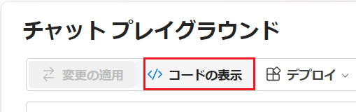

3. \[**サンプル コード**\] ダイアログボックスが表示されるので、画面右下のドロップダウンボックスから \[**curl**\] をクリックし、表示されたコードをコピーしてメモ帳などに貼り付けて保持します

    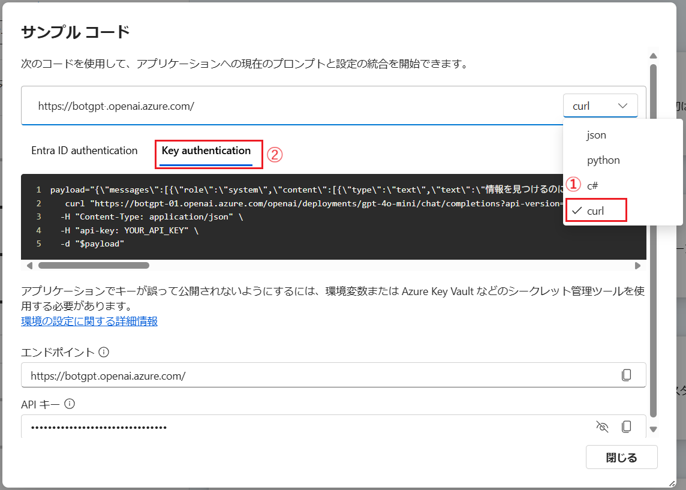

    この内容は演習 3 で使用します。

### チャット プレイグランド画面から独自のデータを追加する

Azure OpenAI Studio の UI を操作して独自のデータを追加します。

この操作では RAG を構築する際に必要となるさまざまな作業がバックグラウンドで実行されるため手軽に RAG を構築することができます。

具体的な手順は以下のとおりです。

\[**手順**\]

1. [Azure OpenAI Studio](https://oai.azure.com/) にサインインし、ここまでの手順でデプロイした言語モデルのチャット プレイグラウンド画面を開きます

    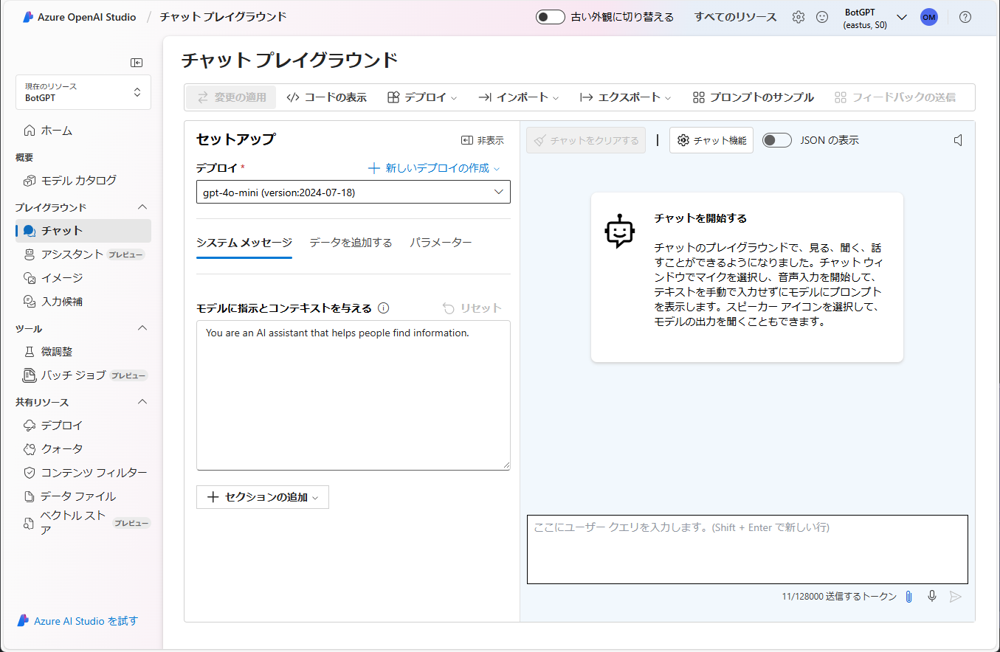

2. \[**セットアップ**\] パネルの \[**データを追加する**\] タブをアクティブにし、同タブ内の　\[**+ データソースを追加する**\] ボタンをクリックします

    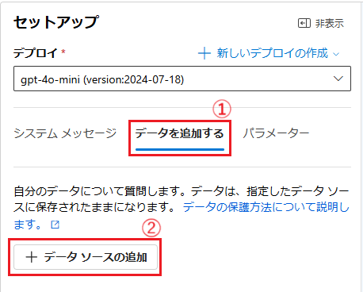

3. \[**データの追加**\] ダイアログが表示されるので、同ダイアログボックス中の \[**データソースを追加する \***\]　ドロップダウンリストから **Upload files(review)** を選択します

    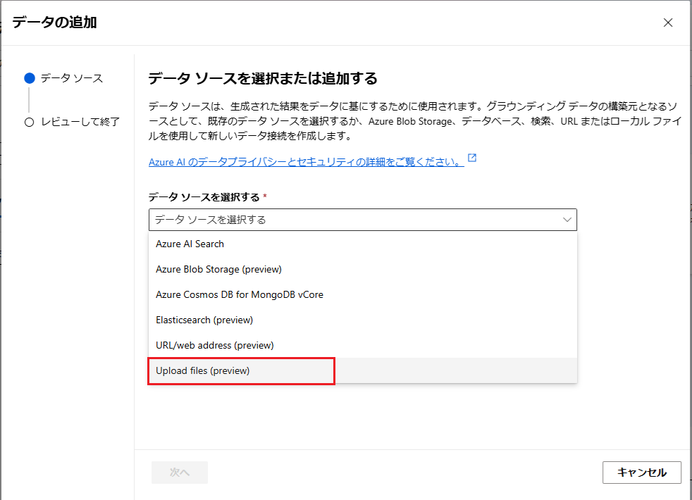

4. 必要な追加設定項目の入力欄が表示されるので、各項目を以下のように設定します

    |  項目  |  値  |
    | ---- | ---- |
    |  **データソースを選択する\***  | **Upload files(review)** が選択されているはずなのでそのまま  |
    |  **サブスクリプション\***  | 使用するサブスクリプションを選択 |
    |  **Azure Blob ストレージ リソースの選択\***  |  前の手順で作成したストレージ アカウント(※)|
    |  **Azure AI Search リソースを選択する\***  |  前の手順で作成した Cognitive Search  |
    |  *インデックス名を入力してください\***  |  任意のインデックス名  |
    |  **ベクトル検索をこの検索リソースに追加します**  |  チェック  |
    |  **埋め込みモデルを選択する**  | [演習 1 のタスク 3](Ex01.md#%E3%82%BF%E3%82%B9%E3%82%AF-3--%E5%9F%8B%E3%82%81%E8%BE%BC%E3%81%BF%E3%83%A2%E3%83%87%E3%83%AB%E3%81%AE%E3%83%87%E3%83%97%E3%83%AD%E3%82%A4) でデプロイした埋め込みモデルを選択 |

    (※) Azure Storage アカウントの選択時に CORS 設定が必要である旨の警告が表示されるので、\[**CORS をオンにする**\] ボタンをクリックして CORS 設定を有効にします

    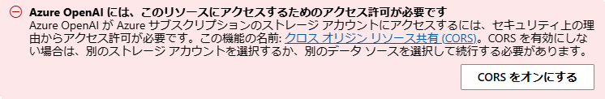

    すべての設定が完了したら、\[**次へ**\] ボタンをクリックします

    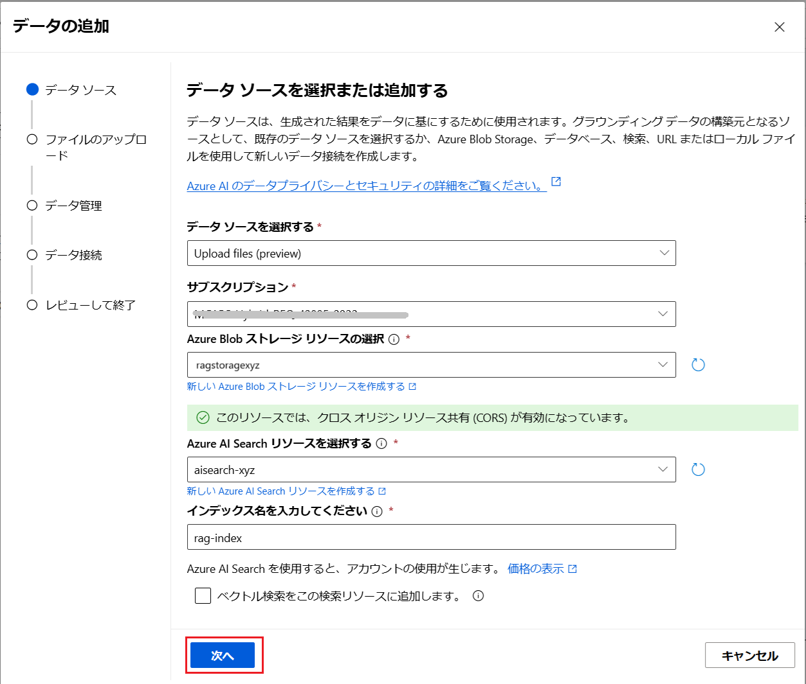

5. **Upload files** 画面に遷移するので、\[ドラッグ アンド ドロップ。または**ファイルを参照する**\] と書かれた灰色のボックス内に以下の検証用のダミーデータのファイルと、その他検索したい任意のファイルをドラッグアンドドロップするか、\[**ファイルを参照する**\]リンクをクリックしてファイルを選択します

    - [ダミーデータ](assets/RAG_TestData.txt)

    ファイルリストにファイル名が表示されたら、\[**ファイルのアップロード**\] ボタンをクリックします

    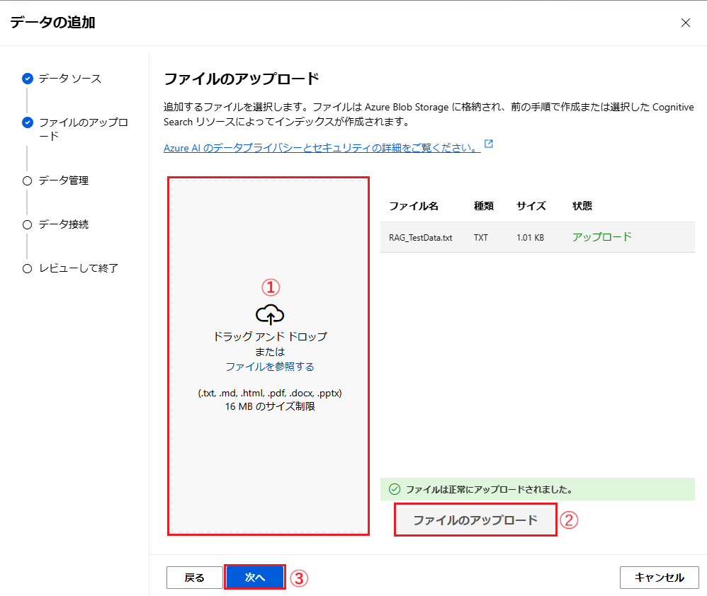

    \[**次へ**\] ボタンがクリック可能なるまで待ち、クリックしします

6. **データ管理** 画面に遷移するので、各項目を以下のように設定し、\[**次へ**\] ボタンをクリックします

    |  項目  |  値  |
    | ---- | ---- |
    |  **検索の種類\***  | **ハイブリット(ベクトル + キーワード)** |
    |  **チャンク サイズ゜\***  | **1024(default)** |

    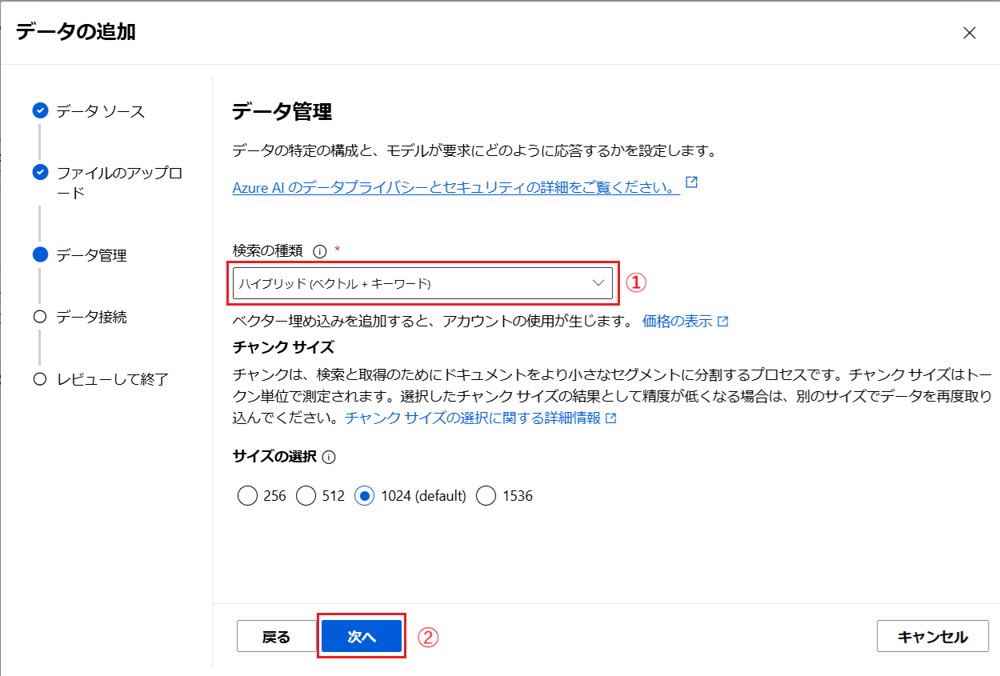

7. **データ接続** 画面に遷移するので、\[**Azure リソース認証の種類 \***\]を \[**API キー**\]設定し、\[**次へ**\] ボタンをクリックします

    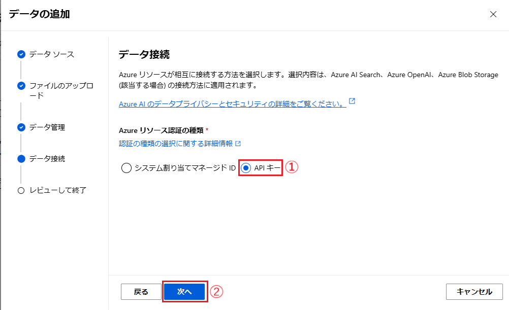

8. **レビューして終了** 画面に遷移するので、\[**保存して閉じる**\] ボタンをクリックします

9. \[**セットアップ**\] パネルの \[**データを追加する**\] タブ内に「**インジェストが進行中です**」と表示されるので完了するまで待ちます

    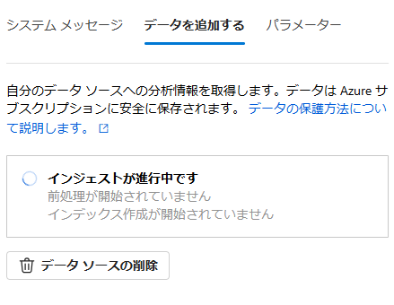

10. インジェストが完了すると、\[**データを追加する**\] タブ内にインデックス名のリンクが表示されるのでクリックします

    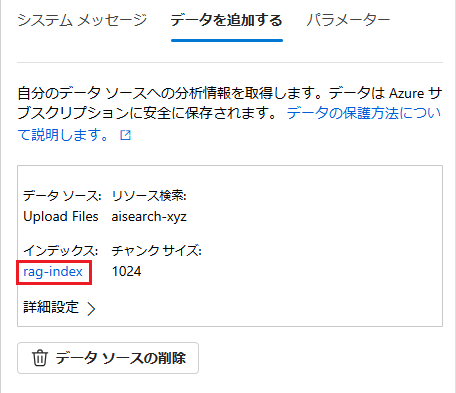

     Web ブラウザーの新しいタブが開き、Azure AI Search のインデックスの画面が表示されます。インデックスの作成が完了している場合は \[**ドキュメント**\] と \[**ストレージ**\] に 0 より大きい数字がセットされています。また、\[**クエリ文字列**\] に **\*** (アスタリスク) を入力して\[**検索**\] ボタンをクリックすると、インデックスに登録されているデータが表示されます。

    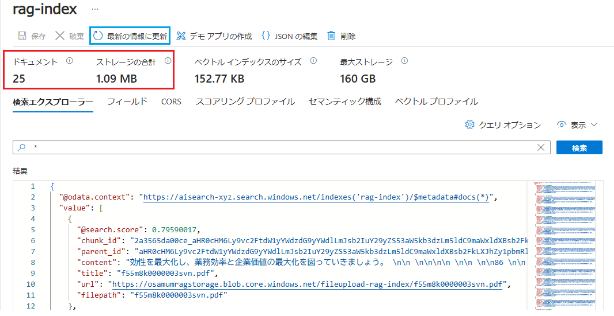

    もし \[**ドキュメント**\] と \[**ストレージ**\] の値が 0 の場合は、しばらく待って \[**最新の情報に更新**\] ボタンをクリックしてください。

11. Azure AI Search のインデックスの画面が表示されたら、ボットがここまでの手順で追加情報を使用して質問に回答できるかを確認します

    言語モデルが知識にない情報を生成しないように、チャット プレイグラウンド画面の \[**システム メッセージ**\] タブの\[**システム メッセージ**\] のテキストボックスに[演習 1 のタスク 1 の演習](Ex02-1.md#%E3%82%B7%E3%82%B9%E3%83%86%E3%83%A0%E3%83%A1%E3%83%83%E3%82%BB%E3%83%BC%E3%82%B8%E3%81%AE%E5%8B%95%E4%BD%9C%E3%81%AE%E7%A2%BA%E8%AA%8D)と同じく以下の文言を入力し、\[**変更の適用**\] ボタンをクリックします

    ```
    あなたは誠実なアシスタントです。知らないことについては正直に「わかりません」と回答します。
    ```

    \[**システムメッセージを更新しますか?**\] と表示されるので、\[**続行**\] ボタンをクリックします

    次にチャット画面で以下のメッセージを入力し、送信します

    ```
    やまたのおろち製作所の所在地について教えてください
    ```

    さらに、以下のメッセージを入力し、送信します

    ```
    代表者は誰ですか?
    ```

12. 応答の内容がここまでの手順でアップロードした [ダミーデータ](assets/RAG_TestData.txt) の内容であることを確認します


### 独自のデータを追加した後のリクエスト内容の確認　

独自のデータを追加した後、リクエストの内容がどのように変化したかを確認します。

1. チャット プレイグランドの画面上部のメニューバーから \[**\</\> コードの表示**\] をクリックします

    

2. 表示された\[**サンプル コード**\] ダイアログボックスの画面右下のドロップダウンボックスから \[**curl**\] をクリックし、表示されたコードをコピーしてメモ帳などに貼り付けて独自のデータを追加する前のリクエスト内容と比較します

    

    以下の変数に加え、さまざまなパラメータが追加されていることを確認します

    ```
    search_endpoint="https://yourinstancename.search.windows.net"
    search_key="***"
    search_index="yourindexname"
    ```
    これらの情報は言語モデルにではなく、言語モデルの手前に配置されたアプリケーションによって使用され RAG を実現しています。

    RAG の仕組みについては演習 3 で詳しく説明します。

    最後に、この [**データの追加**] で作成した RAG 機能は OpenAI Studio を終了すすると削除(※)されます。引き続きこの手順で作成した RAG 機能を使用する場合は、次の [**オプション : Azure OpenAI Studio で作成したチャットボットを Azure App Service にデプロイ**]()の手順を実行してください。
    
    (※ Azure AI Search のインスタンスとインデックスは削除されず Azure ポータルや API を介して引き続き使用することができます。)

    <br>

## オプション : Azure OpenAI Studio で作成したチャットボットを Azure App Service にデプロイ

Azure OpenAI Studio のチャット プレイグランドで動作しているチャットボットを Web アプリや Teams アプリ、Copilot Studio の新しい Copilot としてデプロイすることができます。

この手順では Web アプリとして Azure App Service にデプロイします。

具体的な手順は以下のとおりです。

\[**手順**\]

1. Azure OpanAI Studio のチャット プレイグランド画面上部のメニューから \[**デプロイ**\] - \[**...Web アプリとして**\] をクリックします

    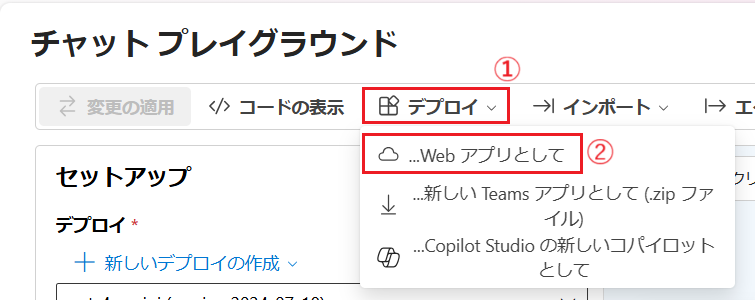

2. \[**Web アプリにデプロイ**\] ダイアログボックスが表示されるので、各項目を以下のように設定します

    |  項目  |  値  |
    | ---- | ---- |
    |  **名前 \***  |  任意のユニークなもの  |
    |  **サブスクリプション \***  |  任意のサブスクリプション  |
    |  **リソースグループ \***  |  任意のリソース グループ  |
    |  **場所 \***  |  任意のリージョン  |
    |  **価格プラン\***  |  F1 Free  |
    |  **Web アプリでチャット履歴を有効にする**  |  任意  |

    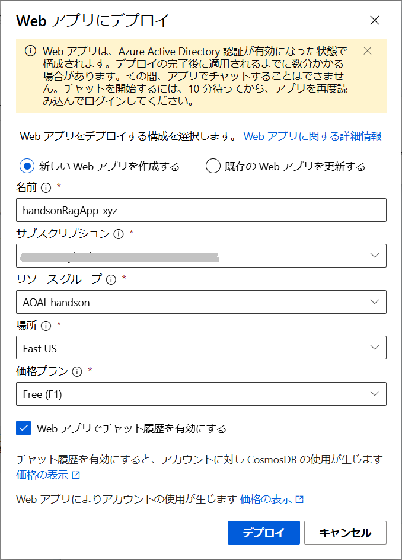

     \[**デプロイ**\] ボタンをクリックすると、Azure App Service にデプロイが開始されるので完了するまで待ちます

3. デプロイが完了すると、\[**起動**\] ボタン表示されるのでクリックします

    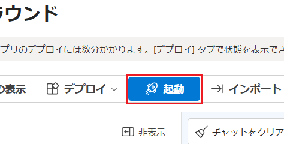

4. Web ブラウザーが起動し、\[**要求されているアクセス許可**\] ダイアログボックスが表示されるので \[**承諾**\] ボタンをクリックします

    Azure App Service にデプロイしたチャットボットが表示されるので任意の質問を入力し、紙飛行機のアイコン(\[**送信**\] ボタン)をクリックして回答が返ることを確認します

    

    また、[タスク 3: 独自データの追加](#%E3%82%BF%E3%82%B9%E3%82%AF-3--%E7%8B%AC%E8%87%AA%E3%83%87%E3%83%BC%E3%82%BF%E3%81%AE%E8%BF%BD%E5%8A%A0) で追加したデータも回答として返ることを確認してください。
    
    この Web アプリケーションは Azure App Service の自動認証が有効になっており、Azure Active Directory よって保護されています。そのため同じ Azure Active Directory テナントにログインしているユーザーだけが使用することができます。

ここまでの手順で、Azure OpenAI Studio で作成したチャットボットを Azure App Service にデプロイし、Web ブラウザーを介してユーザーがアクセスできるようになりました。


<br>

演習 2　ではコーディングを必要とせず Azure OpenAI Studio の UI から言語モデルを操作かる方法を学びました。

次の演習 3 ではここまでの演習でデプロイした言語モデルを含むさまざまなリソースを外部のアプリケーションから利用する方法について学びます。

<br>

<hr>

👉 [**演習 3: Azure Open AI サービスとアプリケーションの統合**](Ex03-0.md)

👈 [**演習 2. 2 : プロンプト エンジニアリング**](Ex02-2.md)

🏚️ [README に戻る](README.md)