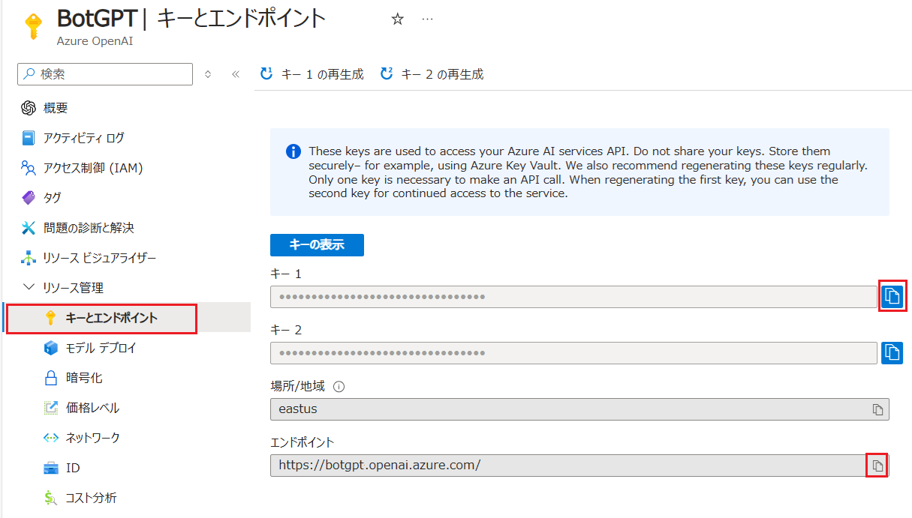

# 演習 3: Azure Open AI サービスとアプリケーションの統合

この演習では Azure OpenAI サービスか提供するサービスを外部から利用する方法を体験します。

OpenAI の言語モデルは [Python](https://github.com/openai/openai-python)、[Node.js](https://www.npmjs.com/package/openai)、[.NET](https://www.nuget.org/packages/OpenAI/2.1.0-beta.1)、[GO](https://github.com/openai/openai-go)、[Ruby](https://github.com/openai/openai-ruby)、[Java](https://github.com/openai/openai-java) などに SDK を提供していますが、REST API を提供しているため HTTPS を扱える開発言語であればその機能を利用することができます。

この演習では JavaScript (Node.js) を使用して実際にアプリケーションを作成していきますが、SDK が提供されていない他の開発言語でも REST API が利用できるよう、HTTP Client ツールを使用した API の呼び出し方法も確認します。

## 目次

この演習 3 で実施するタスクは以下のとおりです

- [3.1 : Azure Open AI サービスの API 利用](Ex03-1.md)
    - [タスク 1 : curl コマンドによる呼び出しの確認](Ex03-1.md#%E3%82%BF%E3%82%B9%E3%82%AF-1---curl-%E3%82%B3%E3%83%9E%E3%83%B3%E3%83%89%E3%81%AB%E3%82%88%E3%82%8B%E5%91%BC%E3%81%B3%E5%87%BA%E3%81%97%E3%81%AE%E7%A2%BA%E8%AA%8D)
    - [タスク 2 :  HTTP Client ツールによる呼び出しの確認](Ex03-1.md#%E3%82%BF%E3%82%B9%E3%82%AF-2-http-client-%E3%83%84%E3%83%BC%E3%83%AB%E3%81%AB%E3%82%88%E3%82%8B%E5%91%BC%E3%81%B3%E5%87%BA%E3%81%97%E3%81%AE%E7%A2%BA%E8%AA%8D)
- [3.2 : ボット アプリケーションの作成](Ex03-2.md)
    - [タスク 1 : コンソールで動作するオウム返しアプリケーションの作成](Ex03-2.md#%E3%82%BF%E3%82%B9%E3%82%AF-1--%E3%82%B3%E3%83%B3%E3%82%BD%E3%83%BC%E3%83%AB%E3%81%A7%E5%8B%95%E4%BD%9C%E3%81%99%E3%82%8B%E3%82%AA%E3%82%A6%E3%83%A0%E8%BF%94%E3%81%97%E3%82%A2%E3%83%97%E3%83%AA%E3%82%B1%E3%83%BC%E3%82%B7%E3%83%A7%E3%83%B3%E3%81%AE%E4%BD%9C%E6%88%90)
    - [タスク 2 : Azure OpenAI ライブラリを利用した言語モデルへのメッセージの送信](Ex03-2.md#%E3%82%BF%E3%82%B9%E3%82%AF-2--azure-openai-%E3%83%A9%E3%82%A4%E3%83%96%E3%83%A9%E3%83%AA%E3%82%92%E5%88%A9%E7%94%A8%E3%81%97%E3%81%9F%E8%A8%80%E8%AA%9E%E3%83%A2%E3%83%87%E3%83%AB%E3%81%B8%E3%81%AE%E3%83%A1%E3%83%83%E3%82%BB%E3%83%BC%E3%82%B8%E3%81%AE%E9%80%81%E4%BF%A1)
    - [タスク 3 : コンソールで動作する基本的なチャットボット アプリの作成](Ex03-2.md#%E3%82%BF%E3%82%B9%E3%82%AF-3--%E3%82%B3%E3%83%B3%E3%82%BD%E3%83%BC%E3%83%AB%E3%81%A7%E5%8B%95%E4%BD%9C%E3%81%99%E3%82%8B%E5%9F%BA%E6%9C%AC%E7%9A%84%E3%81%AA%E3%83%81%E3%83%A3%E3%83%83%E3%83%88%E3%83%9C%E3%83%83%E3%83%88-%E3%82%A2%E3%83%97%E3%83%AA%E3%81%AE%E4%BD%9C%E6%88%90)

- [3.3 : Function Calling 機能を使用した任意の関数の実行](Ex03-3.md)
    - [タスク 1 : HTTP Client ツールによる呼び出しの確認(Function Calling)](Ex03-3.md#%E3%82%BF%E3%82%B9%E3%82%AF-1---http-client-%E3%83%84%E3%83%BC%E3%83%AB%E3%81%AB%E3%82%88%E3%82%8B%E5%91%BC%E3%81%B3%E5%87%BA%E3%81%97%E3%81%AE%E7%A2%BA%E8%AA%8Dfunction-calling)
    - [タスク 2 : チャットボット アプリからの関数の呼び出し](Ex03-3.md#%E3%82%BF%E3%82%B9%E3%82%AF-2--%E3%83%81%E3%83%A3%E3%83%83%E3%83%88%E3%83%9C%E3%83%83%E3%83%88-%E3%82%A2%E3%83%97%E3%83%AA%E3%81%8B%E3%82%89%E3%81%AE%E9%96%A2%E6%95%B0%E3%81%AE%E5%91%BC%E3%81%B3%E5%87%BA%E3%81%97)
    - [タスク 3 : 画像生成モデルの利用](Ex03-3.md#%E3%82%BF%E3%82%B9%E3%82%AF-3---%E7%94%BB%E5%83%8F%E7%94%9F%E6%88%90%E3%83%A2%E3%83%87%E3%83%AB%E3%81%AE%E5%88%A9%E7%94%A8)
        - [タスク 3-1 : HTTP Client ツールによる呼び出しの確認](Ex03-3.md#%E3%82%BF%E3%82%B9%E3%82%AF-3-1--http-client-%E3%83%84%E3%83%BC%E3%83%AB%E3%81%AB%E3%82%88%E3%82%8B%E5%91%BC%E3%81%B3%E5%87%BA%E3%81%97%E3%81%AE%E7%A2%BA%E8%AA%8D)
        - [タスク 3-2 : チャットボット アプリへの画像生成機能の統合](Ex03-3.md#%E3%82%BF%E3%82%B9%E3%82%AF-3-2--%E3%83%81%E3%83%A3%E3%83%83%E3%83%88%E3%83%9C%E3%83%83%E3%83%88-%E3%82%A2%E3%83%97%E3%83%AA%E3%81%B8%E3%81%AE%E7%94%BB%E5%83%8F%E7%94%9F%E6%88%90%E6%A9%9F%E8%83%BD%E3%81%AE%E7%B5%B1%E5%90%88)

    - [3.4 : RAG (Retrieval-Augmented Generation) の実装](Ex03-4.md)
        - [タスク 1: HTTP Client ツールによる問い合わせメッセージのベクトル化とベクトル検索](Ex03-4.md#%E3%82%BF%E3%82%B9%E3%82%AF-4-1--http-client-%E3%83%84%E3%83%BC%E3%83%AB%E3%81%AB%E3%82%88%E3%82%8B%E5%95%8F%E3%81%84%E5%90%88%E3%82%8F%E3%81%9B%E3%83%A1%E3%83%83%E3%82%BB%E3%83%BC%E3%82%B8%E3%81%AE%E3%83%99%E3%82%AF%E3%83%88%E3%83%AB%E5%8C%96%E3%81%A8%E3%83%99%E3%82%AF%E3%83%88%E3%83%AB%E6%A4%9C%E7%B4%A2)
    - [タスク 2: チャットボット アプリに RAG の機能を追加](Ex03-4.md#%E3%82%BF%E3%82%B9%E3%82%AF-4-2--%E3%83%81%E3%83%A3%E3%83%83%E3%83%88%E3%83%9C%E3%83%83%E3%83%88-%E3%82%A2%E3%83%97%E3%83%AA%E3%81%AB-rag-%E3%81%AE%E6%A9%9F%E8%83%BD%E3%82%92%E8%BF%BD%E5%8A%A0)

- [3.5 : 画像認識機能の追加](Ex03-5.md)
    - [タスク 1 : HTTP Client ツールによる呼び出しの確認(画像認識)](Ex03-5.md#%E3%82%BF%E3%82%B9%E3%82%AF-1---http-client-%E3%83%84%E3%83%BC%E3%83%AB%E3%81%AB%E3%82%88%E3%82%8B%E5%91%BC%E3%81%B3%E5%87%BA%E3%81%97%E3%81%AE%E7%A2%BA%E8%AA%8D%E7%94%BB%E5%83%8F%E8%AA%8D%E8%AD%98)
    - [タスク 2 : チャットボット アプリへの画像認識機能の統合](Ex03-5.md#%E3%82%BF%E3%82%B9%E3%82%AF-2---%E3%83%81%E3%83%A3%E3%83%83%E3%83%88%E3%83%9C%E3%83%83%E3%83%88-%E3%82%A2%E3%83%97%E3%83%AA%E3%81%B8%E3%81%AE%E7%94%BB%E5%83%8F%E8%AA%8D%E8%AD%98%E6%A9%9F%E8%83%BD%E3%81%AE%E7%B5%B1%E5%90%88)

- [3.6 : Web を検索して回答する](Ex03-6.md)
    - [タスク 1 : HTTP Client ツールによる呼び出しの確認(Bing Web Search)](Ex03-6.md#%E3%82%BF%E3%82%B9%E3%82%AF-1---http-client-%E3%83%84%E3%83%BC%E3%83%AB%E3%81%AB%E3%82%88%E3%82%8B%E5%91%BC%E3%81%B3%E5%87%BA%E3%81%97%E3%81%AE%E7%A2%BA%E8%AA%8Dbing-web-search)
    - [タスク 2 : Web 検索とコンテンツ取得を行う機能の実装](Ex03-6.md#%E3%82%BF%E3%82%B9%E3%82%AF-2--web-%E6%A4%9C%E7%B4%A2%E3%81%A8%E3%82%B3%E3%83%B3%E3%83%86%E3%83%B3%E3%83%84%E5%8F%96%E5%BE%97%E3%82%92%E8%A1%8C%E3%81%86%E6%A9%9F%E8%83%BD%E3%81%AE%E5%AE%9F%E8%A3%85)
        - [タスク 2-1 : Web ページのコンテンツを取得する機能の実装](Ex03-6.md#%E3%82%BF%E3%82%B9%E3%82%AF-2-1--web-%E3%83%9A%E3%83%BC%E3%82%B8%E3%81%AE%E3%82%B3%E3%83%B3%E3%83%86%E3%83%B3%E3%83%84%E3%82%92%E5%8F%96%E5%BE%97%E3%81%99%E3%82%8B%E6%A9%9F%E8%83%BD%E3%81%AE%E5%AE%9F%E8%A3%85)
        - [タスク 2-2 : Web ページのコンテンツから不要な HTML タグやスクリプト、スタイルシートを除去する機能の実装](Ex03-6.md#%E3%82%BF%E3%82%B9%E3%82%AF-2-2--web-%E3%83%9A%E3%83%BC%E3%82%B8%E3%81%AE%E3%82%B3%E3%83%B3%E3%83%86%E3%83%B3%E3%83%84%E3%81%8B%E3%82%89%E4%B8%8D%E8%A6%81%E3%81%AA-html-%E3%82%BF%E3%82%B0%E3%82%84%E3%82%B9%E3%82%AF%E3%83%AA%E3%83%97%E3%83%88%E3%82%B9%E3%82%BF%E3%82%A4%E3%83%AB%E3%82%B7%E3%83%BC%E3%83%88%E3%82%92%E9%99%A4%E5%8E%BB%E3%81%99%E3%82%8B%E6%A9%9F%E8%83%BD%E3%81%AE%E5%AE%9F%E8%A3%85)
        - [タスク 2-3 : Web 検索機能の実装と言語モデルへのメッセージの生成](Ex03-6.md#%E3%82%BF%E3%82%B9%E3%82%AF-2-3--web-%E6%A4%9C%E7%B4%A2%E6%A9%9F%E8%83%BD%E3%81%AE%E5%AE%9F%E8%A3%85%E3%81%A8%E8%A8%80%E8%AA%9E%E3%83%A2%E3%83%87%E3%83%AB%E3%81%B8%E3%81%AE%E3%83%A1%E3%83%83%E3%82%BB%E3%83%BC%E3%82%B8%E3%81%AE%E7%94%9F%E6%88%90)
    - [タスク 3: チャットボット アプリへの Web 検索機能の統合](Ex03-6.md#%E3%82%BF%E3%82%B9%E3%82%AF-3-%E3%83%81%E3%83%A3%E3%83%83%E3%83%88%E3%83%9C%E3%83%83%E3%83%88-%E3%82%A2%E3%83%97%E3%83%AA%E3%81%B8%E3%81%AE-web-%E6%A4%9C%E7%B4%A2%E6%A9%9F%E8%83%BD%E3%81%AE%E7%B5%B1%E5%90%88)
    
- [3. 7 : 言語モデルの応答に JSON を指定する](Ex03-7.md)
    - [タスク 1 : HTTP Client ツールによる呼び出しの確認(Structured Outputs)](Ex03-7.md#%E3%82%BF%E3%82%B9%E3%82%AF-1--http-client-%E3%83%84%E3%83%BC%E3%83%AB%E3%81%AB%E3%82%88%E3%82%8B%E5%91%BC%E3%81%B3%E5%87%BA%E3%81%97%E3%81%AE%E7%A2%BA%E8%AA%8Dstructured-outputs)
    - [タスク 2 : JavaScript コードからの呼び出しの確認](Ex03-7.md#%E3%82%BF%E3%82%B9%E3%82%AF-2--javascript-%E3%82%B3%E3%83%BC%E3%83%89%E3%81%8B%E3%82%89%E3%81%AE%E5%91%BC%E3%81%B3%E5%87%BA%E3%81%97%E3%81%AE%E7%A2%BA%E8%AA%8D)

- [3. 8 : 演習用ボットをコンソール アシスタントとして利用する](Ex03-8.md)

## 準備

演習 3 のタスクを実施するためには以下の準備が必要です。

もし以下アプリケーションやランタイムのインストールが済んでいない場合はリンク先の手順に従ってインストールを行ってください。

### ツールのインストール

- [**Visual Studio Code**](https://code.visualstudio.com/)

    - [**REST Client 拡張**](https://marketplace.visualstudio.com/items?itemName=humao.rest-client)

- [**Node.js**](https://nodejs.org/ja/)

    > 最新の LTS 版をインストールしてください。もしローカル環境で Node.js のバージョンを切り替える必要がある場合には Windows では [**nvm-windows**](https://github.com/coreybutler/nvm-windows) 、Mac では [nvm](https://github.com/nvm-sh/nvm) を使用すると便利です。
    > 詳しくは以下のドキュメントを参照してください。

    - [**nvm-windows のインストール**](https://learn.microsoft.com/ja-jp/windows/dev-environment/javascript/nodejs-on-windows#install-nvm-windows-nodejs-and-npm)

    - [**nvm のインストール**](https://learn.microsoft.com/ja-jp/windows/dev-environment/javascript/nodejs-on-wsl#install-nvm-nodejs-and-npm)

### 接続情報の入手

REST API の呼び出しに必要となるエンドポイントと API キーを入手します。

具体的な手順は以下のとおりです。

1. Azure Portal にサインインします

2. [**演習 1.1 : Azure ポータルから Open AI リソースを作成**](Ex01-1.md) で作成した OpenAI サービス インスタンスのプロパティ画面を開きます

3. 画面左側のメニューから **キーとエンドポイント** を選択し、表示された画面で \[**キー**\](※キー 1、キー 2 のどちらでも構いません)と \[**エンドポイント**\] をコピーします

    

コピーしたキーとエンドポイントは後続のタスクで使用しますので、メモ帳などに貼り付けて保持してください。

このキーとエンドポイントは言語モデルだけでなく、同じく Azure OpenAI インスタンスにデプロイされた埋め込みモデル、画像生成モデルとも共通です。なおこの 2 のモデルはそれぞれタスク 2、タスク 3 で使用されます。

 

## 次へ

👉 [**演習 3. 1 : Azure Open AI サービスの API 利用**](Ex03-1.md)

 

👈 [**演習 2. 3 : 独自データの追加**](Ex02-3.md)

🏚️ [README に戻る](README.md)

 

