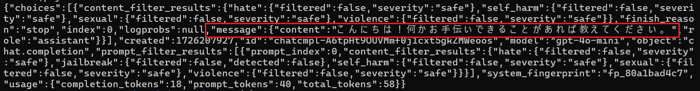
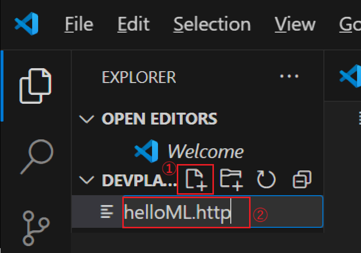
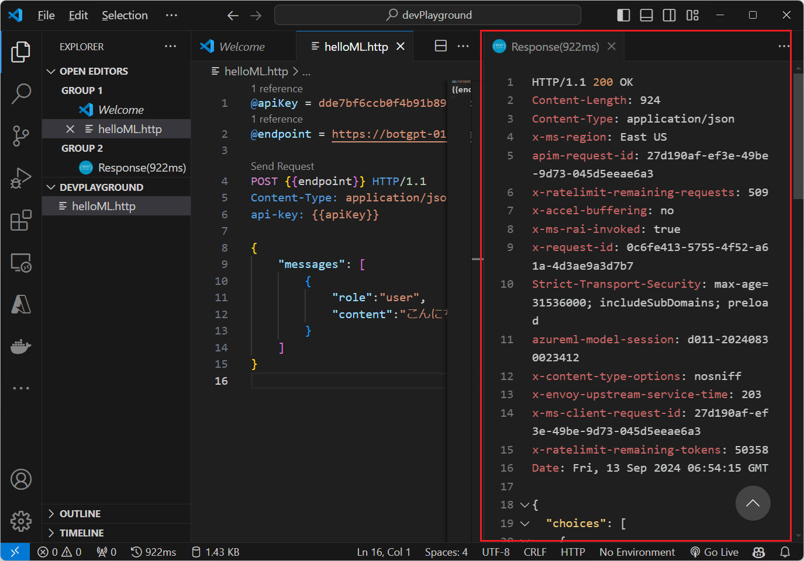

# 演習 3. 1 : Azure Open AI サービスの API 利用

Azure OpenAI の言語モデルは REST API を提供しているため、サービスのエンドポイントと API キー、リクエストとレスポンスのでやりとりされるデータ構造を理解すれば開発言語だけでなく HTTP クライアントツールやコマンドラインからも利用することができます。

このタスクでは curl コマンドを Visual Studio Code の REST Client 拡張を使用して Azure OpenAI サービスのエンドポイントにリクエストを送信し、レスポンスを確認します。

## タスク 1 :  curl コマンドによる呼び出しの確認

Azure OpenAI サービスのエンドポイントに curl コマンドを使用してリクエストを送信し、レスポンスを確認します。

curl コマンドは [演習 2.3 の A独自のデータを追加する前のリクエスト内容の確認](Ex02-3.md#%E7%8B%AC%E8%87%AA%E3%81%AE%E3%83%87%E3%83%BC%E3%82%BF%E3%82%92%E8%BF%BD%E5%8A%A0%E3%81%99%E3%82%8B%E5%89%8D%E3%81%AE%E3%83%AA%E3%82%AF%E3%82%A8%E3%82%B9%E3%83%88%E5%86%85%E5%AE%B9%E3%81%AE%E7%A2%BA%E8%AA%8D)
でコピーしたものを使用します。

もしなんらかの理由でコピーしていない場合は再度、[同手順](Ex02-3.md#%E7%8B%AC%E8%87%AA%E3%81%AE%E3%83%87%E3%83%BC%E3%82%BF%E3%82%92%E8%BF%BD%E5%8A%A0%E3%81%99%E3%82%8B%E5%89%8D%E3%81%AE%E3%83%AA%E3%82%AF%E3%82%A8%E3%82%B9%E3%83%88%E5%86%85%E5%AE%B9%E3%81%AE%E7%A2%BA%E8%AA%8D)を実施してコマンドをコピーしてください。

コマンドをコピーしたら以下の手順を実行します。

\[**手順**\]

1. コピーしたコマンド内の **YOUR_API_KEY** の部分をこの演習の [接続情報の入手](Ex03-0.md#%E6%8E%A5%E7%B6%9A%E6%83%85%E5%A0%B1%E3%81%AE%E5%85%A5%E6%89%8B) でコピーした Azure OpenAI サービスの API キーに置き換えます 

2. ターミナル画面、あるいはコマンドライン画面を表示し、Windows の場合は以下のコマンドを実行して PowerShell から bash に切り替えます

    ```powershell
    bash
    ```

    もし、bash が見つからない、という旨のメッセージが表示される場合は以下のコマンドを実行して WSL をインストールしてください。

    ```powershell
    wsl --install
    ```

3. この手順の 1 番目で置き換えたコマンドを貼り付けて実行し、Azure OpenAI サービスの言語モデルからレスポンスが返ることを確認します

    不明な場合やうまくいかない場合は以下の curl コマンドを書き換えて実行してください。このコマンドでは "こんにちは" というテキストを送信しています。

    ```bash
    curl "curl コマンドに指定されているエンドポイントの URL" \
    -H "Content-Type: application/json" \
    -H "api-key: API キー" \
    -d '{
        "messages": [
            {
                "role":"user",
                "content":"こんにちは"
            }
        ]
    }'
    ```

    例) "こんにちは" というテキストを送信した場合のレスポンス

    

このようにサービスのエンドポイントと API キーとリクエストのデータ構造を理解すればコマンドラインからも Azure OpenAI サービスを利用することが確認できました。

<br>

## タスク 2. HTTP Client ツールによる呼び出しの確認

Azure OpenAI サービスの API を呼び出す際にやり取りされるデータ構造を確認するために Visual Studio Code の REST Client 拡張を使用してリクエストを送信し、レスポンスを確認します。

手順は以下のとおりです。

\[**手順**\]

1. エクスプローラーを使用してローカル環境に **devPlayground** という名前のフォルダを作成します

2. 作成したフォルダの上でマウスの右クリックをし、表示されたコンテキストメニューから \[**Visual Studio Code で開く**\]、もしくは \[**Code で開く**\] を選択します

    もし、コンテキストメニューに上記のメニューが表示されない場合は \[**その他のオプションを確認**\] メニューをクリックして表示されるメニューから選択してください

3. Visual Studio Code が起動するので、画面左のツリービューの **New File** ボタンをクリックするか、画面上部のメニュー \[**File**\] - \[**New File..**\] をクリックして **helloML.http** という名前のファイルを作成します

    

4. 作成したファイルに以下の内容をコピーして貼り付けます

    ```
    @apiKey = ここに API キーを入力
    @endpoint = curl コマンドに指定されている URL を入力 

    POST {{endpoint}} HTTP/1.1
    Content-Type: application/json
    api-key: {{apiKey}}

    {
        "messages": [
            {
                "role":"user",
                "content":"こんにちは"
            }
        ]
    }

    ```
    変数 **@apiKey** と **@endpoint** にはそれぞれ[コピーしてある curl コマンドの API キーとエンドポイント](Ex02-3.md#%E7%8B%AC%E8%87%AA%E3%81%AE%E3%83%87%E3%83%BC%E3%82%BF%E3%82%92%E8%BF%BD%E5%8A%A0%E3%81%99%E3%82%8B%E5%89%8D%E3%81%AE%E3%83%AA%E3%82%AF%E3%82%A8%E3%82%B9%E3%83%88%E5%86%85%E5%AE%B9%E3%81%AE%E7%A2%BA%E8%AA%8D)を指定します。このとき " (ダブルクォーテーション) は使用せず、そのままの値を記述してください。

5. ファイルに記述されている **POST** の上に \[**Send Request**\] と表示されるのでクリックします

    

6. リクエストが送信され、レスポンスが表示されることを確認します

    

このように Visual Studio Code の REST Client 拡張を使用して Azure OpenAI サービスの API を呼び出すことができました。

以降、これを使用して Function Calling、Structured Outputs 等、リクエストするデータ構造の変更により言語モデルの振る舞いがどのように変化するかの確認を行います。

<br>

## 次へ

👉 [**演習 3. 2 : ボット アプリケーションの作成**](Ex03-2.md)

<br>

<hr>

👈 [**演習 3 : Azure Open AI サービスとアプリケーションの統合**](Ex03-0.md)

🏚️ [README に戻る](README.md)
