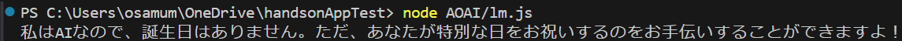
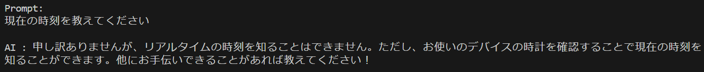

# 演習 3. 2 : ボット アプリケーションの作成

このタスクでは、Node.js を使用して Azure OpenAI サービスの言語モデルと会話を行うためのコンソール アプリケーションを作成します。

最初に、コンソール入力されたユーザーからのメッセージを出力するだけのオウム返しアプリケーションを作成し、その後、Azure OpenAI ライブラリを使用して Azure OpenAI サービスの言語モデルにメッセージを送信する外部モジュールを個別に作成して最後に統合します。

<br>

## タスク 1 : コンソールで動作するオウム返しアプリケーションの作成

コンソールで動作するオウム返しアプリケーションを作成します。

手順は以下のとおりです。

\[**手順**\]

1. [演習 3.1-2. HTTP Client ツールによる呼び出しの確認](Ex03-1.md#%E3%82%BF%E3%82%B9%E3%82%AF-2-http-client-%E3%83%84%E3%83%BC%E3%83%AB%E3%81%AB%E3%82%88%E3%82%8B%E5%91%BC%E3%81%B3%E5%87%BA%E3%81%97%E3%81%AE%E7%A2%BA%E8%AA%8D)で作成したフォルダー **devPlayground** を Visual Studio Code で開きます

2. Visual Studio Code の画面左のツリービューの **New File** ボタンをクリックするか、画面上部のメニュー \[**File**\] - \[**New File..**\] をクリックして **consoleBot.js** という名前のファイルを作成します

    

3. 作成した **consoleBot.js** ファイルが編集状態で Visual Studio Code に開かれるので、以下の内容をコピーして貼り付けます

    ```javascript
    //[PLACEHOLDER:require lm.js]
    
    // 標準入力を取得するための設定
    process.stdin.setEncoding('utf-8');

    function showPrompt() {
        console.log('\nPrompt:');
    }
    showPrompt();

    // 標準入力を受け取る
    process.stdin.on('data', async function(data) {

        //[REPLACE:LM output]
        console.log('\n入力された文字:', data.trim());
    
        showPrompt();
    });

    ```
    貼り付けたらキーボードの \[**Ctrl**\] + \[**S**\] キーを押下して保存します

4. Visual Studio Code の上部のメニュー \[View\] - \[Terminal\] をクリックします

    画面下部にターミナル画面が表示されるので、以下のコマンドを実行して Node.js で作成したファイルを実行します。

    ```bash
    node consoleBot.js
    ```

    なお、この操作はコンソール画面で行っても同様に動作します。

5. コンソール画面に表示された `Prompt:` の後に任意の文字列を入力してキーボードの \[**Enter**\] キーを押下し、入力した文字列がそのまま返ることを確認します

    動作が確認できたらキーボードの \[**Ctrl**\] + \[**C**\] キーを押下してプログラムを終了します

ここまでの作業でアプリケーションのひな型が完成しました。

<br>

## タスク 2 : Azure OpenAI ライブラリを利用した言語モデルへのメッセージの送信

Azure OpenAI ライブラリを利用して、これまでの演習で作成した言語モデルにメッセージを送信し応答を受け取り出力する外部モジュールを作成します。

手順は以下のとおりです。

\[**手順**\]

1. 記述するコードの実行に必要になるライブラリ [dotenv](https://www.npmjs.com/package/dotenv) と [OpenAI Node API Library](https://www.npmjs.com/package/openai)をインストールします。

    Visual Studio Code のターミナル画面で以下のコマンドを実行します

    ```bash
    npm install dotenv --save
    ```
    ```bash
    npm install openai
    ```

2. 環境変数の代わりをする **.env** ファイルを作成します。このファイルはプロジェクトのルートディレクトリに配置します

    Visual Studio Code の画面左のツリービューの **New File** ボタンをクリックするか、画面上部のメニュー \[**File**\] - \[**New File..**\] をクリックして **.env** という名前のファイルを作成します

    

3. 作成した .env ファイルが編集状態で Visual Studio Code に開かれるので、この演習の [**接続情報の入手**](Ex03-0.md#%E6%8E%A5%E7%B6%9A%E6%83%85%E5%A0%B1%E3%81%AE%E5%85%A5%E6%89%8B)でコピーしておいた Azure Open AI サービスへのエンドポイントと API KEY を貼り付けます

    ```
    AZURE_OPENAI_ENDPOINT=ここにエンドポイントを記述
    AZURE_OPENAI_API_KEY=ここに API キーを入力を記述
    ```
    > [!NOTE]
    > ここで使用するエンドポイントは curl コマンドで使用した URL とは異なります。かならず説明にある手順で取得したものを設定してください。

    貼り付けたらキーボードの \[**Ctrl**\] + \[**S**\] キーを押下して保存します

4. Azure OpenAI 関連の処理を行うファイルをまとめるフォルダーを作成します

    Visual Studio Code の画面左のツリービューの **New Folder** ボタンをクリックするか、画面上部のメニュー \[**File**\] - \[**New Folder..**\] をクリックして **AOAI** という名前のフォルダを作成します

    

5. 作成した AOAI フォルダを右クリックし、表示されたコンテキストメニューから \[**New File**\] を選択して **lm.js** という名前のファイルを作成します

    

6. 作成した **lm.js** ファイルが編集状態で Visual Studio Code に開かれるので、以下の内容をコピーして貼り付けます

    このコードは必要なライブラリの参照と、この手順で設定した環境変数を読み込む処理を行い、その他、システムメッセージ等の定義を行っています

    ```javascript
    //ライブラリの参照
    const { AzureOpenAI } = require("openai");
    const dotenv = require("dotenv");
    dotenv.config();
    //[PLACEHOLDER:require funcs.js]
    //[PLACEHOLDER:require imgGen.js] 

    const endpoint = process.env["AZURE_OPENAI_ENDPOINT"] ;
    const apiKey = process.env["AZURE_OPENAI_API_KEY"] ;
    const apiVersion = "2024-05-01-preview";
    const deployment = "gpt-4o-mini"; 
    //言語モデルとユーザーの会話を保持するための配列
    var messages = [
        { role: "system", content: "You are an useful assistant." },
    ];
    //保持する会話の個数
    const messagesLength = 10;
    ```
7. 続けて以下のコードを貼り付けます

    このコードは Azure OpenAI サービスの言語モデルにメッセージを送信と、その結果を返す関数で非同期で動作するため async/await を使用しています

    ```javascript
    //Azure OpenAI にメッセージを送信する関数
    async function sendMessage(message) {
        if(message) addMessage({ role: 'user', content: message });
        const client = new AzureOpenAI({ endpoint, apiKey, apiVersion, deployment });
        const result = await client.chat.completions.create({
            messages: messages,
            model: "",
            //[PLACEHOLDER:functionCalling tools:]
        });

        for (const choice of result.choices) {
            //[REPLACE:functionCalling if{}]
            const resposeMessage = choice.message.content;
            addMessage({ role: 'assistant', content: resposeMessage });
            return resposeMessage;
        }
    }

    //保持する会話の個数を調整する関数
    function addMessage(message) {
        if(messages.length >= messagesLength) messages.splice(1,1);
        messages.push(message);
    }
    ```

8. 続けて結果を確認するための以下のコードを貼り付けます。

    ```javascript
    //[DELETE:Integration lm.js]
    //結果を確認するための即時実行関数
    (async () => {
        const message = 'あなたに誕生日はありますか?';
        const reply = await sendMessage(message);
        console.log(reply);
    })();
    ```

    このコードは sendMessage 関数を呼び出し、その結果をコンソールに出力するためだけのコードですが sendMessage 関数が非同期で動作するため、async/await を使用する必要があるので即時実行関数で記述しています。

9. **lm.js** のコードが正しく動作するか、実行して確認します

    Visual Studio Code のターミナル画面で以下のコマンドを実行し、Azure OpenAI の言語モデルから応答が返ることを確認します。

    ```bash
    node AOAI/lm.js
    ```

    

    もし、うまくいかない場合は以下のサンプルのコードを使用してみてください。

    * [**Azure OpenAI の言語モデルにメッセージを送信するサンプルコード**](samples/lm_0.js)


ここまでの手順で Azure OpenAI サービスの言語モデルとメッセージを送受信するためのコードが記述できました。

<br>

## タスク 3 : コンソールで動作する基本的なチャットボット アプリの作成

タスク 2-1 で作成したオウム返しコンソール アプリケーションとタスク 2-2 で作成した Azure OpenAI ライブラリを使用した言語モデルへのメッセージの送信機能を統合して、コンソールで動作する基本的なチャットボット アプリケーションを作成します。

これによりユーザーはコンソールを使用して Azure OpenAI サービスの言語モデルと継続的に会話を行うことができるようになります。

具体的な手順は以下のとおりです。

\[**手順**\]

1. **lm.js** 内の sendMessage 関数を外部から呼び出せるようにします

    その前に不要な、実行結果を確認するためのコードを削除します。

    具体的には `//[DELETE:Integration lm.js]` とコメントの下にある即時実行関数をコメントごと削除するかコメントアウトします。

    ```javascript
    //[DELETE:Integration lm.js]
    //結果を確認するための即時実行関数
    /*
    (async () => {
        const message = 'あなたに誕生日はありますか?';
        const reply = await sendMessage(message);
        console.log(reply);
    })();
    */

2. **lm.js** ファイルの最後に以下のコードを追加します

    このコードは sendMessage 関数を外部から呼び出せるようにするための処理です

    ```javascript
    module.exports = {sendMessage};
    ```
    
    キーボードの \[**Ctrl**\] + \[**S**\] キーを押下して変更を保存します。

2. オウム返しアプリケーションの **consoleBot.js**  ファイルをオープンし、ファイルの先頭にあるコメント `//[PLACEHOLDER:require lm.js]` を以下のコメントとコードに置き換えます

    ```javascript
    //[PLACEHOLDER:require rag.js]
    const lm = require('./AOAI/lm.js');
    ```
    
    これで lm.js で公開されている関数を consoleBot.js で使用することができるようになります。

3. **consoleBot.js** ファイル内のコメント `//[REPLACE:LM output]` とその下の行のコードをメントごと以下のコードに置き換えます

    ```javascript
    //[REPLACE: RAG Integration]
    console.log(`\nAI : ${await lm.sendMessage(data.trim())}`);
    ```
    コードを置き換えて書式が乱れたらキーボードの \[**Shift**\] + \[**Alt**\] + \[**F**\] キーを押下して書式を整形します。

    つづけて、キーボードの \[**Ctrl**\] + \[**S**\] キーを押下して変更を保存します。

4. **consoleBot.js** を実行して Azure OpenAI サービスの言語モデルと継続的に会話ができるか確認します

    Visual Studio Code のターミナル画面で以下のコマンドを実行します

    ```bash
    node consoleBot.js
    ```

    コンソール画面に `Prompt:` の文字が表示されたら、その後に任意の文字列を入力してキーボードの \[**Enter**\] キーを押下し、Azure OpenAI サービスの言語モデルからの応答が返ることを確認します

5. いくつかの任意のメッセージを送信し、会話が継続的に行えることを確認したら以下のメッセージを送信します

    ```
    現在の時刻を教えてください
    ```

    Azure OpenAI サービスの言語モデルが現在時刻については回答できないことを確認します。

    

    キーボードの \[**Ctrl**\] + \[**C**\] キーを押下してプログラムを終了します。

ここまでの手順で Azure OpenAI サービスの言語モデルと継続的に会話を行うコンソール アプリケーションが作成できました。

もし、うまくいかない場合は以下のサンプルのコードを使用してみてください。


* [**Azure OpenAI の言語モデルにメッセージを送信するモジュールのサンプルコード**](samples/lm_1.js)
* [**Azure OpenAI の言語モデルと継続的に会話を行うコンソール ボットのサンプルサンプルコード**](samples/consoleBot_1.js)

<br>

## 次へ

👉 [**演習 3. 3 : Function Calling 機能を使用した任意の関数の実行**](Ex03-3.md)

<br>

<hr>

👈 [**演習 3. 1 : Azure Open AI サービスの API 利用**](Ex03-1.md)

🏚️ [README に戻る](README.md)
