# 演習 3. 3 : Function Calling 機能を使用した任意の関数の実行 

Azure OpenAI サービスの言語モデルは gpt-4-0613 と gpt-3.5-turbo-0613 から関数呼び出し([Function Calling](https://platform.openai.com/docs/guides/function-calling)) 機能を提供しており、アプリケーションかから送信する言語モデルへのメッセージに任意の関数の情報を含めて呼び出すことで、言語モデルがその関数を使用するタイミングを判断して実行すべき関数名、引数の値を返すようになります。

この一連の流れを図で示すと以下のようになります。

* Function Calling を使用する場合は、アプリケーションから言語モデルに送信するメッセージの中にアプリケーションが呼び出したい関数の情報を含めて送信します。なお、関数の情報は [128 個](https://learn.microsoft.com/ja-jp/azure/ai-services/openai/assistants-reference?tabs=python#request-body)含めることができます。

    ユーザーからのメッセージの内容が追加された関数と関係ないと言語モデルが判断した場合は通常の応答を返します。

    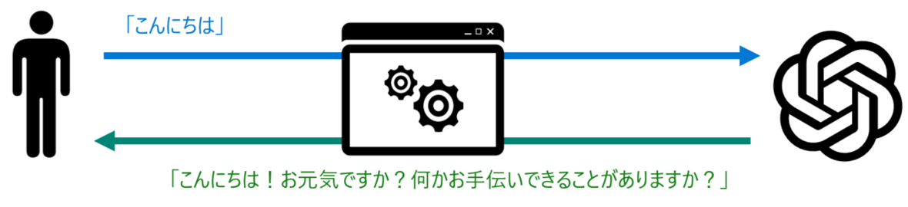

* もし、ユーザーからのメッセージの内容が追加された関数のどれかと関係があると言語モデルが判断した場合は、その関数の名前と引数の名前とセットすべき値のペアの情報を返すので、アプリケーション側ではその情報をもとに関数を実行します。

    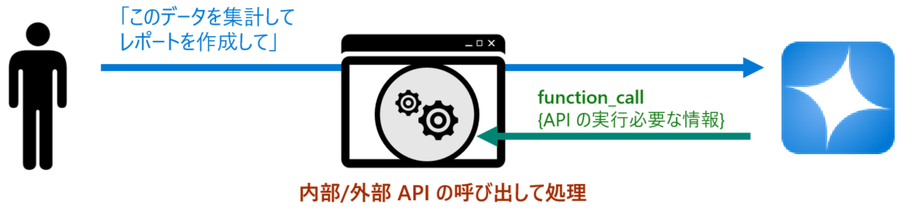

* アプリケーション内で関数の呼び出しが完了したらそのままユーザーにレスポンスを生成して返しても良いですが、関数の呼び出し結果を言語モデルに返すことで、言語モデルがユーザーに返すメッセージを生成してくれます。

    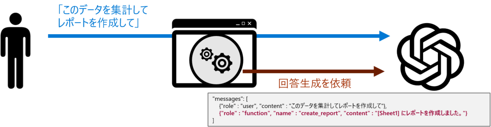

* アプリケーションは、言語モデルが関数の実行結果をもとに生成した回答をユーザーに返します。

    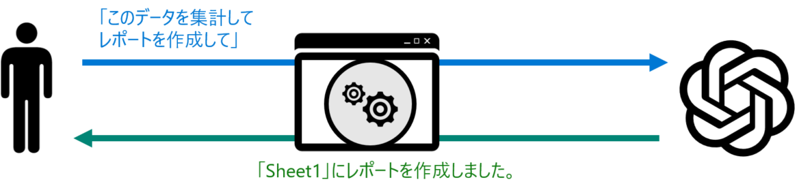

このようにすることで、あたかも言語モデルが関数を実行しているかのようなシームレスな連携が可能になります。

<br>

# タスク 1 :  HTTP Client ツールによる呼び出しの確認(Function Calling)

Azure OpenAI サービスの言語モデルの関数呼び出しを行う際にやり取りされるデータ構造を確認するために Visual Studio Code の REST Client 拡張を使用してリクエストを送信し、レスポンスを確認します。

手順は以下のとおりです。

[**手順**]

1. [演習 3.1-2 : **HTTP Client ツールによる呼び出しの確認**](Ex03-1.md#%E3%82%BF%E3%82%B9%E3%82%AF-2-http-client-%E3%83%84%E3%83%BC%E3%83%AB%E3%81%AB%E3%82%88%E3%82%8B%E5%91%BC%E3%81%B3%E5%87%BA%E3%81%97%E3%81%AE%E7%A2%BA%E8%AA%8D) で作成した **helloML.http** ファイルを開きます

2. ファイルに以下の内容をコピーして貼り付けます

    ```http
    ### Function Calling の実行

    @userMessage = "熱海の名物を教えてください"
    //@userMessage = "熱海の海辺にある露天風呂付きのホテルを一泊 2 万円未満で提示してください"

    POST {{endpoint}} HTTP/1.1
    Content-Type: application/json
    api-key: {{apiKey}}

    {
        "messages": [
            {"role": "user", "content": {{userMessage}}}
        ],
        "tool_choice" : "auto",
        "tools": [
            {
                "type":"function",
                "function": {
                    "name": "search_hotels",
                    "description": "指定されたパラメータに基づいて検索インデックスからホテルを取得します",
                    "parameters": {
                        "type": "object",
                        "properties": {
                            "location": {
                                "type": "string",
                                "description": "ホテルの場所 (神奈川、箱根など)"
                            },
                            "max_price": {
                                "type": "number",
                                "description": "ホテルの最大料金"
                            },
                            "features": {
                                "type": "string",
                                "description": "サービスのカンマ区切りリスト (露天風呂、無料 Wi-Fi など)"
                            }
                        },
                        "required": ["location"]
                    }
                }
            }
        ]
    }
    ```
    この送信データはユーザーからのメッセージ以外に **tools** の配列に関数の情報を含んでいます。含める関数の情報は、関数名と関数の説明、引数と、各引数の説明です。また、必須の引数なども指定できます。このサンプルでは search_hotels というホテルを検索する関数の情報をセットしています。

3. ファイルに記述されている **POST** の上に \[**Send Request**\] と表示されるのでクリックします

    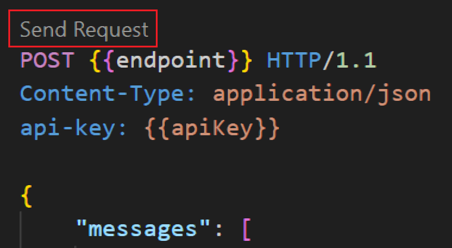

4. リクエストが送信され、レスポンスが返ったら choices/message/content の中身を確認します

    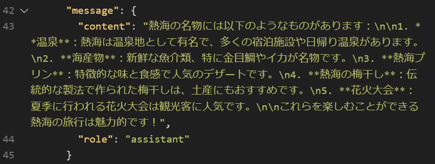

    ユーザーからのメッセージが `熱海の名物を教えてください` というものであったため、関数の情報は無視され、通常の応答が返ってきました。

5. 送信するメッセージの内容を以下のように変更します

    ```JavaScript
    //@userMessage = "熱海の名物を教えてください"
    @userMessage = "熱海の海辺にある露天風呂付きのホテルを一泊 2 万円未満で提示してください"
    ```
    キーボードの \[**Ctrl**\] + \[**S**\] キーを押下して保存します

4. **POST** の上の \[**Send Request**\] をクリックしてリクエストを送信します

    

5. リクエストが送信され、レスポンスが返ったら choices/message/content の中身を確認します

    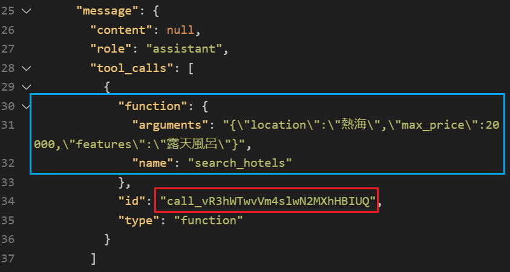

    ユーザーからの `熱海の海辺にある露天風呂付きのホテルを一泊 2 万円未満で提示してください`というメッセージに対し、通常、言語モデルかせのメッセージが返る content が null であり、その代わり **toll_calls** 配列が追加され呼び出すべき関数の名前と、引数名と値のペアが返っていることを確認します。

    また、**message/tool_calls/id** の値を控えておきます。この値は言語モデルに応答の生成を依頼する際に使用します。

6. アプリケーション内で言語モデルが選択した **search_hotel** 関数を実行してその結果を取得したと仮定して、言語モデルに回答の生成を依頼します

     **helloML.http** ファイルに以下の内容を追加し、コメント `ここにレスポンスされた ID を記述` を直前の手順でコピーした **message/tool_calls/id** の値に置き換えます

     ```http
     ### Function Calling : 回答の生成を依頼
    POST {{endpoint}} HTTP/1.1
    Content-Type: application/json
    api-key: {{apiKey}}

    {
        "messages": [
            {
                "content": null,
                "role": "assistant",
                "tool_calls": [
                    {
                        "function": {
                            "arguments": "{\"location\":\"熱海\",\"max_price\":20000,\"features\":\"露天風呂\"}",
                            "name": "search_hotels"
                        },
                        "id": "ここにレスポンスされた ID を記述",
                        "type": "function"
                    }
                ]
            },
            {
                "tool_call_id" : "ここにレスポンスされた ID を記述",
                "role": "tool", 
                "name": "search_hotels",
                "content" : "名前 : ホテル Hot Ocean,一泊 : 19000, 住所 : 静岡県熱海市サンセットビーチ4-5-6, サービス : 無料 Wi-Fi, 露天風呂, ランドリーサービス"
            }
            ]
        }
    ```
    キーボードの \[**Ctrl**\] + \[**S**\] キーを押下して保存します

7. **POST** の上の \[**Send Request**\] をクリックしてリクエストを送信します

    

8. レスポンスが返ったら choices/message/content の中身を確認します

    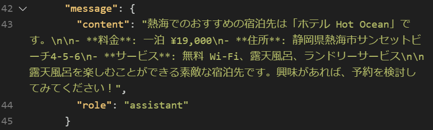

    関数の実行結果を加味したメッセージが生成されていることを確認します。

ここまでの手順で Azure OpenAI サービスの言語モデルで Function Calling 機能を使用する際の基本的なデータ構造とそのやり取りを確認しました。

なお、Function Calling では並列関数の実行など、さまざまな機能をサポートしています。詳細は以下のドキュメントをご参照ください。

* [Function calling - OpenAI API](https://platform.openai.com/docs/guides/function-calling)

<br>

## タスク 2 : チャットボット アプリからの関数の呼び出し

Azure OpenAI 言語モデルの Function Calling 機能を使用して、タスク 2 で作成した[チャットボット アプリケーション](main/Ex03-2.md)から内部、外部関数を呼び出すためのコードを作成します。

> [!NOTE]
> この演習では言語モデルに関数を生成させますが、試用サブスクリプションの場合、コードを生成する際、Token 数が上限を超えてしまう可能性があります。その場合は、[Microsoft Copilot](https://copilot.microsoft.com/) を使用してコードを生成することができます。


具体的な手順は以下のとおりです。

\[**手順**\]

1. [演習 3.1-2](Ex03-1.md#%E3%82%BF%E3%82%B9%E3%82%AF-2-http-client-%E3%83%84%E3%83%BC%E3%83%AB%E3%81%AB%E3%82%88%E3%82%8B%E5%91%BC%E3%81%B3%E5%87%BA%E3%81%97%E3%81%AE%E7%A2%BA%E8%AA%8D)  で作成したフォルダー **devPlayground** を Visual Studio Code で開きます

2. はじめにボットアプリケーションから呼び出される関数を定義するためのファイルを作成します

    Visual Studio Code の画面左のツリービューから **AOAI** フォルダーを右クリックし、表示されたコンテキストメニューから \[**New File**\] を選択して **funcs.js** という名前のファイルを作成します
    
    

3. 記述する関数は言語モデルを使用して作成します

    Visual Studio Code の上部のメニュー \[**View**] - [**Terminal**] をクリックし、画面下部にターミナル画面が表示されるので、以下のコマンドを実行してチャットボット アプリケーションを起動します。

    ```bash
    node consoleBot.js
    ```

    ターミナル画面に `Prompt:` が表示されたら、以下のメッセージを入力して[**Enter**\] キーを押下します

    ```
    引数なしで現在日時を YYYY/MM/DD HH:MM:SS (曜日) の形式で返す getCurrentDatetime という関数を JavaScript で生成してください
    ```

    キーボードの \[**Ctrl**\] + \[**C**\] キーを押下してチャットボットアプリを終了します。
    
    言語モデルが生成した **getCurrentDatetime** 関数のコードをコピーして、作成した **funcs.js** ファイルに貼り付け、キーボードの \[**Ctrl**\] + \[**S**\] キーを押下して保存します。

4. 貼り付けたコードが正しく動作するか確認します。

    以下のコードを **funcs.js** ファイルに追加します

    ```javascript
    console.log(getCurrentDatetime());
    ```

    Visual Studio Code のターミナル画面で以下のコマンドを実行して関数が正しく動作するか確認します

    ```bash
    node AOAI/funcs.js
    ```

    正しく動作したら確認用の以下のコードはコメントアウトするか削除します。

    ```javascript
    //console.log(getCurrentDatetime());　削除するかコメントアウト
    ```
5. 外部の REST API を呼び出すための HTTP Request を送信して結果を受信する関数を言語モデルに作成させます

     Visual Studio Code の上部のメニュー \[**View**] - [**Terminal**] をクリックし、画面下部にターミナル画面が表示されるので、以下のコマンドを実行してチャットボット アプリケーションを起動します。

    ```bash
    node consoleBot.js
    ```

    ターミナル画面に `Prompt:` が表示されたら、以下のメッセージを入力して \[**Enter**\] キーを押下します

    ```
    引数 url を受け取り、その url に HTTP リクエストを送信して結果を json で返す、 callApi という名前の関数を JavaScript で生成してください
    ```

    言語モデルが生成した **callApi** 関数のコードをコピーして、作成した **funcs.js** ファイルに貼り付け、続けて(※チャットボットアプリケーションを終了せずに)以下のメッセージを入力して \[**Enter**\] キーを押下します

    ```
    引数 userName を受け取り、そのユーザーの gitHub アカウント情報を返す getGitHubUserinfo という関数を JavaScript で生成してください。Http request には前回生成した callApi 関数を使用してください。
    ```

    言語モデルは複数の関数のコードとテストコード生成する可能性がありますが、 **getGitHubUserinfo** 関数のコードと、もし `// 使用例` のコードが生成されていればそのコードを **funcs.js** ファイルに貼り付け、キーボードの \[**Ctrl**\] + \[**S**\] キーを押下して保存します。

    Visual Studio Code のターミナル画面でキーボードの \[**Ctrl**\] + \[**C**\] キーを押下してチャットボットアプリを終了します。

6. 貼り付けたコードが正しく動作するか確認します。

    前のステップで `// 使用例` のコードが生成されなかった場合は、以下のコードを **funcs.js** ファイルに追加しキーボードの \[**Ctrl**\] + \[**S**\] キーを押下して保存します。

    ```javascript
    //使用例
    getGitHubUserinfo('octocat')
        .then(userInfo => console.log(userInfo))
        .catch(error => console.error('Error fetching GitHub user info:', error));
    ```

     Visual Studio Code のターミナル画面で以下のコマンドを実行して 'octocat' の GitHub アカウント情報が取得できるか確認します。

    ```bash
    node AOAI/funcs.js
    ```

    もし、うまくいかない場合は以下のサンプルのコードを使用してみてください。

    * [**現在の日付と GitHub アカウントの情報を返すサンプルコード**](samples/funcs_0.js)
    
    正しく動作したら確認用の以下のコードはコメントアウトするか削除します。
    
    ```javascript
    /* ↓ 削除するかコメントアウト
    //使用例
     getGitHubUserinfo('octocat')
        .then(userInfo => console.log(userInfo))
        .catch(error => console.error('Error fetching GitHub user info:', error));
    */
    ```

7. **funcs.js** 内に記述した関数を外部から呼び出せるように以下のコードをファイルの一番最後に追加します

    ```javascript
    module.exports = {getCurrentDatetime,getGitHubUserinfo};
    ```
    追加したらキーボードの \[**Ctrl**\] + \[**S**\] キーを押下して保存します。

8. **AOAI** フォルダ内にある **lm.js** ファイルをオープンし、ファイルの上部にあるコメント `//[PLACEHOLDER:require funcs.js]` を以下のコードに置き換えます

    ```javascript
    const  myFunctions  = require('./funcs');
    ```

9. **lm.js** に Function Calling に使用する funcs.js に定義した関数の情報を含んだ JSON を定義するコードを追加します

    以下のコードを **lm.js** ファイルの最後に追加します

    ```javascript
    // tools スキーマの設定
    const tools = [
        {
            type: 'function',
            function: {
                name: 'get_GitHubUser_info',
                description: 'GitHub アカウントの情報を返す',
                parameters: {
                    type: 'object',
                properties: {
                    userName: {
                        type: 'string',
                        description: 'GitHub のユーザー名、アカウント名、もしくは ID',
                    }
                },
                    required: ['userName'],
                },
            },
        },
        {
            type: 'function',
            function: {
                name: 'get_current_date_time',
                description: '現在のシステム時刻を返します。この関数は引数は必要ありません',
                parameters: {
                    type: 'object',
                    properties: {},
                },
            },
        },
        //[REPLACE:generate_image]
    ];
    ``` 
10. 次に、言語モデルから返された関数の情報に基づき、実際の関数を呼び出す処理を記述します

    以下のコードを **lm.js** ファイルに追加します

    ```javascript
    //実際の関数を呼び出す
    async function routingFunctions(name, args) {
        switch (name) {
            case "get_GitHubUser_info":
                return JSON.stringify(await myFunctions.getGitHubUserinfo(args.userName));
            case "get_current_date_time":
                return await myFunctions.getCurrentDatetime();
            //[REPLACE:generate_image]
            default:
            
            return '要求を満たす関数がありませんでした。';
        }
    }
    ```
11. 続いて、関数の処理結果を言語モデルに返す処理を記述します

    以下のコードを **lm.js** ファイルに追加します

    ```javascript
    //アプリケーション内で実行した関数の結果を言語モデルに返す
    async function sendFunctionResult(returnMessage){
        const toolCall = returnMessage.tool_calls[0];
        const args = JSON.parse(toolCall.function.arguments);
        const functionResponse = await routingFunctions(toolCall.function.name, args);
        //関数の処理結果を言語モデルに送信
        addMessage({
          role: "function",
          name: toolCall.function.name,
          content: functionResponse,
        });
        return await sendMessage();
    }
    ```

12. 最後に、言語モデルに送信する JSON スキーマにこの手順で追記しした tools の情報を追加します

    **lm.js** ファイルに定義されている **sendMessage** 関数内のコメント ` //[PLACEHOLDER:functionCalling tools:]` を

    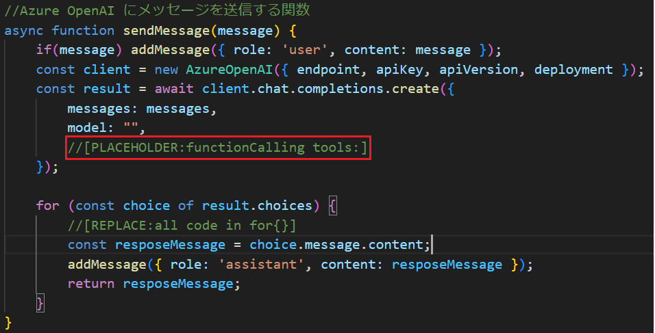

    以下と置き換えます

    ```javascript
        tools: tools,
    ```

    置き換え後は以下のようになります(抜粋)

    ```javascript
    const result = await client.chat.completions.create({
        messages: messages,
        model: "",
        tools: tools, //<-- 置き換えたところ
        tool_choice: "auto",
    });
    ```

    同じく、**sendMessage** 関数内のコメント `//[REPLACE:all code in for{}]` のコメントのある **for 文の中身**を全て、
    
     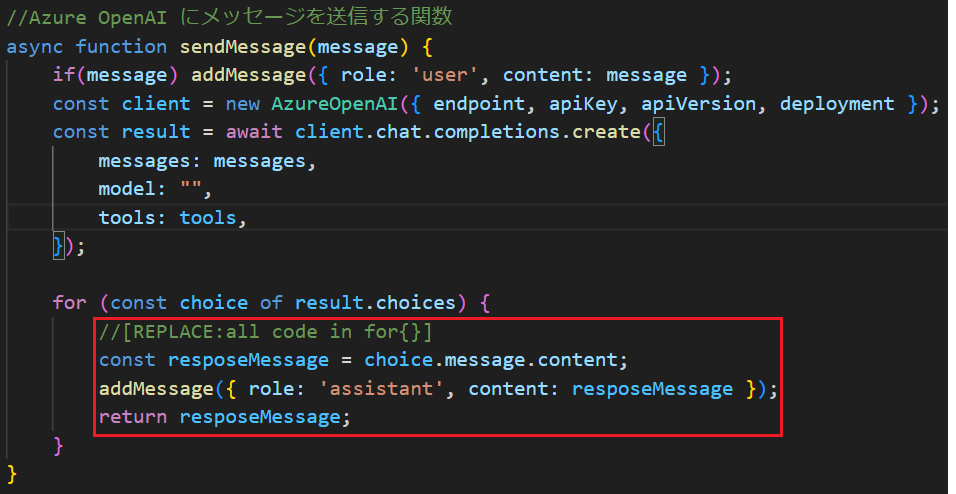

    
    以下のコードに置き換えます

    ```javascript
    if (choice.message.tool_calls) {
        return sendFunctionResult(choice.message);
    }else{
        const resposeMessage = choice.message.content;
        //[REPLACE : Add Web Search function - RECEIVE]
        //--- Start ---
        addMessage({ role: 'assistant', content: resposeMessage });
        //--- End ---
        return resposeMessage;
    }
    ```

    キーボードの \[**Ctrl**\] + \[**S**\] キーを押下して変更を保存します。

    ここまでの手順でコードの追加は完了です。

13. 作成したコードが正しく動作するか確認します
    
    Visual Studio Code のターミナル画面で以下のコマンドを実行してチャットボットアプリを起動します
    
    ```bash
    node consoleBot.js
    ```
    
    ターミナル画面に `Prompt:` が表示されたら、以下のメッセージを入力して \[**Enter**\] キーを押下します
    
    ```
    現在の時刻を教えてください
    ```

    現在の時刻が返ってくることを確認します。

    続いて、以下のメッセージを入力して \[**Enter**\] キーを押下します

    ```
    GitHub アカウント octocat のリポジトリの URL を教えてください
    ```

    octocat のリポジトリの一覧を示す URL がマークダウンのリンク形式で返ってくることを確認します。

    続いて、以下のメッセージを入力して \[**Enter**\] キーを押下します

    ```
    GitHub アカウント octocat から取得できる情報を貼り付け可能なマークダウンの表のタグで出力してください
    ```

    octocat の情報がマークダウンの表形式で返ってくることを確認します。

    確認ができたら、キーボードの \[**Ctrl**\] + \[**C**\] キーを押下してプログラムを終了します。

ここまでの手順で、Azure OpenAI サービスの言語モデルの Function Calling 機能を使用して、アプリケーションの内部、外部問わず任意の関数を呼び出すコンソール アプリケーションが作成できました。

もし、うまくいかない場合は以下のサンプルのコードを使用してみてください。
    
* [**Function Calling の処理を追記した lm.js**](samples/lm_2.js)

>[!CAUTION]
>この演習では言語モデルに関数を生成させて使用しましたが、実際の開発作業においては、生成されたコードをそのまま使用することはせず、必ず生成されたコードをベースに適切なエラーハンドリングやセキュリティの対策に問題がないか確認のうえ、ご自身の責任のもとで使用してください。

<br>

## タスク 3 :  画像生成モデルの利用

[演習 1. 4 : 画像生成モデルのデプロイ](Ex01-4.md) でデプロイした [DALL-E 3](https://learn.microsoft.com/ja-jp/azure/ai-services/openai/concepts/models#dall-e) モデルを使用してプロンプトから画像を生成します。

### 準備

画像生成モデルを使用するための情報を取得します。

具体的な手順は以下のとおりです。

\[**手順**\]

1. [Azure OpenAI Studio](https://platform.openai.com/) にアクセスし、画面左のメニューから \[[**デプロイ**](https://oai.azure.com/resource/deployments/)\] を選択します


2. デプロイしたモデルの一覧が表示されるので、[演習 1. 4 : 画像生成モデルのデプロイ](Ex01-4.md) でデプロイした **dall-e-3** モデルをクリックします

3. プロパティ画面が表示されるので、**デプロイ名**と \[**ターゲット URL**\] をメモ帳などに控えておきます

    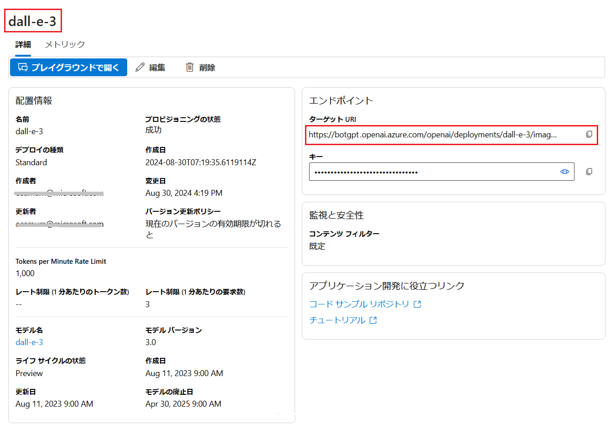

ここまでの手順で必要な情報の取得は完了です。

<br>

### タスク 3-1 : HTTP Client ツールによる呼び出しの確認

Azure OpenAI サービスの言語モデルの関数呼び出しを行う際にやり取りされるデータ構造を確認するために Visual Studio Code の REST Client 拡張を使用してリクエストを送信し、レスポンスを確認します。

手順は以下のとおりです。

1. [演習 3.1-2 : **HTTP Client ツールによる呼び出しの確認**](Ex03-1.md#%E3%82%BF%E3%82%B9%E3%82%AF-2-http-client-%E3%83%84%E3%83%BC%E3%83%AB%E3%81%AB%E3%82%88%E3%82%8B%E5%91%BC%E3%81%B3%E5%87%BA%E3%81%97%E3%81%AE%E7%A2%BA%E8%AA%8D) で作成した **helloML.http** ファイルを開きます

2. ファイルに以下の内容をコピーして貼り付け、変数 `@dalle-endpoint` の値を、このタスクの準備で控えた **ターゲット URL** に置き換えます

    ```http
    ###dall-e-3 モデルによる画像の生成
    @dalle-endpoint = DALL-E 3 モデルのターゲット URL を記述

    POST {{dalle-endpoint}} HTTP/1.1
    Content-Type: application/json
    api-key: {{apiKey}}

    {
        "prompt": "デジタル化された近未来のオフィスのイメージを生成してください",
        "size": "1024x1024", 
        "n": 1,
        "style": "vivid"
    }
    ```
    リクエストで指定しているパラメーターはプロンプト(prompt)と画像のサイズ(size)と枚数(n)と描画スタイル(style)です。なお、dall-e-3 は 1 枚のみの生成に対応しています。

3. ファイルに記述されている POST の上に \[**Send Request**\] と表示されるのでクリックします

    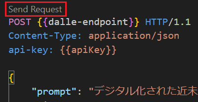

    なお、レスポンスが返るまでに数秒かかる場合があります。

4. リクエストが送信され、レスポンスが返ったら内容に生成された画像への URL が含まれていることを確認します

    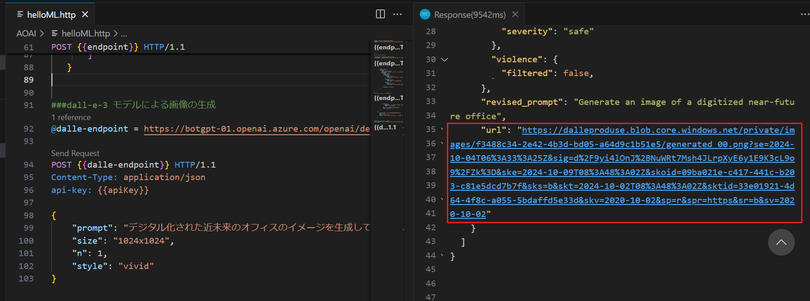

    画像の URL にアクセスして画像が表示されることを確認します。

    

ここまでの手順で Azure OpenAI サービスの DALL-E モデルで画像を生成する際の基本的なデータ構造とそのやり取りを確認しました。

なお、DALL-E モデルの呼び出し方についての詳細は以下のドキュメントをご参照ください。

* [DALL-E モデルを使用する方法を学ぶ](https://learn.microsoft.com/ja-jp/azure/ai-services/openai/how-to/dall-e?tabs=dalle3)

<br>

### タスク 3-2 : チャットボット アプリへの画像生成機能の統合

DALL-E モデルの画像生成機能をチャットボット アプリケーションに統合します。

最初にプロンプトから画像を生成するための関数を作成し、その後、チャットボット アプリケーションに統合します。

具体的な手順は以下のとおりです。

\[**手順**\]

1. [演習 3.1-2](Ex03-1.md#%E3%82%BF%E3%82%B9%E3%82%AF-2-http-client-%E3%83%84%E3%83%BC%E3%83%AB%E3%81%AB%E3%82%88%E3%82%8B%E5%91%BC%E3%81%B3%E5%87%BA%E3%81%97%E3%81%AE%E7%A2%BA%E8%AA%8D)  で作成したフォルダー **devPlayground** を Visual Studio Code で開きます

2. Visual Studio Code の画面左のツリービューから **AOAI** フォルダーを右クリックし、表示されたコンテキストメニューから \[**New File**\] を選択して **imgGen.js** という名前のファイルを作成します
    
    

3.  作成した **imgGen.js** ファイルが編集状態で Visual Studio Code に開かれるので、以下の内容をコピーして貼り付けます

    このコードは必要なライブラリの参照と、この手順で設定した環境変数を読み込む処理を行い、その他、システムメッセージ等の定義を行っています。

    ```javascript
    const { AzureOpenAI } = require("openai");
    const dotenv = require("dotenv");
    dotenv.config();
    const endpoint = process.env["AZURE_OPENAI_ENDPOINT"];
    const apiKey = process.env["AZURE_OPENAI_API_KEY"];
    ```

5. 画像生成モデルにメッセージを送信し、生成された画像の情報を取得する関数を記述します

    以下のコードを **imgGen.js** ファイルに追加し、変数 `deploymentName` には [演習 3.3 : 準備](#%E6%BA%96%E5%82%99) で控えたデプロイメント名を記述します

    ```javascript
    async function ganarateImage(prompt) {
        const size = "1024x1024";
        const n = 1; //生成する画像の枚数　dall-e-3 は 1 枚のみ
        const deploymentName = "ここに dell-e-3 モデルのデプロイメント名を記述";
        const apiVersion = "2024-06-01"; 

        try {
            const client = new AzureOpenAI({endpoint,apiKey,apiVersion,deployment: deploymentName});
            const results = await client.images.generate({
                prompt,
                size: size,
                n: n,
                style: "vivid", // or "natural"
            });

            return results.data[0].url;
        }catch (err){
            return err.message;
        }
    }
    ```

    Azure OpenAI ライブラリが提供する getImages メソッドに必要な引数はプロンプトと生成する画像のサイズ、生成する画像の数(n)、デプロイメント名ですが、このサンプルでは処理を簡単にするためにサイズは 1024x1024、生成する画像の数は 1 としています。

6. 関数が正しく動作するか確認します

    以下のコードを **imgGen.js** ファイルに追加します

    ```javascript
    ganarateImage("賢いイルカのアシスタントを描いてください")
        .then(url => console.log(url))
    ``` 
    キーボードの \[**Ctrl**\] + \[**S**\] キーを押下して保存します。

7. Visual Studio Code のターミナル画面で以下のコマンドを実行して関数が正しく動作するか確認します

    ```bash
    node AOAI/imgGen.js
    ```
    正しく動作すると、生成された画像の URL が表示されるので、その URL にアクセスして画像が表示されることを確認します。

    なお、生成された画像の URL は 24 時間アクティブです。


    正しく動作したら確認用の以下のコードはコメントアウトするか削除します。

    ```javascript
    //ganarateImage("賢いイルカのアシスタントを描いてください")
    //    .then(url => console.log(url))
    ```

    もし、うまくいかない場合は以下のサンプルのコードを使用してみてください。

    * [**画像生成モデルの関数を定義した imgGen.js**](samples/imgGen_0.js)


8. **imgGen.js** 内に記述した関数を外部から呼び出せるように以下のコードをファイルの一番最後に追加します

    ```javascript   
    module.exports = {ganarateImage};
    ```

9. コンソールチャットボット アプリケーションに画像生成モデルを統合します

    **lm.js** ファイルをオープンし、ファイルの上部にあるコメント `//[PLACEHOLDER:require imgGen.js] ` を以下コードと置き換えます

    ```javascript
    const imageGen = require('./imgGen');
    ```

    同ファイルの `const tools = [...]` のコメント `//[REPLACE:generate_image]` を以下の JSON に置き換えます

    ```javascript
    {
        type: 'function',
        function: {
            name: 'generate_image',
            description: '指定されたプロンプトに基づいて画像を生成します',
            parameters: {
                type: 'object',
                properties: {
                    prompt: {
                        type: 'string',
                        description: '生成したい画像の概要を指定します。例: "恰好良いオートバイのイラストを描いてください"'
                    }
                },
                required: ['prompt']
            }
        }
    },
    ```

    同ファイルの関数 `routingFunctions` の定義内にあるコメント `//[REPLACE:generate_image]` を以下のコードに置き換えます

    ```javascript
    case "generate_image":
      console.log("\nAI : 画像を生成しています。この処理には数秒かかる場合があります。");
      return await imageGen.ganarateImage(args.prompt);
    ```

    コードを張り付けて書式が乱れた場合にはキーボートの \[**Shift**] + \[**Alt**\] + \[**F**\] キーを押下して書式を整形し、 \[**Ctrl**\] + \[**S**\] キーを押下して変更を保存します。

    置き換え後のコードは以下のようになります
    
    * `const tools = [...]` の定義箇所

        ```javascript
        // tools スキーマの設定
        const tools = [
            {
                type: 'function',
                function: {
                    name: 'get_GitHubUser_info',
                    description: 'GitHub アカウントの情報を返す',
                    parameters: {
                        type: 'object',
                        properties: {
                            userName: {
                                type: 'string',
                                description: 'GitHub のユーザー名、アカウント名、もしくは ID',
                            }
                        },
                        required: ['userName'],
                    },
                },
            },
            {
                type: 'function',
                function: {
                    name: 'get_current_date_time',
                    description: '現在のシステム時刻を返します。この関数は引数は必要ありません',
                    parameters: {
                        type: 'object',
                        properties: {},
                    },
                },
            },
            //--- ココカラ----
            {
                type: 'function',
                function: {
                    name: 'generate_image',
                    description: '指定されたプロンプトに基づいて画像を生成します',
                    parameters: {
                        type: 'object',
                        properties: {
                            prompt: {
                                type: 'string',
                                description: '生成したい画像の概要を指定します。例: "恰好良いオートバイのイラストを描いてください"'
                            }
                        },
                        required: ['prompt']
                    }
                }
            },
            //--- ココマデ----
        ];
        ```

* `routingFunctions` 関数の定義箇所

    ```javascript
    //実際の関数を呼び出す
    async function routingFunctions(name, args) {
        switch (name) {
            case "get_GitHubUser_info":
               console.log('get_GitHubUser_info');
                return JSON.stringify(await myFunctions.getGitHubUserinfo(args.userName));
            case "get_current_date_time":
                return await myFunctions.getCurrentDatetime();
            //--- ココカラ----
            case "generate_image":
                console.log("\nAI : 画像を生成しています。この処理には数秒かかる場合があります。");
                return await imageGen.ganarateImage(args.prompt);
                //--- ココマデ----
            default:
                return '要求を満たす関数がありませんでした。';
        }
    }
    ```

    キーボードの \[**Ctrl**\] + \[**S**\] キーを押下して変更を保存します。


10. 追加したコードが正しく動作するか確認します
    
    Visual Studio Code のターミナル画面で以下のコマンドを実行してチャットボットアプリを起動します
    
    ```bash
    node consoleBot.js
    ```
    
    ターミナル画面に `Prompt:` が表示されたら、以下のメッセージを入力して \[**Enter**\] キーを押下します
    
    ```
    次の内容で画像を生成してください : 雲の隙間から光の柱が差し込んでいる,空に浮かぶ羽の生えた電脳,電脳には後光がさしている
    ```

    マークダウンのリンク形式で生成された画像の URL が表示されるので
 URL にアクセスして画像が表示されることを確認します。

    確認ができたら、キーボードの \[**Ctrl**\] + \[**C**\] キーを押下してプログラムを終了します。

    もし、うまくいかない場合は以下のサンプルのコードを使用してみてください。

    * [**画像生成モデルの関数を追加した lm.js**](samples/lm_3.js)

ここまでの手順でチャットボット アプリケーションが画像を生成できるようになりました。

なお、画像生成モデルの DALL-E のその他のパラメーターやオプション、仕様については以下のドキュメントをご参照ください。

* [**DALL-E モデルを使用する方法を学ぶ**](https://learn.microsoft.com/ja-jp/azure/ai-services/openai/how-to/dall-e?tabs=dalle3)

* [**Azure OpenAI Service の REST API リファレンス - イメージの生成**](https://learn.microsoft.com/ja-jp/azure/ai-services/openai/reference#image-generation)

<br>

## まとめ

この演習では、Azure OpenAI サービスの GTP モデルが提供している Function Calling 機能を使用して、外部、内部の任意の関数を呼び出す方法を学びました。

この演習では単一の関数を呼び出すだけでしたが、複数の関数を呼び出すことも可能です。

この並列関数呼び出しについては、以下のドキュメントをご参照ください。サンプルコードは Python での記述になりますが、OpenAI の SDK が用意されている他の開発言語であれば、言語モデルに命令してコードを変換させることができるかもしれません。(手直しせずにそのまま使用できるかどうかはわかりませんが)

* [**Azure OpenAI Service (プレビュー) で関数呼び出しを使用する方法**](https://learn.microsoft.com/ja-jp/azure/ai-services/openai/how-to/function-calling)

また、REST API の作成に関しては、Azure LogicApps を使用してノンコーディングで作成する方法についてのハンズオンもありますので適宜お試しください。

* [Azure LogicApps を使用した Web API の作成方法](https://github.com/osamum/HowtomakeWebAPIusingLogicApp)


画像生成モデルの使い方については、このハンズオンでは外部呼出しでの利用方法のみ紹介しましたが、以下に画像生成のためのプロンプト エンジニアリングの手法についてのドキュメントも用意されていますので、ぜひご参照ください。

* [画像プロンプト エンジニアリングの手法](https://learn.microsoft.com/ja-jp/azure/ai-services/openai/concepts/gpt-4-v-prompt-engineering)

* [ChatGPT-Prompt-Sample-Japanese
/DALL-E](https://github.com/dahatake/ChatGPT-Prompt-Sample-Japanese/tree/main/DALL-E)

<br>

## 次へ

👉 [**演習 3. 4 : RAG (Retrieval-Augmented Generation) の実装**](Ex03-4.md)

<br>

<hr>

👈 [**演習 3. 2 : ボット アプリケーションの作成**](Ex03-2.md)

🏚️ [README に戻る](README.md)