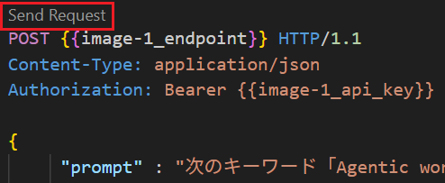
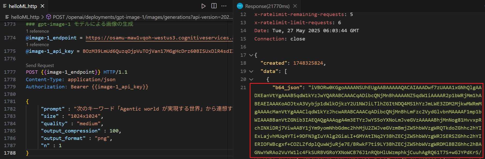
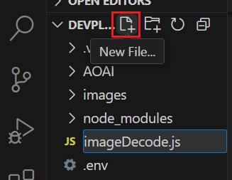
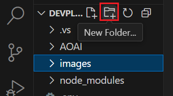
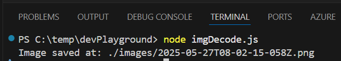
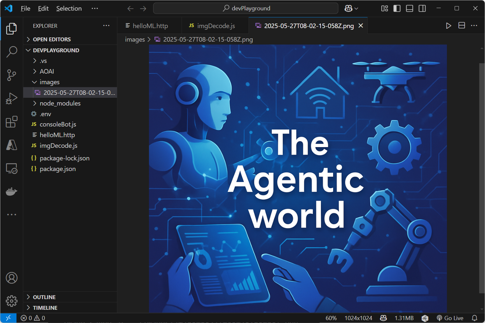

# タスク 3 : GPT-image-1 を使用した画像生成モデルの利用

[演習 1. 4 : 画像生成モデル gpt-image-1 のデプロイ](https://github.com/osamum/AOAI-first-step-for-Developer/blob/prv-image1/Ex01-4_gpt-image.md#%E6%BC%94%E7%BF%92-1-4---%E7%94%BB%E5%83%8F%E7%94%9F%E6%88%90%E3%83%A2%E3%83%87%E3%83%AB-gpt-image-1-%E3%81%AE%E3%83%87%E3%83%97%E3%83%AD%E3%82%A4) でデプロイした gpt-image-1 モデルを使用してプロンプトから画像を生成します。

<br>

## タスク 3-1 : HTTP Client ツールによる呼び出しの確認 (画像の生成)

Azure OpenAI サービスの言語モデルの関数呼び出しを行う際にやり取りされるデータ構造を確認するために Visual Studio Code の REST Client 拡張を使用してリクエストを送信し、レスポンスを確認します。

この演習では、gpt-image-1 モデルを使用してプロンプトから画像を生成するリクエストを送信し、レスポンスとして返される Base64 エンコードされた画像データを確認します。

手順は以下のとおりです。

\[**手順**\]

1. [演習 3.1-2 : **HTTP Client ツールによる呼び出しの確認**](Ex03-1.md#%E3%82%BF%E3%82%B9%E3%82%AF-2-http-client-%E3%83%84%E3%83%BC%E3%83%AB%E3%81%AB%E3%82%88%E3%82%8B%E5%91%BC%E3%81%B3%E5%87%BA%E3%81%97%E3%81%AE%E7%A2%BA%E8%AA%8D) で作成した **helloML.http** ファイルを開きます

2. ファイルに以下の内容をコピーして貼り付け、変数 `@image-1_gen_endpoint` と `@image-1_api_key` の値を、[演習 1. 4 : 画像生成モデル gpt-image-1 のデプロイ](Ex01-4_gpt-image.md#1-gpt-image-1-%E3%83%A2%E3%83%87%E3%83%AB%E3%81%AE%E3%83%87%E3%83%97%E3%83%AD%E3%82%A4) の手順で控えておいた API キーとエンドポイントに置き換えます。

    ```http
    ###gpt-image-1 モデルによる画像の生成
    @image-1_gen_endpoint = メモしておいた gpt-image-1 モデルのエンドポイント URL を記述
    @image-1_api_key = メモしておいた gpt-image-1 モデルの API キーを記述

    POST {{image-1_gen_endpoint }} HTTP/1.1
    Content-Type: application/json
    Authorization: Bearer {{image-1_api_key}}

    {
         "prompt" : "次のキーワード「Agentic world が実現する世界」から連想する画像を生成し、画像の中央に 「The Agentic world」という文字を配置",
        "size" : "1024x1024",
        "quality" : "medium",
        "output_compression" : 100,
        "output_format" : "png",
        "n" : 1
    }
    ```
    リクエストで指定しているパラメーターはプロンプト(prompt)と画像のサイズ(size: 1024x1024,1024x1536,1536x1024)と枚数(n: 1 ～ 10)、品質(quality:low,medium,high)、画像のフォーマット(output_format:PNG,JPEG)、圧縮(output_compression: 0～100)です。

3. ファイルに記述されている POST の上に \[**Send Request**\] と表示されるのでクリックします

    

    レスポンスが返るまでに数十秒かかるので、レスポンスが返るまでしばらく待ちます。

4. レスポンスが返ったら内容に生成された画像のデータが Base64 エンコードされた形式で含まれていることを確認します。

    

ここまでの手順で、gpt-image-1 モデルを呼び出して画像を生成することができました。

Base64 エンコードされた画像データは *.html ファイルでは以下のマークアップで、

```html


```

*.md ファイルでは以下のマークアップで表示できます。

```markdown

```
ここまでの手順で Azure OpenAI サービスの GPT-image-1 モデルで画像を生成する際の基本的なデータ構造とそのやり取りを確認しました。

なお、GPT-image-1 モデルの呼び出し方についての詳細は以下のドキュメントをご参照ください。

* [Azure OpenAI イメージ生成モデルを使用する方法](https://learn.microsoft.com/ja-jp/azure/cognitive-services/openai/concepts/gpt-image-1)


<br>

## タスク 3-2 : Base 64 画像データのデコードと保存

前述したように gpt-image-1 モデルが返す Base64 エンコードされた画像データは、HTML や Markdown ファイルで表示することができますが、実際に画像ファイルとして保存して利用するためには、Base64 エンコードされたデータをデコードして画像ファイルとして保存する必要があります。

このタスクでは Base64 エンコードされた画像データをデコードして画像ファイルとして保存するための関数を作成します。今回作成する関数は、演習用ボット アプリケーションに画像生成機能を統合する際にも使用されます。

具体的な手順は以下のとおりです。

\[**手順**\]

1. [演習 3.1-2](Ex03-1.md#%E3%82%BF%E3%82%B9%E3%82%AF-2-http-client-%E3%83%84%E3%83%BC%E3%83%AB%E3%81%AB%E3%82%88%E3%82%8B%E5%91%BC%E3%81%B3%E5%87%BA%E3%81%97%E3%81%AE%E7%A2%BA%E8%AA%8D)  で作成したフォルダー **devPlayground** を Visual Studio Code で開きます

2. 関数を定義するためのファイルを作成します

    Visual Studio Code の画面左のツリービューからプロジェクトのルートが選択されている状態で \[**New File**\] アイコンをクリックして **imgDecode.js** という名前のファイルを作成します
    
    

3. 記述する関数は言語モデルを使用して作成します

    Visual Studio Code の上部のメニュー \[**View**] - [**Terminal**] をクリックし、画面下部にターミナル画面が表示されるので、以下のコマンドを実行してチャットボット アプリケーションを起動します。

    ```bash
    node consoleBot.js
    ```

    ターミナル画面に `Prompt:` が表示されたら、以下のメッセージを入力して[**Enter**\] キーを押下します

    ```
    引数"base64Data"に渡されたBase 64 エンコードされたデータを png 形式の画像ファイルにデコードして保存し、保存したファイルパスを返り値として返す"saveImage" という名前の関数を Node.js で作成してください。なお、保存に使用するファイル名は現在の日付時刻からユニークなものを作成し、ファイルの保存先は既存のディレクトリ "./images"内になるようにファイル名と文字列結合してください。パスの記述は相対パスで構いません。
    ```

    キーボードの \[**Ctrl**\] + \[**C**\] キーを押下してチャットボットアプリを終了します。
    
    言語モデルが生成した **saveImage** 関数のコードをコピーして、作成した **imgDecode.js** ファイルに貼り付け、キーボードの \[**Ctrl**\] + \[**S**\] キーを押下して保存します。

    言語モデルが生成したコードにはおそらく以下のように `fs` モジュールと `path` モジュールのインポートが含まれているはずなので、

    ```javascript
    const fs = require('fs');
    const path = require('path');
    ```

    Visual Studio Code のコンソール画面で以下のコマンドを実行して、必要なモジュールをインストールします。

    ```bash
    npm install fs path
    ```
    (※) 処理の内容としては `path` モジュールを使用しなくても同様の処理が記述できますが、言語モデルが生成したコードには含まれているので、ここではそのまま使用します。

4. デコードした画像ファイルを保存するためのディレクトリを作成します

    Visual Studio Code の画面左のツリービューからプロジェクトのルートが選択されている状態で \[**New Folder**\] アイコンをクリックして **images** という名前のフォルダーを作成します。

    

5. 作成した **imgDecode.js** ファイルを開き、以下のコードをファイルの最後に追加します。

    ```javascript
    //動作確認用のコード 
    const imageBase64 = '※ここにBase64エンコードされた画像データを貼り付け'; 

    saveImage(imageBase64).then((path) => {
        console.log('Image saved at:', path);
    }).catch((error) => {
        console.error('Error saving image:', error);
    });
    ```

    変数 `imageBase64` には、演習 3-1 で取得した Base64 エンコードされた画像データを貼り付けます。

6. Visual Studio Code のターミナル画面で以下のコマンドを実行して、作成した **imgDecode.js** ファイルを実行します。

    ```bash
    node imgDecode.js
    ```
    正しく実行されると、以下のように画像ファイルが保存されたパスが表示されます。

    

    ファイルのパスをクリックすると保存された画像ファイルが Visual Studio Code のエディターで開くので内容を確認します。

    

    正しく画像が生成されていることを確認できたら、ターミナル画面で \[**Ctrl**\] + \[**C**\] キーを押下して imgDecode.js の実行を終了し、**前の手順で追加した確認用のコードを削除して** imgDecode.js ファイルを保存してください。

7. 作成した **imgDecode.js** ファイルを他のファイルから使用できるようにするために、以下のコードをファイルの先頭に追加します。

    ```javascript
    // 関数をエクスポート
    module.exports = {saveImage};
    ```

ここまでの手順で、Bsase64 エンコードされた画像データをデコードして画像ファイルとして保存する関数を作成し、動作を確認することができました。
    
もし、うまくいかない場合は以下のコードを参考にしてください。

```javascript
const fs = require('fs');

async function saveImage(base64Data) {
  // Base64 データをバイナリデータに変換
  const binaryData = Buffer.from(base64Data, 'base64');
  const fileName = new Date().toISOString().replace(/[:.]/g, '-') + '.png';
  const savePath = './images/' + fileName;

  // バイナリデータを PNG 画像ファイルとして保存
  fs.writeFileSync(savePath, binaryData);
  return savePath;
}

// 関数をエクスポート
// (他のファイルからこの関数を使用できるようにするため)
module.exports = {saveImage};

//動作確認用のコード 
const imageBase64 = ''; // ここにBase64エンコードされた画像データを入力

saveImage(imageBase64).then((path) => {
  console.log('Image saved at:', path);
}).catch((error) => {
  console.error('Error saving image:', error);
});
```

<br>

### タスク 3-3 : HTTP Client ツールによる呼び出しの確認 (画像の編集)

gpt-image-1 モデルはテキストのプロンプトによる画像の生成だけでなく、既存の画像を送信し、編集することもできます。このタスクでは、前の手順で生成した画像を使用して、画像の編集を行うリクエストの内容の確認と、レスポンスされる内容を確認します。

具体的な手順は以下のとおりです。

\[**手順**\]

1. [演習 1. 4 : 画像生成モデル gpt-image-1 のデプロイ](Ex01-4_gpt-image.md#1-gpt-image-1-%E3%83%A2%E3%83%87%E3%83%AB%E3%81%AE%E3%83%87%E3%83%97%E3%83%AD%E3%82%A4) の手順で控えておいたエンドポイントのクエリーストリングの直前のディレクトリ名 `generations`　を `edits` に変更します。
    例えば、以下のように変更します。

    \[変更前\]
    
    https://\<your-resource-name\>.cognitiveservices.azure.com/openai/deployments/gpt-image-1/**generations**?api-version=2025-04-01-preview
    

    \[変更後\]
    
    https://\<your-resource-name\>.cognitiveservices.azure.com/openai/deployments/gpt-image-1/**edits**?api-version=2025-04-01-preview
    

2. [演習 3.1-2 : **HTTP Client ツールによる呼び出しの確認**](Ex03-1.md#%E3%82%BF%E3%82%B9%E3%82%AF-2-http-client-%E3%83%84%E3%83%BC%E3%83%AB%E3%81%AB%E3%82%88%E3%82%8B%E5%91%BC%E3%81%B3%E5%87%BA%E3%81%97%E3%81%AE%E7%A2%BA%E8%AA%8D) で作成した **helloML.http** ファイルを開きます

3. ファイルに以下の内容をコピーして貼り付け、変数 `@image-1_edit_endpoint` の内容を前の手順で変更したエンドポイントに置き換えます。

    ```http
    ### gpt-image-1 モデルによる画像の編集
    @image-1_edit_endpoint = 編集した gpt-image-1 モデルのエンドポイント URL を記述
    @upload_filePath = ./images/画像のファイル名

    POST {{image-1_edit_endpoint}} HTTP/1.1
    Content-Type: multipart/form-data; boundary=boundary
    Authorization: Bearer {{image-1_api_key}}

    --boundary
    Content-Disposition: form-data; name="prompt"

    添付の画像をより写実的にしてください
    --boundary
    Content-Disposition: form-data; name="size"

    1024x1024
    --boundary
    Content-Disposition: form-data; name="n"

    1
    --boundary
    Content-Disposition: form-data; name="quality"

    medium
    --boundary
    Content-Disposition: form-data; name="image"; filename="example.png"
    Content-Type: image/png

    < {{upload_filePath}}
    --boundary--
    ```

4. ファイルに記述されている POST の上に \[**Send Request**\] と表示されるのでクリックします

    

    レスポンスが返るまでに数十秒かかるので、レスポンスが返るまでしばらく待ちます。

4. レスポンスが返ったら、内容に生成された画像のデータが Base64 エンコードされた形式で含まれていることを確認し、エンコード データをコピーします。
   
   前のタスクで作成した **imgDecode.js** ファイルを開き、変数 `imageBase64` の値をコピーした Base64 エンコードされた画像データに書き換えます。

5. Visual Studio Code のターミナル画面で以下のコマンドを実行して、作成した **imgDecode.js** ファイルを実行します。

    ```bash
    node imgDecode.js
    ```

    正しく実行されると、以下のように画像ファイルが保存されたパスが表示されます。

    

    ファイルのパスをクリックすると保存された画像ファイルが Visual Studio Code のエディターで開くので内容を確認します。

    

6. ターミナル画面で \[**Ctrl**\] + \[**C**\] キーを押下して imgDecode.js の実行を終了し、これからの作業での誤動作を防ぐために**前の手順で追加した確認用のコードを削除して**ください。その後、キーボードの \[**ctrl**\] + \[**S**\] を押下して imgDecode.js ファイルを保存してください。

ここまでの手順で、gpt-image-1 モデルを使用して画像の編集を行う際のリクエストとレスポンスの確認ができました。


これらの機能については上記ドキュメントを参照してください。

* [Azure OpenAI イメージ生成モデルを使用する方法 - Image Edit API を呼び出す](https://learn.microsoft.com/ja-jp/azure/ai-services/openai/how-to/dall-e?tabs=gpt-image-1#call-the-image-edit-api)

<br>

## タスク 3-2 : チャットボット アプリへの画像生成機能の統合

GPT-image-1 モデルの画像生成機能をチャットボット アプリケーションに統合します。

最初にプロンプトから画像を生成するための関数を作成し、その後、チャットボット アプリケーションに統合します。

具体的な手順は以下のとおりです。

\[**手順**\]

1. [演習 3.1-2](Ex03-1.md#%E3%82%BF%E3%82%B9%E3%82%AF-2-http-client-%E3%83%84%E3%83%BC%E3%83%AB%E3%81%AB%E3%82%88%E3%82%8B%E5%91%BC%E3%81%B3%E5%87%BA%E3%81%97%E3%81%AE%E7%A2%BA%E8%AA%8D)  で作成したフォルダー **devPlayground** を Visual Studio Code で開きます

2. プロジェクトのルートにある **.env** ファイルを開き、環境変数として以下の内容を追加します。

    ```
    IMAGE_GEN_ENDPOINT=メモしておいた画像生成用の gpt-image-1 モデルのエンドポイント URL を記述
    IMAGE_EDIT_ENDPOINT=メモしておいた画像編集用の gpt-image-1 モデルのエンドポイント URL を記述
    IMAGE_GEN_KEY=メモしておいた gpt-image-1 モデルの API キーを記述
    ```
    キーボードの \[**Ctrl**\] + \[**S**\] キーを押下して保存します。

3. Visual Studio Code の画面左のツリービューから **AOAI** フォルダーを右クリックし、表示されたコンテキストメニューから \[**New File**\] を選択して **imgGen.js** という名前のファイルを作成します
    
    

4.  作成した **imgGen.js** ファイルが編集状態で Visual Studio Code に開かれるので、以下の内容をコピーして貼り付けます

    このコードは必要なライブラリの参照と、この手順で設定した環境変数を読み込む処理を行っています。

    ```javascript
    const { AzureOpenAI } = require("openai");
    const dotenv = require("dotenv");
    dotenv.config();
    const endpoint = process.env["IMAGE_GEN_ENDPOINT"];
    const apiKey = process.env["IMAGE_GEN_KEY"];
    const imageDecode = require('../imgDecode');
    ```

5. 画像生成モデルにメッセージを送信し、生成された画像の情報を取得する関数を記述します

    以下のコードを **imgGen.js** ファイルに追加し、変数 `deploymentName` には [演習 3.3 : 準備](#%E6%BA%96%E5%82%99) で控えたデプロイメント名を記述します

    ```javascript
    //画像生成モデルのサービスを呼び出し、デコードして保存した画像のパスを返す
    async function generateImage(prompt) {
        let result = {};
        try {
            result.filePath = imageDecode.saveImage(await apiCall_generateImage(prompt));
            result.status = 'success';
        }
        catch (err) {
            result.errorMessage = err.message;
            result.status = 'error';
        } finally {
            return JSON.stringify(result);
        }
    }

    //画像生成モデルのサービスを呼び出す
    async function apiCall_generateImage(prompt) {
        const size = '1024x1024';
        const n = 1; //生成する画像の枚数　
        const imageFormat = 'png'; //画像のフォーマット
        const outputCompression = 100; //出力画像の圧縮率
        const apiVersion = '2025-04-01-preview';
        const client = new AzureOpenAI({ endpoint, apiKey, apiVersion }); 
        const results = await client.images.generate({
            prompt: prompt,
            size: size,
            output_compression: outputCompression,
            output_format: imageFormat,
            n: n
        });
        return results.data[0].b64_json;
    }
    ```

6. 関数が正しく動作するか確認します

    以下のコードを **imgGen.js** ファイルに追加します

    ```javascript
    generateImage("優秀な AI アシスタントの画像を日本の有名なアニメスタジオ風に描いてください")
        .then(result => console.log(result))
    ``` 
    キーボードの \[**Ctrl**\] + \[**S**\] キーを押下して保存します。

7. Visual Studio Code のターミナル画面で以下のコマンドを実行して関数が正しく動作するか確認します
   
   なお、この処理は**数十秒かかる**ので、しばらく待つ必要があります。

    ```bash
    node AOAI/imgGen.js
    ```
    正しく動作すると、生成された画像ファイルへのパスを含む JSON が返るので、同ファイルパスを \[ctrl\] キーを押下しながらクリックして画像ファイルを開き、生成された画像を確認します。

    <image src="images/generatedImg_GPTimage-2.png" alt="生成された画像の確認" width="700px">

     正しく動作したら確認用の以下のコードはコメントアウトするか削除します。

    ```javascript
    //generateImage("優秀な AI アシスタントの画像を日本の有名なアニメスタジオ風に描いてください")
    //    .then(result => console.log(result))
    ```

    もし、うまくいかない場合は以下のサンプルのコードを使用してみてください。

    * [**画像生成モデルの関数を定義した imgGen.js**](samples/imgGen_1.js)


8. **imgGen.js** 内に記述した関数を外部から呼び出せるように以下のコードをファイルの一番最後に追加します

    ```javascript   
    module.exports = {generateImage};
    ```
9. コンソールチャットボット アプリケーションに画像生成モデルを統合します

    **lm.js** ファイルをオープンし、ファイルの上部にあるコメント `//[PLACEHOLDER:require imgGen.js] ` を以下コードと置き換えます

    ```javascript
    const imageGen = require('./imgGen');
    ```

    同ファイルの `const tools = [...]` のコメント `//[REPLACE:generate_image]` を以下の JSON に置き換えます

    ```javascript
    {
        type: 'function',
        function: {
            name: 'generate_image',
            description: '指定されたプロンプトに基づいて画像を生成します',
            parameters: {
                type: 'object',
                properties: {
                    prompt: {
                        type: 'string',
                        description: '生成したい画像の概要を指定します。例: "恰好良いオートバイのイラストを描いてください"'
                    }
                },
                required: ['prompt']
            }
        }
    },
    ```

    同ファイルの関数 `routingFunctions` の定義内にあるコメント `//[REPLACE:generate_image]` を以下のコードに置き換えます

    ```javascript
    case "generate_image":
      console.log("\nAI : 画像を生成しています。この処理には数十秒かかりますのでしばらくお待ちください....");
      return await imageGen.generateImage(args.prompt);
    ```

    コードを張り付けて書式が乱れた場合にはキーボートの \[**Shift**] + \[**Alt**\] + \[**F**\] キーを押下して書式を整形し、 \[**Ctrl**\] + \[**S**\] キーを押下して変更を保存します。

    置き換え後のコードは以下のようになります
    
    * `const tools = [...]` の定義箇所

        ```javascript
        // tools スキーマの設定
        const tools = [
            {
                type: 'function',
                function: {
                    name: 'get_GitHubUser_info',
                    description: 'GitHub アカウントの情報を返す',
                    parameters: {
                        type: 'object',
                        properties: {
                            userName: {
                                type: 'string',
                                description: 'GitHub のユーザー名、アカウント名、もしくは ID',
                            }
                        },
                        required: ['userName'],
                    },
                },
            },
            {
                type: 'function',
                function: {
                    name: 'get_current_date_time',
                    description: '現在のシステム時刻を返します。この関数は引数は必要ありません',
                    parameters: {
                        type: 'object',
                        properties: {},
                    },
                },
            },
            //--- ココカラ----
            {
                type: 'function',
                function: {
                    name: 'generate_image',
                    description: '指定されたプロンプトに基づいて画像を生成します',
                    parameters: {
                        type: 'object',
                        properties: {
                            prompt: {
                                type: 'string',
                                description: '生成したい画像の概要を指定します。例: "恰好良いオートバイのイラストを描いてください"'
                            }
                        },
                        required: ['prompt']
                    }
                }
            },
            //--- ココマデ----
        ];
        ```

* `routingFunctions` 関数の定義箇所

    ```javascript
    //実際の関数を呼び出す
    async function routingFunctions(name, args) {
        switch (name) {
            case "get_GitHubUser_info":
               console.log('get_GitHubUser_info');
                return JSON.stringify(await myFunctions.getGitHubUserinfo(args.userName));
            case "get_current_date_time":
                return await myFunctions.getCurrentDatetime();
            //--- ココカラ----
            case "generate_image":
                console.log("\nAI : 画像を生成しています。この処理には数秒かかる場合があります。");
                return await imageGen.generateImage(args.prompt);
            //--- ココマデ----
            default:
                return '要求を満たす関数がありませんでした。';
        }
    }
    ```

    キーボードの \[**Ctrl**\] + \[**S**\] キーを押下して変更を保存します。


10. 追加したコードが正しく動作するか確認します
    
    Visual Studio Code のターミナル画面で以下のコマンドを実行してチャットボットアプリを起動します
    
    ```bash
    node consoleBot.js
    ```
    
    ターミナル画面に `Prompt:` が表示されたら、以下のメッセージを入力して \[**Enter**\] キーを押下します
    
    ```
    次の内容で画像を生成してください : AI をエンジンになぞらえ、それを使用して車やオートバイ、船といったさまざまなものが作られていく,画像の中央に大きく輝く「AI」の文字
    ```

    マークダウンのリンク形式で生成された画像の URL が表示されるので
 URL にアクセスして画像が表示されることを確認します。

    確認ができたら、キーボードの \[**Ctrl**\] + \[**C**\] キーを押下してプログラムを終了します。

    もし、うまくいかない場合は以下のサンプルのコードを使用してみてください。

    * [**画像生成モデルの関数を追加した lm.js**](samples/lm_3.js)

ここまでの手順でチャットボット アプリケーションが画像を生成できるようになりました。


* [**Azure OpenAI イメージ生成モデルを使用する方法**](https://learn.microsoft.com/ja-jp/azure/ai-services/openai/how-to/dall-e?tabs=gpt-image-1)

* [**Azure OpenAI Service の REST API リファレンス - イメージの生成**](https://learn.microsoft.com/ja-jp/azure/ai-services/openai/reference-preview#image-generations---create)


なお、画像生成モデルの DALL-E のその他のパラメーターやオプション、仕様については以下のドキュメントをご参照ください。

> [!NOTE]
> gpt-image-1 モデルは、既存の DALL-E 3 モデルと比較して画像の生成に時間がかかります。そのためチャット ボット アプリケーションに組み込んで使用する際には、ユーザーに画像の生成に時間がかかる旨を伝えるとともに、完了を待つあいだ正常に実行されていることを示すためのアニメーション GIF を表示するなどの工夫をすることをお勧めします。

### 他の開発フレームワークへの移植について

DALL-E 3 モデルの場合、画像の生成が完了すると画像への URL が返されるので、レスポンスされた内容をそのまま言語モデルに送って回答を生成することができます。しかし、gpt-image-1 モデルの場合は画像のデータが Base64 エンコードされた形式で返されます。Base64 エンコードされた画像データは、大量のテキストで構成されているため言語モデルが処理できるトークン数を超えてしまい処理できません。そのため、画像の生成が完了した後に、画像のデータをデコードして画像ファイルとして保存し、そのファイルへのパスや URL を使用する必要があります。

この「画像をなんらかのストレージに保存してアクセス可能なパスあるいは URL を返す」という処理はアプリケーションが動作する環境によって個別に実装する必要があります。例えばこの演習用ボット アプリケーションのようなコマンドライン アプリケーションやデスクトップアプリケーションでは、ローカルのファイルシステムに画像を保存することができます。一方で、Web アプリケーションやモバイルアプリケーションでは、クラウド ストレージや CDN などに画像を保存し、アクセス可能な URL を返す必要があります。

この演習で作成した gpt-image-1 モデル使用した画像生成機能を Web で動作するアプリケーションに移植する際には、./imgDecode.js ファイルの saveImage 関数の内容を変更して、画像をクラウド ストレージや CDN に保存するように実装してください。

<br>

## まとめ

[☜ 元のページの**まとめ**に戻る ](Ex03-3.md#%E3%81%BE%E3%81%A8%E3%82%81)