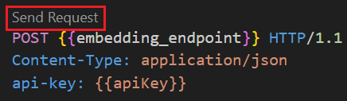
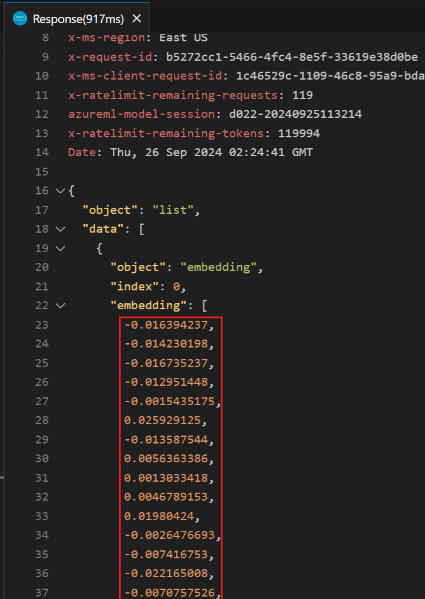
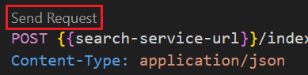
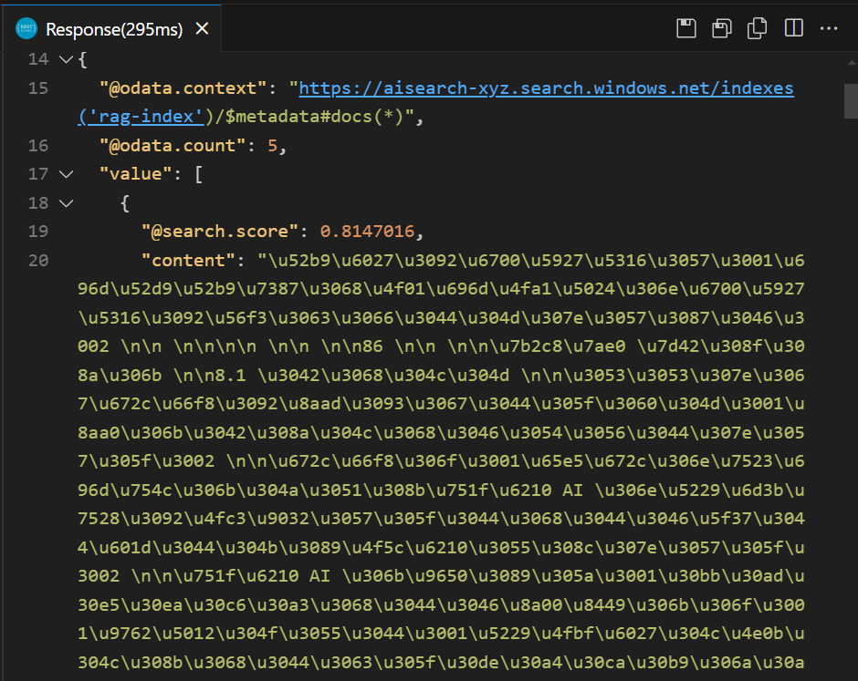
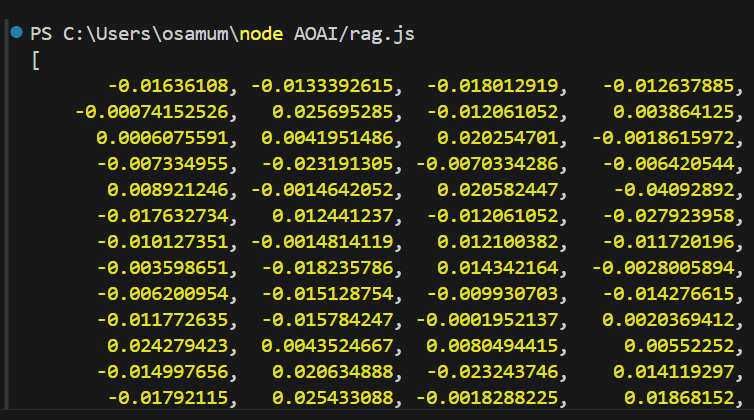
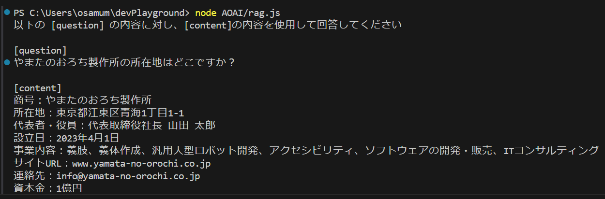
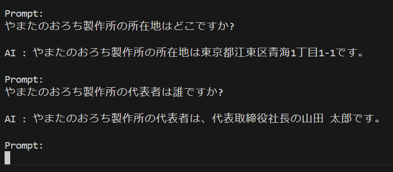

# 演習 3. 4 : RAG (Retrieval-Augmented Generation) の実装

取得拡張生成(RAG : Retrieval-Augmented Generation) は、言語モデルに情報検索機能を組み込むことで、独自のデータを追加し知識を拡張する方法です。

仕組みとしては、ユーザーからのメッセージを直接言語モデルに送るのではなく、その前処理として検索サービスを使用して関連する情報を検索します。関連する情報が見つかった場合には、ユーザーからの問い合わせに対し、検索結果をもとに回答を生成するように言語モデルに指示します。


検索結果にユーザーかの問い合わせに関する情報が見つからなかった場合には、言語モデルに直接問い合わせを送り、回答を生成します。


なお、検索サービスはユーザーからのメッセージをそのまま検索に使用できる「自然言語検索」が可能なものでないと検索の前に複雑な処理が必要になるので注意が必要です。

### 検索方式について

データの検索方法は従来のキーワード検索、フルテキスト検索、ルールベース検索等々、さまざまな方式がありますがこの演習では Azure AI Search を使用してベクトル検索を行います。

ベクトル検索は、データを多次元のベクトル空間に埋め込んでベクトル間の距離を計算することで、データの類似性を判定する方式です。たとえば、猫と犬を埋め込むと、猫と犬が近くに存在していたり、他の何かが遠くに存在していたりというのをベクトル空間上で表現できます。

データのベクトル化には AI の埋め込み(エンベディング)モデルを使用することが一般的です。埋め込みモデルは、自然言語処理、画像処理、音声処理等々、様々な分野で使用されている AI モデルで、データをベクトルに変換する機能を持っています。

この演習では[演習 1 のタスク 3](Ex01.md#%E3%82%BF%E3%82%B9%E3%82%AF-3--%E5%9F%8B%E3%82%81%E8%BE%BC%E3%81%BF%E3%83%A2%E3%83%87%E3%83%AB%E3%81%AE%E3%83%87%E3%83%97%E3%83%AD%E3%82%A4) でデプロイ text-embedding-ada-002 モデルを使用して、ベクトル化を行います。


### 演習の内容

この演習では、ベクトル検索を可能にするまでの手順を簡略化するためにRAG の検索サービスとして演習 2 のタスク 3 : 独自データの追加で作成した Azure AI Search サービスのインスタンスと自動生成されたインデックスを使用します。 

[Azure AI Search](https://learn.microsoft.com/ja-jp/azure/search/search-what-is-azure-search) は検索用の [REST API](https://learn.microsoft.com/ja-jp/rest/api/searchservice/) を提供しておりアプリケーションのコードからさまざなま形式のセマンティック検索を行うことができます。

### 準備 1 : Azure AI Search インスタンスの情報取得 

作成済の Azure AI Search インスタンスから API を利用するために必要な以下の情報を取得します。

* エンドポイント
* API キー
* インデックス名

具体的な手順は以下のとおりです。

\[**手順**\]

1. Azure ポータルで、演習 2 のタスク 3 準備 2 で作成した Azure AI Search サービス インタンスのプロパティ画面を開きます

2. \[**概要**\] 画面が表示されていることを確認し、インスタンス名と \[**URL**\] の値をコピーしてメモ帳等に保存します

    

3. 画面左の \[**キー**\] メニューをクリックしると、\[**API アクセス制御**\] 画面が表示されるので **管理者キーの管理** の \[**プライマリ管理者 キー**\] の値をコピーしてメモ帳等に保存します

    

4. 画面左の \[**インデックス**\] メニューをクリックし、インデックスの一覧が表示されるので、作成済のインデックス名をコピーしてメモ帳等に保存します

    

ここまでの手順て Azure AI Search の API を使用するために必要な情報を取得しました。

### 準備 2 : 埋め込み(エンベディング)モデルの情報取得

ベクトル検索を行うためには、ユーザーが検索に使用する問い合わせメッセージをベクトル化する必要があります。これは検索エンジンがメッセージのベクトル データとインデックス内のベクトル データを比較し距離(Cosine 類似度)を測る必要があるためです。

そのため、問い合わせメッセージのベクトル化に使用する埋め込みモデルは Azure AI Serch がベクトル インデックスを作成する際に使用したモデルと同じモデルを使用する必要があります。

今回は演習 2 のタスク 3 で独自のデータを追加する際に埋め込みモデル text-embedding-ada-002 を使用しているので、同じモデルを使用します。

同モデルの以下の情報を取得しておきます。

* デプロイメント名
* エンドポイント
* API キー


具体的な手順は以下のとおりです。

\[**手順**\]

1. [**Azure OpenAI Studio**](https://oai.azure.com/resource/overview) にアクセスし、画面左上の \[**現在のリソース**\] ドロップダウンボックスでこのハンズオンで使用しているリソースが選択されていることを確認します

    

2. デプロイ済のモデルの一覧が表示されるので、演習 2 タスク 3 でデプロイした埋め込みモデルの名前をクリックします

    

3. 選択したモデルのプロパティ画面に遷移し、\[**詳細**\] タブがアクティブなった状態で表示されるのでデプロイ名と \[**ターゲット URL**\] と \[**キー**\] の値をコピーしてメモ帳等に保存します 

    

ここまでの手順で埋め込みモデルの API を使用するために必要な情報を取得しました。

<br>

### タスク 4-1 : HTTP Client ツールによる問い合わせメッセージのベクトル化とベクトル検索

Azure OpenAI サービスの埋め込みモデルと、Azure AI Search の API 呼び出しを行う際にやり取りされるデータを確認するために Visual Studio Code の REST Client 拡張を使用してリクエストを送信し、レスポンスを確認します。

まず最初に問い合わせメッセージを埋め込みモデルを使用してベクトル化し、そのベクトルを Azure AI Search に送信して検索を行います。

具体的な手順は以下のとおりです。

\[**手順**\]

1. 埋め込みモデルに問い合わせメッセージのテキストを送信してベクトルデータを取得します。
    
    この演習のタスク 1 の [**HTTP Client ツールによる呼び出しの確認**](#http-client-%E3%83%84%E3%83%BC%E3%83%AB%E3%81%AB%E3%82%88%E3%82%8B%E5%91%BC%E3%81%B3%E5%87%BA%E3%81%97%E3%81%AE%E7%A2%BA%E8%AA%8D) で作成した **helloML.http** ファイルを開きます

2. ファイルに以下の内容をコピーして貼り付け、`@embedding_endpoint` に前の手順でメモしておいた埋め込みモデルのエンドポイントを記述します

    ```http
    ### 問い合わせメッセージをベクトル化
    @embedding_endpoint=埋め込みモデルのエンドポイントを記述

    POST {{embedding_endpoint}} HTTP/1.1
    Content-Type: application/json
    api-key: {{apiKey}}

    {"input": "やまたのおろち製作所の所在地はどこですか?"}
    ```
    (※) api-key は言語モデルと同じもので大丈夫です

3. ファイルに記述されている **POST** の上に \[**Send Request**\] と表示されるのでクリックします

    

4. レスポンスされたデータ内の `"embedding` の配列の値をコピーしてメモ帳等に保存します

    

    ここまでの手順で問い合わせメッセージをベクトル化し、ベクトルデータを取得することがでました。

5. 取得したベクトルデータを使用して Azure AI Search ベクトル検索を行います

    **helloML.http** ファイルに以下の内容を追加し、コメントの内容にしたがい、これまでの手順でメモしておいた Azure AI Search のエンドポイント、インデックス名、管理者キーを記述します。また送信する JSON の `vectorQueries/[vector]` に前の手順でメモしておいたベクトルデータを貼り付けます

    ```http
    ### Azure AI Search でベクトル検索を実行
    @search-service-url=Azure AI Search のエンドポイントを記述
    @index-name=インデックス名を記述
    @admin-apiKey=Azure AI Search の管理者キーを記述

    POST {{search-service-url}}/indexes/{{index-name}}/docs/search?api-version=2024-07-01
    Content-Type: application/json
    api-key: {{admin-apiKey}}

    {
        "count": true,
        "select": "title,content,url",
        "vectorQueries": [
            {
                "kind": "vector",
                "vector": [
                    // ここにベクトルデータを貼り付け
                ],
                "exhaustive": true,
                "fields": "contentVector",
                "weight": 0.5,
                "k": 5
            }
        ]
    }
    ```

6. ファイルに記述されている **POST** の上に \[**Send Request**\] と表示されるのでクリックします

    

8. 検索結果で変えることを確認します

    

ここまでの手順で問い合わせメッセージをベクトル化し、そのベクトルデータを Azure AI Search に送信して検索を行うことができました。

なお、Azure AI Search のベクトル検索、検索の際のパラメーターなど、ベクトルクエリの詳細な作成方法については以下のドキュメントをご参照ください。

* [**Azure AI Search のベクトル**](https://learn.microsoft.com/ja-jp/azure/search/vector-search-overview)

* [**Azure AI Search でベクトル クエリを作成する**](https://learn.microsoft.com/ja-jp/azure/search/vector-search-how-to-query?tabs=query-2024-07-01%2Cbuiltin-portal)

<br>

### タスク 4-2 : チャットボット アプリに RAG の機能を追加


Azure OpenAI 埋め込みモデルと Azure AI Search のベクトル検索を使用してタスク 2 で作成した[チャットボット アプリケーション](#%E3%82%BF%E3%82%B9%E3%82%AF-2-2-azure-openai-%E3%83%A9%E3%82%A4%E3%83%96%E3%83%A9%E3%83%AA%E3%82%92%E5%88%A9%E7%94%A8%E3%81%97%E3%81%9F%E8%A8%80%E8%AA%9E%E3%83%A2%E3%83%87%E3%83%AB%E3%81%B8%E3%81%AE%E3%83%A1%E3%83%83%E3%82%BB%E3%83%BC%E3%82%B8%E3%81%AE%E9%80%81%E4%BF%A1)に RAG の機能を追加します。


具体的な手順は以下のとおりです。

\[**手順**\]

1. [タスク 1-2 で作成した](#%E3%82%BF%E3%82%B9%E3%82%AF-1-2-http-client-%E3%83%84%E3%83%BC%E3%83%AB%E3%81%AB%E3%82%88%E3%82%8B%E5%91%BC%E3%81%B3%E5%87%BA%E3%81%97%E3%81%AE%E7%A2%BA%E8%AA%8D) フォルダー **devPlayground** を Visual Studio Code で開きます

2. はじめにボットアプリケーションから呼び出される関数を定義するためのファイルを作成します

    Visual Studio Code の画面左のツリービューから **AOAI** フォルダーを右クリックし、表示されたコンテキストメニューから \[**New File**\] を選択して **rag.js** という名前のファイルを作成します
    
    

3. 作成した **rag.js** ファイルが編集状態で Visual Studio Code に開かれるので、以下の内容をコピーして貼り付けます

    このコードは必要なライブラリの参照と、これまでに手順で設定した環境変数を読み込む処理を行行っています。

    なお、変数 `deploymentName` の値はメモしておいた埋め込みモデルのデプロイメント名に置き換えてください。

    ```javascript
    const { AzureOpenAI } = require("openai");
    //[PLACEHOLDER:require @azure/search-documents]

    const dotenv = require("dotenv");
    dotenv.config();

    const embedding_endpoint = process.env["AZURE_OPENAI_ENDPOINT"];
    const embedding_apiKey = process.env["AZURE_OPENAI_API_KEY"];
    const embedding_deployment = "text-embedding-ada-002";
    const apiVersion = "2024-06-01"; 

    //[PLACEHOLDER: load AI search valiables]
    ```
4. 続けて以下のコードを貼り付けます

    このコードは埋め込みモデルのクライアントのインスタンスを生成するもので、その下の関数 `getEmbedding` は引数として渡されたテクストを埋め込みモデルに送信してベクトルデータを取得し返り値として返す関数です。

    ```javascript
    //埋め込みモデルのクライアントを作成
    const embeddingClient = new AzureOpenAI({embedding_endpoint,embedding_apiKey,apiVersion,deployment: embedding_deployment});
    //[PLACEHOLDER: new searchClient]

    //テキストをベクトルデータに変換する関数
    async function getEmbedding(text) {
        const embeddings = await embeddingClient.embeddings.create({ input: text, model: ''});
        return embeddings.data[0].embedding;
    }
    ```
5. 続けて結果を確認するための以下のコードを貼り付けます。

    ```JavaScript
    //[DELETE: after embedding test]
    getEmbedding('やまたのおろち製作所の所在地はどこですか？')
        .then(embedding => console.log(embedding));

    ```
    このコードは getEmbedding 関数を呼び出し、その結果をコンソールに出力するためだけのコードです。正常動作が確認できたら削除するかコメントアウトしてください。

    キーボードの \[**Ctrl**\] + \[**S**\] キーを押下して変更を保存します

6. **rag.js** に記述したコードが正しく動作するか、実行して確認します

    Visual Studio Code のターミナル画面で以下のコマンドを実行し、Azure OpenAI の埋め込みモデルからベクトルデータが返ることを確認します。

    ```bash
    node AOAI/rag.js
    ```
    

7. 正しく実行されることが確認されたら結果を確認するためのコードはコメントアウトするか削除します

    ```javascript
    //[DELETE: after embedding test]
    //getEmbedding('やまたのおろち製作所の所在地はどこですか？')
    //    .then(embedding => console.log(embedding));
    ```

    キーボードの \[**Ctrl**\] + \[**S**\] キーを押下して変更を保存します

8. Azure AI Search API を使用するための準備をします

    Visual Studio Code のターミナル画面で以下のコマンドを実行して、Azure AI Search のライブラリをインストールします

    ```bash
    npm install @azure/search-documents
    ```

9. **.env** ファイルを開き、以下の 2 つの設定を追加します

    変数それぞれにこれまでの手順でメモしておいた Azure AI Search のエンドポイントと管理者キーを設定してください。

    ```text
    SEARCH_ENDPOINT=Azure AI Search のエンドポイントを記述
    SEARCH_API_KEY=Azure AI Search の管理者キーを記述
    ```
    キーボードの \[**Ctrl**\] + \[**S**\] キーを押下して変更を保存します

10. ファイル **rag.js** を開き、上部のコメント `//[PLACEHOLDER:require @azure/search-documents]` を以下のコードに置き換えます

    ```javascript
    const { SearchClient, AzureKeyCredential } = require("@azure/search-documents");
    ```

    同様にコメント、`//[PLACEHOLDER: load AI search valiables]` を以下のコードに置き換えます。変数 `search_indexName` にはメモしておいた Azure AI Search のインデックス名を記述します

    ```javascript
    const search_endpoint = process.env["SEARCH_ENDPOINT"];
    const search_apiKey = process.env["SEARCH_API_KEY"];
    const search_indexName = 'ここにインデックス名を記述';

    //Azure AI Search のクライアントを作成
    const searchClient = new SearchClient(search_endpoint, search_indexName, new AzureKeyCredential(search_apiKey));
    ```
11. 次に以下のコードを追加します

    `findIndex` 関数はユーザーからの問い合わせメッセージを受け取り、そのメッセージを Azure AI Search で検索し、検索結果がスコア 8 以上の場合は、検索結果を付加して言語モデルに回答の生成を依頼するメッセージを返します。スコアが 8 未満の場合は、問い合わせメッセージをそのまま返します。

    `searchWithVectorQuery` 関数はベクトル化された問い合わせメッセージを Azure AI Search に送信して検索を行い、最も近いベクトルを持つドキュメントを返します。

    ```javascript
    //問い合わせメッセージを受け取って検索を実行す
    async function findIndex(queryText) {
        const embedding = await getEmbedding(queryText);
        const result = await searchWithVectorQuery(embedding, queryText);

        //スコアが 8 以上の場合は、検索結果を付加して言語モデルに回答の生成を依頼するメッセージを返す
        if (result.score >= 8) {
            return `以下の [question] の内容に対し、[content]の内容を使用して回答してください\n\n[question]\n${queryText}\n\n[content]\n${result.document.content}`
        } else {
            return queryText;
        }    
    }

    // ベクトル化されたクエリを使用して検索を実行
    async function searchWithVectorQuery(vectorQuery, queryText) {
        const searchResults = await searchClient.search(queryText, {
            vector: {
                fields: ["contentVector"],
                kNearestNeighborsCount: 3,
                value: vectorQuery,
            },
        });
        for await (const result of searchResults.results) {
            // クエリベクトルに最も近いものを返す
            return result;
        }
    }
    ```
12. 続けて結果を確認するための以下のコードを貼り付けます。

    ```javascript
    //[DELETE: after search test]
    findIndex('やまたのおろち製作所の所在地はどこですか？')
        .then(result => console.log(result));
    ```

    キーボードの \[**Ctrl**\] + \[**S**\] キーを押下して変更を保存します

13. **rag.js** に記述したコードが正しく動作するか、実行して確認します
    
    Visual Studio Code のターミナル画面で以下のコマンドを実行し、Azure AI Search のベクトル検索の結果が返ることを確認します。    

    ```bash
    node AOAI/rag.js
    ```
    

    また質問内容を以下のように変更すると、問い合わせメッセージがそのまま返されることを確認します。

    ```text
    秋葉原の名物はなんですか?
    ```

    キーボードの \[**Ctrl**\] + \[**C**\] キーを押下してプログラムを終了します。

14. **rag.js** のコードが正しく動作することが確認できたら、検証用の以下のコードを削除するかコメントアウトします。

     ```javascript
    //[DELETE: after search test]
    //findIndex('やまたのおろち製作所の所在地はどこですか？')
        //.then(result => console.log(result));
    ```
    キーボードの \[**Ctrl**\] + \[**S**\] キーを押下して変更を保存します

15.  ファイル **rag.js** 内に記述した関数を外部から呼び出せるように以下のコードをファイルの一番最後に追加します

    ```javascript
    module.exports = { findIndex };
    ```

    キーボードの \[**Ctrl**\] + \[**S**\] キーを押下して変更を保存します。

16. 作成した **rag.js** ファイルの機能を使用してチャットボット アプリケーションに RAG の機能を実装します

    Visual Studio Code の画面左のツリービューから **consoleBot.js** ファイルを開き、ファイル上部のコメント `//[PLACEHOLDER:require rag.js]` を以下のコードに置き換えます

    ```javascript
    const rag = require('./AOAI/rag.js')
    ```

    続けてコメント `//[REPLACE: RAG Integration]` とその下のコードを以下のコードに置き換えます

    ```javascript
    console.log(`\nAI : ${await lm.sendMessage(await rag.findIndex(data.trim()))}`);
    ```
    キーボードの \[**Ctrl**\] + \[**S**\] キーを押下して変更を保存します

17. チャットボット アプリケーションを起動して、RAG の機能が正しく動作することを確認します

    Visual Studio Code のターミナル画面で以下のコマンドを実行します

    ```bash
    node consoleBot.js
    ```

    チャットボット アプリケーションが起動したら、挨拶や `現在の時刻を教えてください` 等、従来の機能を以下のように質問を入力して RAG の機能が正しく動作することを確認します

    ```text
    やまたのおろち製作所の所在地はどこですか?
    ```

    

    キーボードの \[**Ctrl**\] + \[**C**\] キーを押下してプログラムを終了します。

ここまでの手順で、Azure OpenAI サービスの埋め込みモデルと Azure AI Search のベクトル検索を使用して RAG の機能をチャットボット アプリケーションに追加することができました。

<hr>

👉 [**演習 3. 5 : 言語モデルの応答をに JSON を指定する**](Ex03-5.md)

👈 [**演習 3. 3 : Function Calling 機能を使用した任意の関数の実行** ](Ex03-3.md)

🏚️ [README に戻る](README.md)
