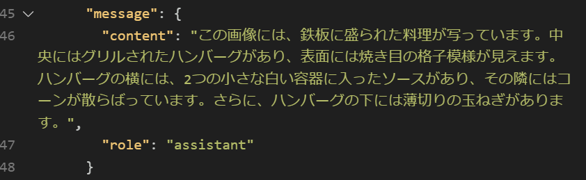
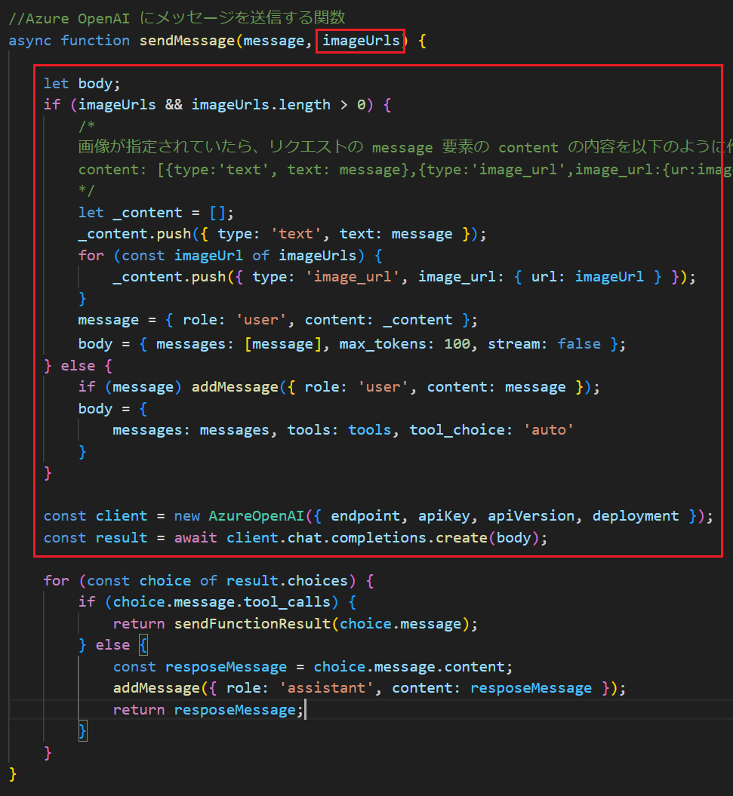
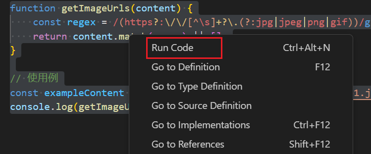
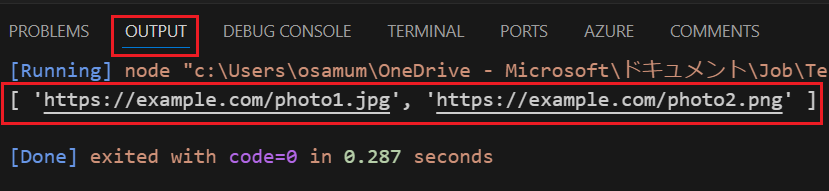
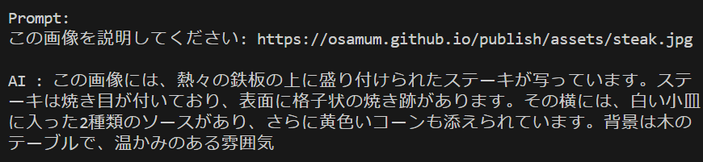
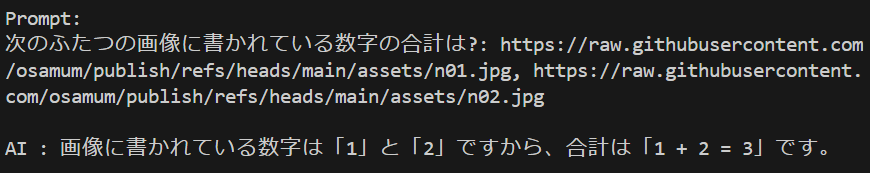

# 演習 3. 5 : 画像認識機能の追加

Azure OpenAI サービスが提供する [GPT-4o、GPT-4o mini、GPT-4 Turbo](https://learn.microsoft.com/ja-jp/azure/ai-services/openai/concepts/models?tabs=python-secure#gpt-4o-and-gpt-4-turbo) モデルはテキストと画像の両方を入力として受け入れることができるマルチモーダル バージョンを備えています。

具体的には、一回のリクエストにつき、20 MB 以下の画像を最大 10 枚まで認識し、その画像に関連するテキストを生成することができます。

この機能を使用して、画像を入力として受け取り、その画像に関連するテキストを生成するモデルを構築します。

この演習の内容は、ここまでの演習で準備したリソースを実施可能ですのでとくに追加の準備は必要ありません。

この演習で行う作業は以下の通りです。

* [タスク 1 : HTTP Client ツールによる呼び出しの確認(画像認識)](#%E3%82%BF%E3%82%B9%E3%82%AF-1---http-client-%E3%83%84%E3%83%BC%E3%83%AB%E3%81%AB%E3%82%88%E3%82%8B%E5%91%BC%E3%81%B3%E5%87%BA%E3%81%97%E3%81%AE%E7%A2%BA%E8%AA%8D%E7%94%BB%E5%83%8F%E8%AA%8D%E8%AD%98)
* [タスク 2 : チャットボット アプリへの画像認識機能の統合](#%E3%82%BF%E3%82%B9%E3%82%AF-2---%E3%83%81%E3%83%A3%E3%83%83%E3%83%88%E3%83%9C%E3%83%83%E3%83%88-%E3%82%A2%E3%83%97%E3%83%AA%E3%81%B8%E3%81%AE%E7%94%BB%E5%83%8F%E8%AA%8D%E8%AD%98%E6%A9%9F%E8%83%BD%E3%81%AE%E7%B5%B1%E5%90%88)
    * [2-1 : AOAI/lm.js の sendMessage 関数の変更](Ex03-op-1.md#%E3%82%BF%E3%82%B9%E3%82%AF-2-1--aoailmjs-%E3%81%AE-sendmessage-%E9%96%A2%E6%95%B0%E3%81%AE%E5%A4%89%E6%9B%B4)
    * [2-2 : consoleBot.js の変更](#%E3%82%BF%E3%82%B9%E3%82%AF-2-2--consolebotjs-%E3%81%AE%E5%A4%89%E6%9B%B4)

<br>

## タスク 1 :  HTTP Client ツールによる呼び出しの確認(画像認識)

Azure OpenAI サービスの言語モデルで画像認識を行う際にやり取りされるデータ構造を確認するために Visual Studio Code の REST Client 拡張を使用してリクエストを送信し、レスポンスを確認します。

手順は以下のとおりです。

[**手順**]

1. [演習 3.1-2 : **HTTP Client ツールによる呼び出しの確認**](Ex03-1.md#%E3%82%BF%E3%82%B9%E3%82%AF-2-http-client-%E3%83%84%E3%83%BC%E3%83%AB%E3%81%AB%E3%82%88%E3%82%8B%E5%91%BC%E3%81%B3%E5%87%BA%E3%81%97%E3%81%AE%E7%A2%BA%E8%AA%8D) で作成した **helloML.http** ファイルを開きます

2. ファイルに以下の内容をコピーして貼り付けます

    ```http
    ### GTP-4 モデルによる画像認識

    POST {{endpoint}} HTTP/1.1
    Content-Type: application/json
    api-key: {{apiKey}}

    {
        "messages": [
            {
                "role":"user",
                "content":[
                    {
	                    "type": "text",
	                    "text": "この画像を説明してください:"
	                },
	                {
	                    "type": "image_url",
	                    "image_url": {
                        "url": "https://osamum.github.io/publish/assets/steak.jpg"
                        }
                    } 
            ] 
            }
        ],
        "max_tokens": 100, 
        "stream": false 
    }
    ```

    認識させる画像は以下です。

    

3. ファイルに記述されている **POST** の上に \[**Send Request**\] と表示されるのでクリックします

    

    なお、レスポンスが返るまでに数秒かかる場合があります。

4. レスポンスが返ったら choices/message/content の中身を確認します

    

    画像の内容を説明するメッセージが生成されていることを確認します。

ここまでの手順で Azure OpenAI サービスの言語モデルで画像を認識させる際の基本的なデータ構造とそのやり取りを確認しました。

GPT-4 モデルの画像認識機能は、複数枚数の画像の指定や以下のような Base 64 エンコードされた画像データの入力もサポートしています。

```
"type": "image_url",
"image_url": {
   "url": "data:image/jpeg;base64,<your_image_data>"
}
```

この機能を利用すると、ローカルファイルの画像もリクエストに含めることができます。

詳細については以下のドキュメントをご参照ください。

* [クイックスタート: AI チャットで画像を使用する](https://learn.microsoft.com/ja-jp/azure/ai-services/openai/gpt-v-quickstart?tabs=image%2Ccommand-line%2Ctypescript&pivots=rest-api)

* [GPT-4 Turbo with Vision を使用する](https://learn.microsoft.com/ja-jp/azure/ai-services/openai/how-to/gpt-with-vision)

<br>

## タスク 2 :  チャットボット アプリへの画像認識機能の統合

画像認識機能をチャットボット アプリケーションに統合します。

作業内容としては以下の 2 点です。

* consoleBot.js での作業
    
    - ユーザーのメッセージに含まれる画像ファイルへの URL を配列として取り出す

* AOAI/lm.js での作業

    - 言語モデルにメッセージを送信する sendMessage 関数に画像の URL 配列を受け取るための引数を追加
    - URL 配列の引数が空でなければ、画像認識用のスキーマを生成

### タスク 2-1 : AOAI/lm.js の sendMessage 関数の変更

作業効率化の都合上、**AOAI/lm.js** 側の作業から行います。

具体的な手順は以下の通りです。

\[**手順**\]

1. [演習 3.1-2](Ex03-1.md#%E3%82%BF%E3%82%B9%E3%82%AF-2-http-client-%E3%83%84%E3%83%BC%E3%83%AB%E3%81%AB%E3%82%88%E3%82%8B%E5%91%BC%E3%81%B3%E5%87%BA%E3%81%97%E3%81%AE%E7%A2%BA%E8%AA%8D)  で作成したフォルダー **devPlayground** を Visual Studio Code で開きます

2. **AOAI/lm.js** を開き、**sendMessage** 関数の引数に以下のように **imageUrls** 引数を追加します

    ```javascript
    //Azure OpenAI にメッセージを送信する関数
    async function sendMessage(message, imageUrls) {
    ```

3. 同関数の関数名の下の行から、以下のコードの手前(1 行うえ) まで行のコードを、

    ```javascript
    for (const choice of result.choices) {
    ```

    以下のコードに置き換えます

    ```javascript
    let body;
    if (imageUrls && imageUrls.length > 0) {
        /*
        画像が指定されていたら、リクエストの message 要素の content の内容を以下のように作成
        content: [{type:'text', text: message},{type:'image_url',image_url:{ur:imageUrl}},{複数画像の場合}] };
        */
        let _content = [];
        _content.push({ type: 'text', text: message });
        for (const imageUrl of imageUrls) {
            //トークンの消費量を抑えたい場合は detail プロパティを 'auto' から 'low' に変更
            _content.push({ type: 'image_url', image_url: { url: imageUrl, detail: 'auto' } });
        }
        message = { role: 'user', content: _content };
        body = { messages: [message], max_tokens: 100, stream: false };
    } else {
        //[REPLACE : Add Web Search function - SEND]
        //--- Start ---
        if (message) addMessage({ role: 'user', content: message });
        body = {
            messages: messages, tools: tools, tool_choice: 'auto'
        }
        //--- End ---
    }

    const client = new AzureOpenAI({ endpoint, apiKey, apiVersion, deployment });
    const result = await client.chat.completions.create(body);
    ```
  
    この作業で変更された **sendMessage** 関数内のコードは以下の赤枠の部分です。

    

    変更が完了したキーボードの \[**crtl**\] + \[**S**\] キーを押下して保存します。

ここのまでの手順で、画像認識機能を利用するためのスキーマを生成する処理を AOAI/lm.js に追加しました。

>[!NOTE]
>GTP-4 モデルが一回の会話で処理できる画像の最大数は 10 枚ですが、このコードでは演習用としてコードをシンプルにする目的で枚数のチェックやエラー処理は省略しています。実際のアプリケーション開発の際にはこれらの処理を適切に追加してください。

<br>

### タスク 2-2 : consoleBot.js の変更

**consoleBot.js** 側の作業では、ユーザーのメッセージに含まれる画像ファイルへの URL を配列として取り出し、それを AOAI/lm.js の **sendMessage** 関数に渡すようにコードを変更します。

\[**準備**\]

この作業では、ユーザーのメッセージに含まれる画像ファイルへの URL を配列として取り出す関数を言語モデルに生成させますが、生成されたコードの検証を簡単にするために
Visual Studio Code に **Code Runner** 拡張をインストールします。

以下のリンク先の \[**Install**\] ボタンをクリックして、Visual Studio Code に **Code Runner** 拡張をインストールしてください。

* [Code Runner](https://marketplace.visualstudio.com/items?itemName=formulahendry.code-runner)

\[**手順**\]

**consoleBot.js** での作業は以下の通りです。

1. 言語モデルにユーザーのメッセージに含まれる画像ファイルへの URL を配列として取り出す関数を生成させます

    Visual Studio Code のターミナル画面で以下のコマンドを実行します

    ```bash
    node consoleBot.js
    ```

    チャットボット アプリケーションが起動したら、以下のメッセージを送信して **getImageUrls** 関数を生成します

    ```plaintext
    getImageUrls という名前で、引数 content に与えられた文字列に含まれる画像ファイルの URL を配列を返す JavaScript の関数を生成してください 
    ```

    **getImageUrls** 関数と、`使用例` としてテスト用のコードが生成されるので、それらのコードをコピーして **consoleBot.js** に貼り付けます。

    なお、コードの生成が完了したら、ターミナル画面で \[**ctrl**\] + \[**C**\] キーを押下してチャットボット アプリケーションを終了してください。

2. **consoleBot.js** に貼り付けた **getImageUrls** 関数とテスト用コードをマウスでドラッグして右クリックし、表示されたコンテキスト メニューから \[**Run Code**\] をクリックします

    

    実行結果が以下のように表示されるので、関数に与えた文字列に含まれる画像ファイルの URL が配列として取り出されることを確認します。

    

    なお、特定のパターンでしか正しく動作しない関数コードが生成されることがあるので、引数として与える文字列を変えて何度かテストしてみてください。

    もし、うまくいかない場合は以下のコードを使用してみてくたさい。

    ```javascript
   //文字列中の画像の URL を配列として取得する関数
    function getImageUrls(content) {
        const regex = /(https?:\/\/[^\s]+?\.(?:jpg|jpeg|png|gif))/g;
        return content.match(regex) || [];
    }

    // 使用例
    const exampleContent = "画像リンク: https://example.com/photo1.jpg そしてこちら: https://example.com/photo2.png";
    console.log(getImageUrls(exampleContent));
    ```
    
    **getImageUrls** 関数が正常に動作することを確認したらテスト用のコードを削除するかコメントアウトしてください。

3. 同 **consoleBot.js** の、ユーザーからの入力を処理する **process.stdin.on** ハンドラーの中身を以下のコードに置き換えます。

    ```javascript
    const inputString = data.trim();
    console.log(`\nAI : ${await lm.sendMessage(await rag.findIndex(inputString),getImageUrls(inputString))}`);
    showPrompt();
    ```

    変更点としては、ユーザーからの入力を取得する `data.trim()` 関数の結果を変数 `inputString` に格納するようにしたのと、`lm.sendMessage` 関数に新たに追加した、ファイルの URL の配列を指定する 第 2 引数に `getImageUrls(inputString)` を指定している部分のみです。

    変更後の **process.stdin.on** ハンドラー全体のコードは以下のようになります。

    ```javascript
    // 標準入力を受け取る
    process.stdin.on('data', async function (data) {
        const inputString = data.trim();
        console.log(`\nAI : ${await lm.sendMessage(await rag.findIndex(inputString),getImageUrls(inputString))}`);
        showPrompt();
    });
    ```
    コードの変更が完了したら、キーボードの \[**ctrl**\] + \[**S**\] キーを押下して保存します。

4. コンソール ボットを起動して画像認識の機能を確認します

    Visual Studio Code のターミナル画面で以下のコマンドを実行します

    ```bash
    node consoleBot.js
    ```

    プロンプトが表示されたら、以下のメッセージを入力して画像認識の機能を確認します

    ```plaintext
    この画像を説明してください: https://osamum.github.io/publish/assets/steak.jpg
    ```

    認識させる画像は以下です。

    

    画像の内容を説明するメッセージが応答されることを確認します。

    


5. 複数のファイルの URL を含むメッセージを処理できることを確認します

    ボットに対し、以下のメッセージを送信します。

    ```plaintext
    次のふたつの画像に書かれている数字の合計は?: https://osamum.github.io/publish/assets/n01.jpg, https://osamum.github.io/publish/assets/n02.jpg
    ```
    認識させる画像は以下の 2 つです。

     
    

    送信したメッセージの内容が正しく処理されていることを確認します。

    

ここまでの手順でチャットボット アプリケーションが画像を認識できるようになりました。

うまく動作しない場合は以下のサンプルのコードを使用してみてください。

* [画像認識のためのリクエストを生成する lm.js](samples/lm_4.js)
* [ユーザーのメッセージからファイルの URL のリストを取得する](samples/consoleBot_2.js)

なお、GTP-4 モデルの画像認識機能についてのより詳しい内容については以下のドキュメントをご参照ください。

- [Vision - OpenAPI](https://platform.openai.com/docs/guides/vision)
- [GPT-4 Vision API | OpenAI Help Center](https://help.openai.com/en/articles/8555496-gpt-4-vision-api)

>[!CAUTION]
>この演習では言語モデルに関数を生成させて使用しましたが、実際の開発作業においては、生成されたコードをそのまま使用することはせず、必ず生成されたコードをベースに適切なエラーハンドリングやセキュリティの対策に問題がないか確認のうえ、ご自身の責任のもとで使用してください。

<br>

## まとめ

この演習では、Azure OpenAI サービスの言語モデルで画像認識を行う際のデータ構造を確認し、チャットボット アプリケーションに画像認識機能を統合しました。

GTP-4 の画像認識機能は、画像の内容を説明するだけでなく OCR によるテキストの抽出も可能であることも確認できたかと思います。

今回の画像認識では画像の URL を扱いましたが、前述したとおり Base 64 エンコードされた画像データをリクエストに含めることもできるので、ローカルファイルの画像も GTP-4 モデルに認識させることが可能です。

たとえばこの演習で作成したコンソールボットに以下のメッセージを送信すれば、指定したローカルの画像ファイルの Base64 エンコードされたデータを返す関数を生成してくれます。

```plaintext
getBase64LocalImage という名前で、引数 path に与えられたパスにある画像ファイルの Base64 エンコードデータを返す Node.js の関数を生成してください 
```

あとは Base64 データの前に文字列 `data:image/jpeg;base64,` を追加して画像の URL を扱う配列にセットすれば、ローカルファイルの画像も認識させることができます。

ただし、繰り返しになりますが、生成されたコードをそのまま使用することはせず、必ず生成されたコードをベースに適切なエラーハンドリングやセキュリティの対策に問題がないか確認のうえ、ご自身の責任のもとで使用してください。

その他、この演習では画像認識に GPT-4-mini モデルを使用しましたが、認識の精度を上げたい場合には GPT-4o や GPT-4 Turbo モデルをお試しください。

### 特定用途の画像認識について

画像内から自社の製品を識別するなど、特定の用途に特化した画像認識を行いたい場合には Azure Custom Vision を、レシートや請求書などの特定の書類の情報を抽出したい場合には Azure AI Document Intelligence が用意されていますので、それらのサービスもご検討ください。

* [Custom Vision とは - Azure AI Searvices](https://learn.microsoft.com/ja-jp/azure/ai-services/custom-vision-service/overview)

* [Azure AI Document Intelligence とは? - Azure AI Searvices](https://learn.microsoft.com/ja-jp/azure/ai-services/custom-vision-service/overview)

また、画像認識をサポートしていない言語モデルであっても、上記のような画像認識サービスと組み合わせることで、画像認識機能を追加することができます。


## 次へ

👉 [**演習 3. 6 : Web の情報を検索する**](Ex03-6.md)

<br>

<hr>

👈 [**演習 3. 4 : RAG (Retrieval-Augmented Generation) の実装** ](Ex03-4.md)

🏚️ [README に戻る](README.md)

