# 演習 3. 6 : Web を検索して回答する

演習で作成しているボット アプリケーションの知識の拡張として、Web の情報を検索する機能を追加します。

この演習では、ボットがユーザーの質問に答えるために Web 検索を使用する方法を学びます。

アプリケーションの処理の流れとしては、RAG のデータソースに情報がなく、関数呼び出し(Function Call) にも該当せず、言語モデルの知識にも情報が無かった場合はに Web 検索を行い、検索結果上位 3 件の Web ページのコンテンツを取得してその内容から回答を生成して返す仕様とします。

以下のフローチャート図の ① から ③ の処理を実装します。

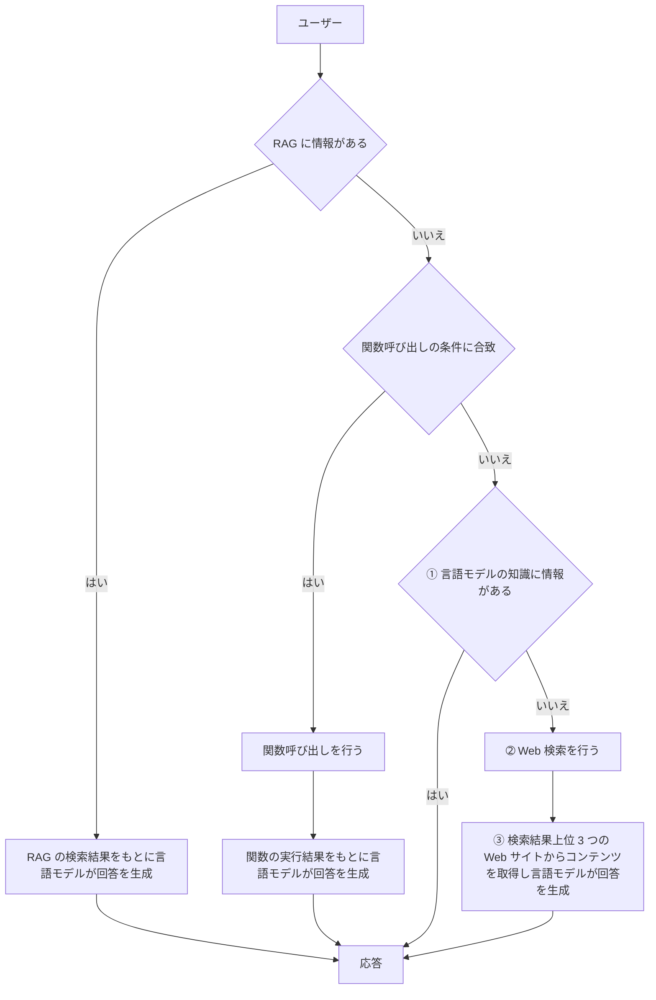

## 準備 - Bing Web Search のデプロイ

この演習では Web の検索に [Bing Web Search API](https://learn.microsoft.com/ja-jp/bing/search-apis/bing-web-search/bing-api-comparison) を使用します。

Azure Portal での Bing Web Search API のデプロイ手順は以下の通りです。

\[**手順**\]

1. Azure ポータルにサインインします

    [https://portal.azure.com](https://portal.azure.com/#home)

2. ポータル画面上部の \[**+**\] リソースの作成 アイコンか、表示されていない場合は画面左上のハンバーガーメニューをクリックし、\[**リソースの作成**\] をクリックします。

    

3. 遷移した画面の検索ボックスに **bing search** と入力してキーボードの \[**Enter**\] キーを押下します

    検索結果の画面で、\[**Azure サービスのみ**\] チェックボックス にチェックを入れると **Bing Search v7** のタイルが表示されるのでクリックします

    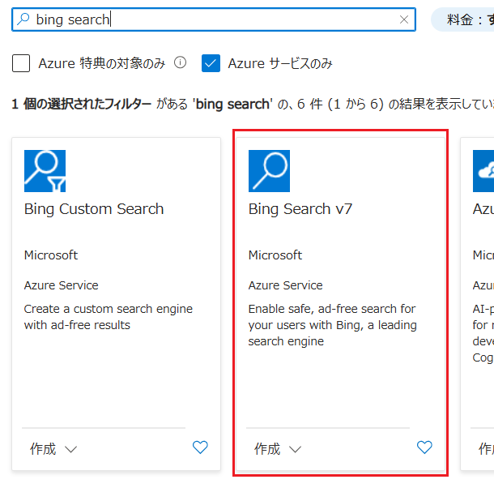

4. Bing Search v7 のプランの選択画面に遷移するので、既定のまま \[**作成**\] ボタンをクリックします

5. Azure OpenAI の作成の \[**基本**\] 画面が表示されるので、各項目を以下のように入力します

    |  項目  |  値  |
    | ---- | ---- |
    |  **サブスクリプション \***  |  使用するサブスクリプションを選択  |
    |  **リソース グループ \***  |  既存のものを選択するか、「新規作成」リンクをクリックして作成  |
    |  **名前 \*** | 任意の名前 |
    |  **リージョン** | `グローバル` |
    |  **価格レベル \*** | **F1** |
    |  \[**ご契約条件**\] のチェックボックス | チェック |

    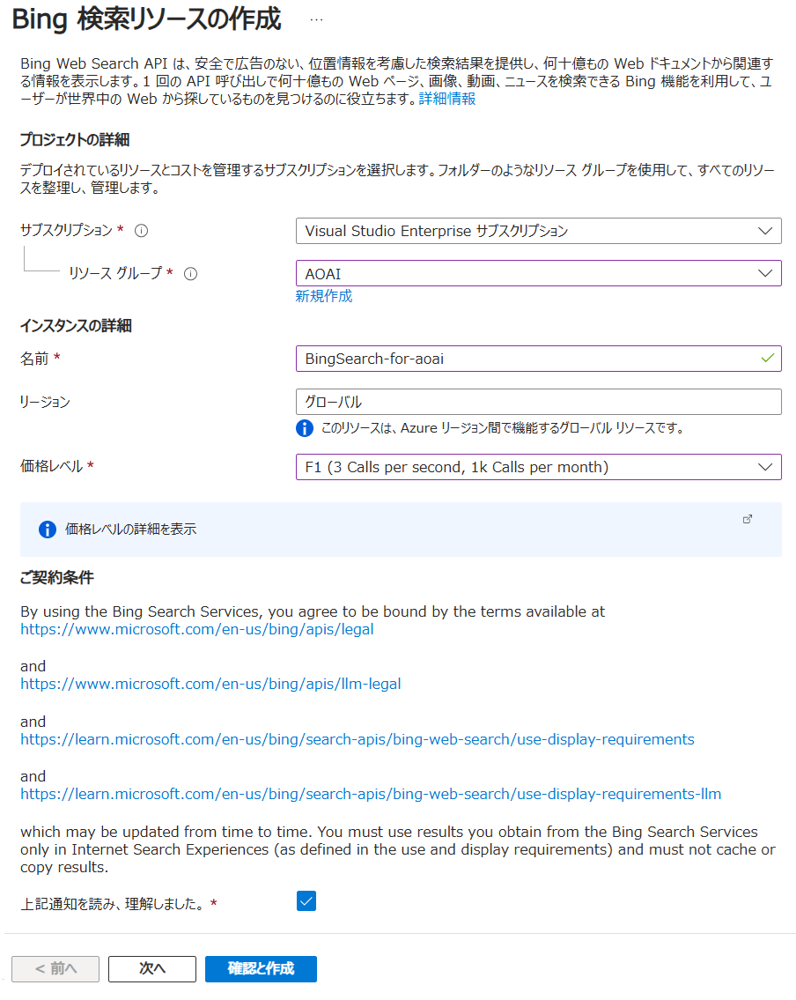

    入力が完了したら、\[**確認と作成**\] ボタンをクリックし、その後 \[**作成**\] ボタンをクリックします。

    Bing Search の作成が完了すると、\[デプロイが完了しました\] というメッセージが表示されます。この画面で \[**リソースに移動**\] ボタンをクリックします

6. 作成した Bing Search のリソース画面が表示されるので、画面左のメニューバーから \[リソース管理\] を展開し、\[**キーとエンドポイント**\] をクリックします

7. キーとエンドポイントの画面で、\[**キー 1**\] と \[**エンドポイント**\] の値をコピーし、メモ帳などに保持しておきます

    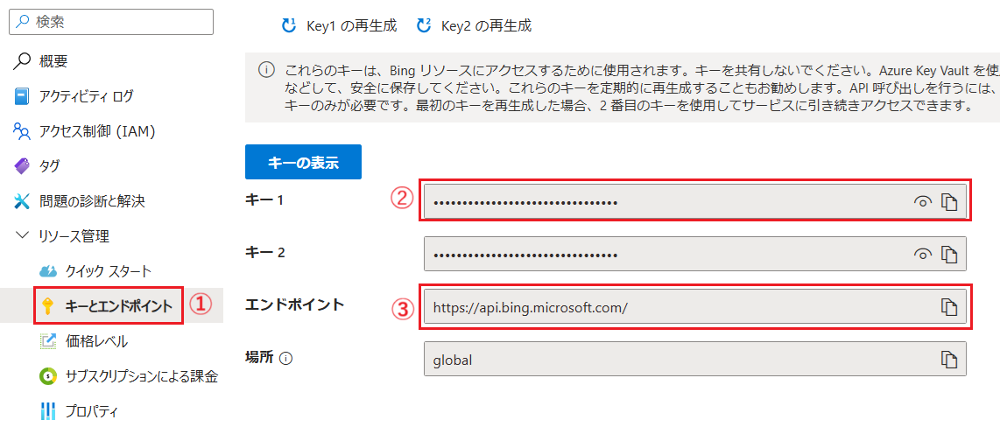

ここまでの手順で Bing Web Search のデプロイが完了しました。

Bing Search の検索は \[概要\] 画面の \[**お試しください**\] タブで動作確認が可能です。

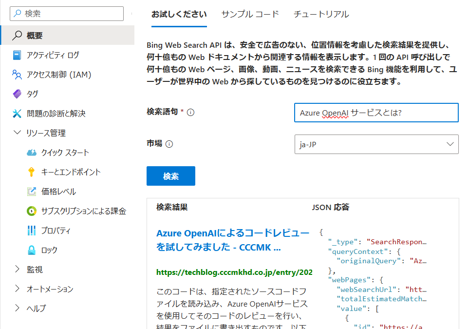

<br>

# タスク 1 :  HTTP Client ツールによる呼び出しの確認(Bing Web Search)

Azure OpenAI サービスの言語モデルの関数呼び出しを行う際にやり取りされるデータ構造を確認するために Visual Studio Code の REST Client 拡張を使用してリクエストを送信し、レスポンスを確認します。

手順は以下のとおりです。

[**手順**]

1. [演習 3.1-2 : **HTTP Client ツールによる呼び出しの確認**](Ex03-1.md#%E3%82%BF%E3%82%B9%E3%82%AF-2-http-client-%E3%83%84%E3%83%BC%E3%83%AB%E3%81%AB%E3%82%88%E3%82%8B%E5%91%BC%E3%81%B3%E5%87%BA%E3%81%97%E3%81%AE%E7%A2%BA%E8%AA%8D) で作成した **helloML.http** ファイルを開きます

2. ファイルに以下の内容をコピーして貼り付け、**BingSearch-subscriptionKey** には Azure ポータルで取得した Bing Web Search のキーを入力します

    ```http
    ### Function Calling の実行

    @BingSearch-endpoint=https://api.bing.microsoft.com/v7.0/search
    @BingSearch-subscriptionKey=ここにBing Web Search のキーを入力
    @search_keyword=Azure OpenAI サービスについて教えてください

    GET {{BingSearch-endpoint}}?q={{search_keyword}}&count=5&offset=0&mkt=ja-JP&safeSearch=Strict HTTP/1.1
    Ocp-Apim-Subscription-Key: {{BingSearch-subscriptionKey}}
    ```

3. ファイルに記述されている **GET** の上に \[**Send Request**\] と表示されるのでクリックします

     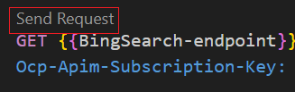

4. リクエストが送信され、レスポンスが返ったらクエリーパラメーター **count** に指定してある 5 件の検索結果が表示されることを確認します

    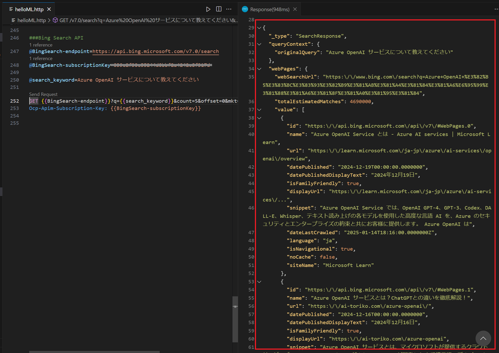

ここまでの手順で HTTP での Bing Web Search API の呼び出しとレスポンスの内容が確認できました。

なお、Bing Web Search API を呼び出す際に使用できるクエリーパラメーターについては以下のドキュメントを

* [**Web Search API v7 query parameters**](https://learn.microsoft.com/ja-jp/bing/search-apis/bing-web-search/reference/query-parameters)

応答で返される JSON データの詳細については以下のドキュメントを参照してください。

* [**Web Search API v7 response objects**](https://learn.microsoft.com/ja-jp/bing/search-apis/bing-web-search/reference/response-objects)


<br>

## タスク 2 : Web 検索とコンテンツ取得を行う機能の実装

Bing Web Search API を使用して Web 検索を行い、その結果から言語モデルが回答を生成するのに必要な情報を提供する機能を実装します。

この機能は Bing Web Search API が提供する機能だけでは実装できません。

なぜならば、Bing Web Search API は検索結果の **snippet** プロパティには Web ページのコンテンツを説明するテキストが含まれますが、その情報だけで言語モデルが回答を生成するのに十分な情報が得られるとは限らないためです。

そのため  Bing Web Search API の検索結果に含まれる URL が示す Web ページのコンテンツを取得する必要があります。

ただし、Web ページには回答の生成には必要のない HTML タグやスクリプトが含まれているためそのまま言語モデルに渡したのでは無駄に Token を消費することになります。

よって、この機能の実装には Web の検索機能以外に以下の機能が必要となります。

1. [Web ページのコンテンツを取得する機能](#%E3%82%BF%E3%82%B9%E3%82%AF-2-1--web-%E3%83%9A%E3%83%BC%E3%82%B8%E3%81%AE%E3%82%B3%E3%83%B3%E3%83%86%E3%83%B3%E3%83%84%E3%82%92%E5%8F%96%E5%BE%97%E3%81%99%E3%82%8B%E6%A9%9F%E8%83%BD%E3%81%AE%E5%AE%9F%E8%A3%85)
2. [Web ページのコンテンツから不要な HTML タグやスクリプト、スタイルシートを除去する機能](#%E3%82%BF%E3%82%B9%E3%82%AF-2-2--web-%E3%83%9A%E3%83%BC%E3%82%B8%E3%81%AE%E3%82%B3%E3%83%B3%E3%83%86%E3%83%B3%E3%83%84%E3%81%8B%E3%82%89%E4%B8%8D%E8%A6%81%E3%81%AA-html-%E3%82%BF%E3%82%B0%E3%82%84%E3%82%B9%E3%82%AF%E3%83%AA%E3%83%97%E3%83%88%E3%82%B9%E3%82%BF%E3%82%A4%E3%83%AB%E3%82%B7%E3%83%BC%E3%83%88%E3%82%92%E9%99%A4%E5%8E%BB%E3%81%99%E3%82%8B%E6%A9%9F%E8%83%BD%E3%81%AE%E5%AE%9F%E8%A3%85)
3. [Web を検索する機能と、検索結果にもとづき言語モデルに回答の生成を依頼する機能](#%E3%82%BF%E3%82%B9%E3%82%AF-2-3--web-%E6%A4%9C%E7%B4%A2%E6%A9%9F%E8%83%BD%E3%81%AE%E5%AE%9F%E8%A3%85%E3%81%A8%E8%A8%80%E8%AA%9E%E3%83%A2%E3%83%87%E3%83%AB%E3%81%B8%E3%81%AE%E3%83%A1%E3%83%83%E3%82%BB%E3%83%BC%E3%82%B8%E3%81%AE%E7%94%9F%E6%88%90)

このタスクではこれらの機能を実装します。

<br>

### タスク 2-1 : Web ページのコンテンツを取得する機能の実装

URL から Web ページのコンテンツを取得する機能を実装します。

この作業の具体的な手順は以下のておりです。

\[**手順**\]

1. [演習 3.1-2](Ex03-1.md#%E3%82%BF%E3%82%B9%E3%82%AF-2-http-client-%E3%83%84%E3%83%BC%E3%83%AB%E3%81%AB%E3%82%88%E3%82%8B%E5%91%BC%E3%81%B3%E5%87%BA%E3%81%97%E3%81%AE%E7%A2%BA%E8%AA%8D)  で作成したフォルダー **devPlayground** を Visual Studio Code で開きます

2. はじめにボットアプリケーションから呼び出される関数を定義するためのファイルを作成します

    Visual Studio Code の画面左のツリービューから **AOAI** フォルダーを右クリックし、表示されたコンテキストメニューから \[**New File**\] を選択して **webSearch.js** という名前のファイルを作成します
    
    

3. 記述する関数は言語モデルを使用して作成します

    Visual Studio Code の上部のメニュー \[**View**] - [**Terminal**] をクリックし、画面下部にターミナル画面が表示されるので、以下のコマンドを実行してチャットボット アプリケーションを起動します。

    ```bash
    node consoleBot.js
    ```

    ターミナル画面に `Prompt:` が表示されたら、以下のメッセージを入力して[**Enter**\] キーを押下します

    ```
    引数 url に指定された Web ページの body タグの内容だけを取得して返り値として返す getBodyContent と名前の関数を JavaScript で生成してください。なお HTTP リクエストには fetch を使用し、リクエストの際の user-agent には Microsoft Edge のものを使用してください。body タグの検出は正規表現か文字列操作関数でおこなってください
    ```

    キーボードの \[**Ctrl**\] + \[**C**\] キーを押下してチャットボットアプリを終了します。
    
    言語モデルが生成した **getBodyContent** 関数のコードをコピーして、作成した **webSearch.js** ファイルに貼り付け、キーボードの \[**Ctrl**\] + \[**S**\] キーを押下して保存します。

4. 貼り付けたコードが正しく動作するか確認します。

    以下のコードを **webSearch.js** ファイルに追加します

    ```javascript
    getBodyContent('https://osamum.github.io/publish/').then(body => {
        console.log(body);
    });
    ```

    Visual Studio Code のターミナル画面で以下のコマンドを実行して関数が正しく動作するか確認します

    ```bash
    node AOAI/webSearch.js
    ```

    コンソールに以下の内容が表示されれば正しく動作しています。

    ```html
    <style>
        .article{
            color:black;
        }
    </style>
    <h1>online assets</h1>
    <!--
        このコメントは HTML のコメントです。
        このコメントはブラウザに表示されません。
    -->
    <div id="articleDiv" class="article">
        このページは <a href="https://aka.ms/firststep-aoai-appdev">Azure OpenAI アプリケーション開発ハンズオン</a> の検証用ページです。
        <span style="color: blue;">この文字列はタグ中の style 属性によって書式が設定されています。</span>
    </div>
    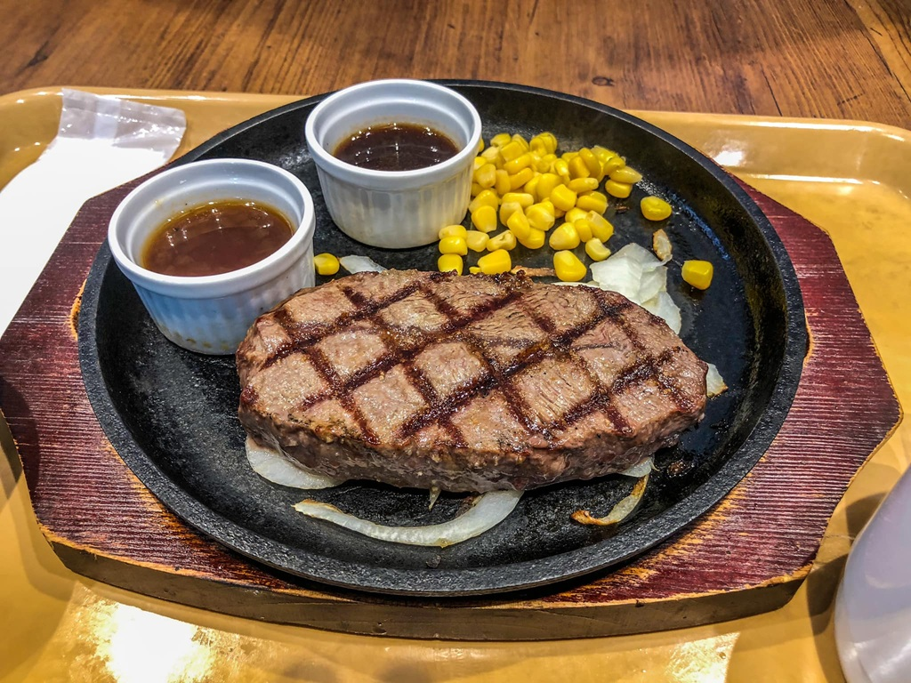
    
    
    <script>
        console.log("Hello, world!");
    </script>
    ```

ここまでの手順で Web ページのコンテンツを取得する機能の実装が完了しました。

もしうまく動作しない場合は、以下のコードをお試しください。

```javascript
async function getBodyContent(url) {
    const response = await fetch(url, {
        method: 'GET',
        headers: {
            'User-Agent': 'Mozilla/5.0 (Windows NT 10.0; Win64; x64) AppleWebKit/537.36 (KHTML, like Gecko) Chrome/91.0.4472.124 Safari/537.36'
        }
    });
    const text = await response.text();
    const bodyMatch = text.match(/<body[^>]*>([\s\S]*?)<\/body>/i);
    return bodyMatch ? bodyMatch[1] : null;
}
```
<br>

### タスク 2-2 : Web ページのコンテンツから不要な HTML タグやスクリプト、スタイルシートを除去する機能の実装

取得したコンテンツから HTML タグをすべて取り除くかどうかについては、取得するデータの精度と処理の複雑さ、利用料金などを考慮して決定する必要があります。

HTML は本来ドキュメントの構造を定義するものであり、これを定義するマークアップを削除することは、言語モデルでコンテンツの意味を理解する上での重要な情報を失う可能性があります。

たとえば、表を表す table タグやリストを表す ul や ol、dl タグを削除してしまうと、前後の文字列との関係が失われてしまうため言語モデルは Web コンテンツに書かれている本来の意味を理解できなくなってしまいます。 


とくに[セマンティックな要素](https://en.wikipedia.org/wiki/Semantic_Web)で記述されたコンテンツはデータとして構造化されているため、マシンリーダブルであり、検索エンジンはもちろん言語モデルにとってもコンテンツの内容を理解するのに有用な情報です。

ただし、ドキュメントの構造を表さない \<script\> や \<style\>、\<iframe\>、\<!--(コメント アウト) といったタグは、コンテンツの意味を理解する上では重要ではないので取り除いても良いでしょう。

とはいえ、HTML タグを含むコンテンツは、文字列のみのコンテンツと比較してデータ量は大幅に増えるので Token の消費量(利用料)が増えることになり、かつ、使用しているプランによっては許可されているコンテキスト長さを越えてしまいエラーが発生する可能性があります。また、ドキュメントの構造が必ずしも検索の条件に有用でない場合もあります。たとえば、装飾に重きをおき Web 標準を無視した構造の Web ページなどは、HTML タグを解析しても意味のある情報が得られないでしょう。ブラウザー上で動的に生成される仕組みのコンテンツも同様です。

そのため、Web ページから HTML タグを除去した文字列データを使用してみて充分に必要な精度が得られていると判断できる場合には、HTML タグを除去した文字列を使用してコストを節約するのも良いかもしれません。

上記の処理については、[Microsoft Copilot](https://copilot.microsoft.com/) や [OpenAI ChatGPT](https://chatgpt.com/)、[Google Gemini](https://gemini.google.com/app)、[X grok](https://x.com/i/grok) といった言語モデルを使用した各アシスタントサービスに以下の質問をしてみるのも良いかもしれません。(※ただし、その回答が本当かどうかを確認する手段はありませんが)

```text
あなたはユーザーの質問に対し、インターネットを参照して回答をすることができますが、その際、Web ページのドキュメント構造を分析していたりしますか?
```

<参考>
* [HtmlRAG: HTML is Better Than Plain Text for Modeling Retrieved Knowledge in RAG Systems](https://arxiv.org/abs/2411.02959)


<br>

#### コンテンツから不要な HTML タグと属性を除去する処理の実装

前述の **getBodyContent** 関数で取得した Web ページのコンテンツから不要な HTML タグやスクリプト、スタイルシートと、ドキュメント構造に影響しない HTML タグの属性を除去する機能を実装します。

この処理には \<script\>～</script\> や \<style\>～\</style\> などのように HTML タグで囲まれた文字列とタグそのものを除去する処理と、\<!-- --\> で囲まれたコメント アウト部分の削除、HTML タグの内の不要な属性を除去する 3 つの処理が必要です。

HTML タグには style 属性や class 属性、id 属性などが含まれていることがありますが、これらはコンテンツの意味を理解する上で重要ではないことがほとんどです。

しかしながら a タグの href 属性や img タグの src、alt 属性などはユーザーからの質問の回答に使用されることも考えられるため、これらの属性を削除するかどうかは慎重に検討する必要があります。

この手順ではこれらの処理を行う関数を実装します。

具体的な手順は以下のとおりです。

\[**手順**\]

 1. 記述する関数は言語モデルを使用して作成します

    Visual Studio Code の上部のメニュー \[**View**] - [**Terminal**] をクリックし、画面下部にターミナル画面が表示されるので、以下のコマンドを実行してチャットボット アプリケーションを起動します。

    ```bash
    node consoleBot.js
    ```

    ターミナル画面に `Prompt:` が表示されたら、以下のメッセージを入力して[**Enter**\] キーを押下します

    ```text
    引数contentの文字列から引数htmlTagに指定されたHTMLタグで囲まれた文字列をタグを含め除去するrmTagRangeという名前の関数をJavaScriptで生成してください\n例)\ncontent=script,content=AAAAA<script>\n  alert('OK');\n</script>BBBB\n返り値: AAAAABBBB
    ```

     言語モデルが生成した **rmTagRange** 関数のコードをコピーして、作成した **webSearch.js** ファイルに貼り付けます

     続けて、言語モデルに対し以下のメッセージを入力して[**Enter**\] キーを押下します。

     ```text
    引数 content に渡された文字列中の <!-- から --> までの文字列をすべて削除して返り値として返す rmComment という名前の関数をJavaScript で生成してください
    ```

    言語モデルが生成した **rmComment** 関数のコードをコピーして、作成した **webSearch.js** ファイルに貼り付けます

    続けて、言語モデルに対し以下のメッセージを入力して[**Enter**\] キーを押下します。

    ```text
    引数 content に渡された文字列中のすべての HTML タグから以下の属性を削除して返り値として返す sharpenTags という名前の関数をJavaScript で生成してください:\nid, style, class, tabindex, width, height, target
    ```

    言語モデルが生成した **sharpenTags** 関数のコードをコピーして、作成した **webSearch.js** ファイルに貼り付け、キーボードの \[**Ctrl**\] + \[**S**\] キーを押下して保存します。

    キーボードの \[**Ctrl**\] + \[**C**\] キーを押下してチャットボットアプリを終了します。

2. 貼り付けたコードが正しく動作するか確認します。

    前の手順で **getBodyContent** 関数を作成する際に使用した検証コードを以下のように変更します。

    ```javascript
    getBodyContent('https://osamum.github.io/publish/').then(body => {
        let rmed_content = rmTagRange(body, 'style');
        rmed_content = rmTagRange(rmed_content, 'script');
        rmed_content = rmComment(rmed_content);
        console.log(sharpenTags(rmed_content));
    });
    ```
3. Visual Studio Code のターミナル画面で以下のコマンドを実行して関数が正しく動作するか確認します

    ```bash
    node AOAI/webSearch.js
    ```

    コンソールに以下の内容が表示されれば正しく動作しています。

    ```html
    <h1>online assets</h1>

    <div>
        このページは <a href="https://aka.ms/firststep-aoai-appdev">Azure OpenAI アプリケーション開発ハンズオン</a> の検証用ページです。
        <span>この文字列はタグ中の style 属性によって書式が設定されています。</span>
    </div>
    
    
    
    ```

    タスク 2-1 の実行結果と比較して、スタイルシートやスクリプト、コメントや id、class 属性が除去されていることを確認してください。


ここまでの手順で文字列から指定した HTML タグの範囲を除去する機能の実装が完了しました。
もしうまく動作しない場合は、以下のコードをお試しください。

```javascript
// 指定された HTML タグで囲まれた文字列を削除する
function rmTagRange(content, htmlTag) {
    const regex = new RegExp(`<${htmlTag}[^>]*>(.*?)<\/${htmlTag}>`, 'gs');
    return content.replace(regex, '');
}

// すべてのコメントを削除する
function rmComment(content) {  
    return content.replace(/<!--.*?-->/g, '').trim();
}

// ドキュメントの構造に影響を与えない属性を削除する
function sharpenTags(content) {
    return content.replace(/\s*(id|style|class|tabindex|width|height|target)="[^"]*"/g, '');
}
```

なお、動作確認用コードが残っていると以降の演習に問題が発生するので必ず削除してください。

```javascript
/* 削除するかコメントアウトする 
getBodyContent('https://osamum.github.io/publish/').then(body => {
    let rmed_content = rmTagRange(body, 'style');
    rmed_content = rmTagRange(rmed_content, 'script');
    rmed_content = rmComment(rmed_content);
    console.log(sharpenTags(rmed_content));
});
*/
```

<br>


## タスク 2-3 : Web 検索機能の実装と言語モデルへのメッセージの生成

[準備](#%E6%BA%96%E5%82%99---bing-web-search-%E3%81%AE%E3%83%87%E3%83%97%E3%83%AD%E3%82%A4) でデプロイした Bing Web Search API を使用して Web 検索を行う機能を実装し、検索結果から言語モデルが回答を生成するのに必要な情報を提供する機能を実装します。

具体的な手順は以下のとおりです。

\[**手順**\]

1. 演習用ボット アプリケーションの **.env** ファイルを開き、以下の 2 つの設定を追加します

    変数それぞれに[準備](#%E6%BA%96%E5%82%99---bing-web-search-%E3%81%AE%E3%83%87%E3%83%97%E3%83%AD%E3%82%A4)でメモしておいた Bing Web Search のエンドポイントとサブスクリプションキーを設定します。

    ```text
    BING_SEARCH_ENDPOINT=Bing Web Search のエンドポイントを記述
    BING_SEARCH_KEY=Bing Web Search のサブスクリプションキーを記述
    ```
    キーボードの \[**Ctrl**\] + \[**S**\] キーを押下して変更を保存します

2. ファイル **webSearch.js** を開き、ファイルの先頭に以下のコードを追加します

    ```javascript
    const dotenv = require("dotenv");
    dotenv.config();

    const bing_search_endpoint = process.env['BING_SEARCH_ENDPOINT'];
    const bing_search_key = process.env['BING_SEARCH_KEY'];
    ```

3. Bing Web Search API を使用して検索を行う関数を言語モデルを使用して生成します

    
    Visual Studio Code の上部のメニュー \[**View**] - [**Terminal**] をクリックし、画面下部にターミナル画面が表示されるので、以下のコマンドを実行してチャットボット アプリケーションを起動します。

    ```bash
    node consoleBot.js
    ```

    ターミナル画面に `Prompt:` が表示されたら、以下のメッセージを入力して[**Enter**\] キーを押下します

    ```text
    getBingSearchResultという名前で、引数queryで受け取った文字列をBing Web Search APIで検索し、検索結果の"webPages"の内容を返す関数をJavaScript で作成してください。\n・取得するWeb pageの件数は3件にしてください\n・HTTPのリクエストにはfetchを使用してください
    ```

    キーボードの \[**Ctrl**\] + \[**C**\] キーを押下してチャットボットアプリを終了します。
    
    言語モデルが生成した **getBingSearchResult** 関数のコードをコピーして、作成した **webSearch.js** ファイルに貼り付けます。
    
    生成されたコードの内でサブスクリプションキーを指定している部分を前の手順で定義した変数 **bing_search_key** に変更します。

    エンドポイントはおそらく正しいものがあらかじめ設定されていると思いますが、メモしておいたものと異なる場合は適宜書き換えてください。
    
    キーボードの \[**Ctrl**\] + \[**S**\] キーを押下して保存します。

4. 作成した関数が正しく動作するか確認します

    以下のコードを **webSearch.js** ファイルに追加します

    ```javascript
    getBingSearchResult('Azure OpenAI サービスについて教えてください').then(result => {
        console.log(result);
    });
    ```

    Visual Studio Code のターミナル画面で以下のコマンドを実行して関数が正しく動作するか確認します

    ```bash
    node AOAI/webSearch.js
    ```

    コンソールに検索結果が表示されれば正しく動作しています。

    正常に動作が確認できたら検証用のコードを削除するかコメントアウトします。

    ここまでの手順で文字列から指定した HTML タグの範囲を除去する機能の実装が完了しました。

    もしうまく動作しない場合は、以下のコードをお試しください。

    ```javascript
    async function getWebSearchResult(query) {
    const endpoint = `https://api.bing.microsoft.com/v7.0/search?q=${encodeURIComponent(query)}&count=3`;

        const response = await fetch(endpoint, {
            headers: {
            'Ocp-Apim-Subscription-Key': bing_search_key,
            },
        });

        if (!response.ok) {
            throw new Error('Network response was not ok');
        }

        const data = await response.json();
        return data.webPages;
    }
    ```

5. 検索結果から言語モデルが回答を生成するためのプロンプトを生成します

    以下のコードを **webSearch.js** ファイルに追加します

    ```javascript
    //言語モデルが回答を生成するためのプロンプト
    async function createRequestWithWebSearchResult(query) {
    const webSerchResult = JSON.stringify(await getWebSearchResult(query));
        return `[question] の内容に対し[content]内のJSONの内容を使用して回答してください\n` +
            `・ 各要素の snippet、content の内容を付き合わせ、信頼性の高い情報を採用してください\n` +
            `・ 各要素の url のドメイン名からも信頼性を判断してください\n` +
            `・ 各要素の content 内の HTML タグの構造も参考にしてください\n` +
            `・ 自身の回答に不必要に重複する文章がないようにしてください\n` +
            `・ [question]に対し[content]の内容に回答としてふさわしい情報かないと判断した場合にはその旨を回答してください\n` +
            `[question]\n${query}\n\n[content]\n${webSerchResult}`
    }

    //言語モデルが回答を生成するための情報を生成
    async function getWebSearchResult(query) {
    // Bing Search の検索結果を取得
        const sitesList = (await getBingSearchResult(query)).value;
        const resultList = [];
        for (const site of sitesList) {
            const result = {};
            result.url = site.url;
            result.snippet = site.snippet;
            //Web ページの内容を取得
            const bodyContent = await getBodyContent(site.url);
            //コメントの削除
            let rmed_content = rmComment(bodyContent);　
            //不要なタグの削除
            rmed_content = rmTagRange(rmed_content, 'style');
            rmed_content = rmTagRange(rmed_content, 'script');
            rmed_content = rmTagRange(rmed_content, 'iframe');
            rmed_content = rmTagRange(rmed_content, 'area');
            rmed_content = rmTagRange(rmed_content, 'map');
            //空の div タグの削除
            rmed_content = rmed_content.replace(/<div><\/div>/g, '');
            //改行、タブの削除
            rmed_content = rmed_content.replace(/[\r\n\t]/g, '');
            //不要な属性の削除
            result.content = sharpenTags(rmed_content);
            resultList.push(result);
        }
        return resultList;
    }
    ```
6. 作成した関数が正しく動作するか確認します

    以下のコードを **webSearch.js** ファイルに追加します

    ```javascript
    createRequestWithWebSearchResult('Azure OpenAI サービスについて教えてください').then(request => {
        console.log(request);
    });
    ```

    Visual Studio Code のターミナル画面で以下のコマンドを実行して関数が正しく動作するか確認します

    ```bash
    node AOAI/webSearch.js
    ```

    コンソールにプロンプトが表示されれば正しく動作しています。

    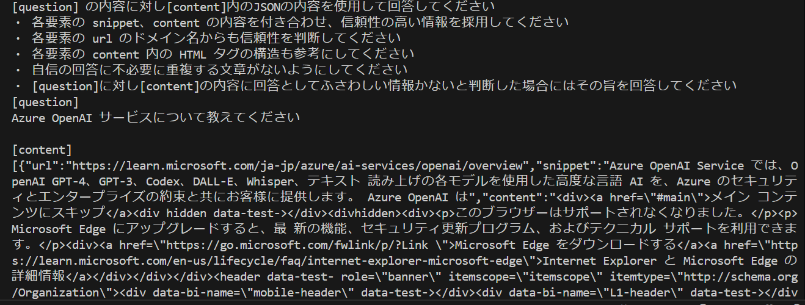


    正常動作が確認できたら検証用のコードを削除するかコメントアウトします。

7. 作成した **createRequestWithWebSearchResult** 関数を外部から利用できるようにエクスポートします

    以下のコードを **webSearch.js** ファイルの一番最後に追加します

    ```javascript
    module.exports = {
        createRequestWithWebSearchResult
    };
    ```

    キーボードの \[**Ctrl**\] + \[**S**\] キーを押下して保存します。

ここまでの手順で Web 検索機能を実装し、検索結果から言語モデルが回答を生成するのに必要な情報を提供する機能を実装しました。

うまく動作しない場合は以下のサンプルのコードを使用してみてください。

* [Web を検索する機能を実装する](samplecode/webSearch.js)

>[!CAUTION]
>この演習で追加したコードを実行して以下のようなエラーが発生する場合は、言語モデルの**1 分あたりのトークン数レート制限**の値を引き上げてください。
>```text
>    error: {
>    code: '429',
>    message: 'Requests to the ChatCompletions_Create Operation under Azure OpenAI API version 2024-05-01-preview 
>       have exceeded token rate limit of your current OpenAI S0 pricing tier. Please retry after 86400 seconds. 
>       Please go here: https://aka.ms/oai/quotaincrease if you would like to further increase the default rate limit.'
>    }
>```
>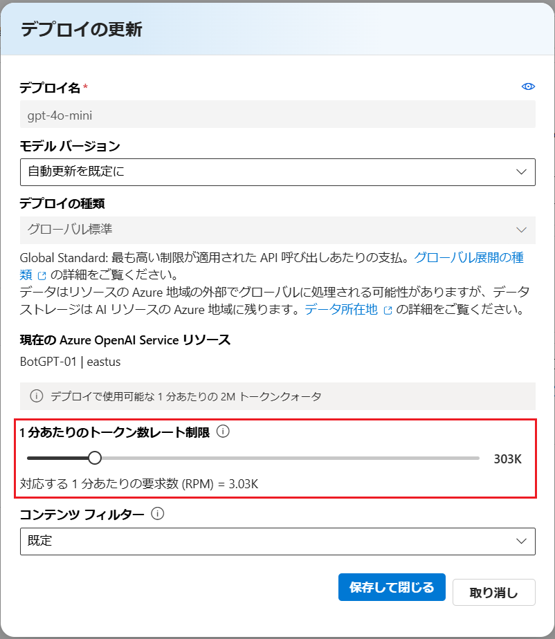
<br>

## タスク 3: チャットボット アプリへの Web 検索機能の統合

ここまでの作業で作成した Web 検索機能をチャットボット アプリに統合します。

作業内容としては、まず最初に、問い合わせ内容の回答するデータが RAG のデータソースにも、言語モデルの知識にもない場合に、言語モデルが文字列 `$_SEARCHSTRING:` のあとに回答に必要となる情報を Web から検索するための検索文字を生成して返すようにシステムメッセージを変更します。

つぎに言語モデルから回答された文字列の先頭が `$_SEARCHSTRING:` だった場合に 、それに続く検索文字列を取り出して Web 検索を行い、その結果を言語モデルに提供して回答を生成するようにします。

具体的な手順は以下のとおりです。

\[**手順**\]

1. [演習 3.1-2](Ex03-1.md#%E3%82%BF%E3%82%B9%E3%82%AF-2-http-client-%E3%83%84%E3%83%BC%E3%83%AB%E3%81%AB%E3%82%88%E3%82%8B%E5%91%BC%E3%81%B3%E5%87%BA%E3%81%97%E3%81%AE%E7%A2%BA%E8%AA%8D)  で作成したフォルダー **devPlayground** を Visual Studio Code で開きます

2. **AOAI/lm.js** を開き、ファイルの上のほうに記述してある、以下のシステムメッセージを定義している部分を

    ```javascript
    //言語モデルとユーザーの会話を保持するための配列
    var messages = [
        { role: "system", content: "You are an useful assistant." },
    ];
    ```
    以下のように変更します

    ```javascript
    //言語モデルとユーザーの会話を保持するための配列
    var messages = [
    { role: "system", content: "あなたは誠実なアシスタントです。質問に対し、回答すべき情報が知識にない場合には、" 
        + "文字列 $_SEARCHSTRING: に続けてインターネットを検索して情報を得るための検索文字列を返してください。" 
        + "\n例) $_SEARCHSTRING:今日の東京の天気" },
    ];
    ```
    これで言語モデルは自身の知識に回答を生成するための情報がないと判断した場合に、文字列 `$_SEARCHSTRING:` のあとに、回答に必要となる情報を検索するための検索文字を生成して返すようになります。

    キーボードの \[**Ctrl**\] + \[**S**\] キーを押下して変更を保存します。

3. Visual Studio Code の画面左のツリービューから **consoleBot.js** ファイルを開き、ファイル上部のコメント `//[PLACEHOLDER:require webSearch.js]` を以下のコードに置き換えます

    ```javascript
    const webSearch = require('./AOAI/webSearch.js')
    ```

4. 同 **consoleBot.js** ファイルに以下の関数を追加します

    ```javascript
    //言語モデルの回答の先頭が "$_SEARCHSTRING:" だった場合に検索用の文字列を取り出して、Web 検索を行う
    async function if_Idontknow(assistantAnswer) {
        if (assistantAnswer.indexOf('$_SEARCHSTRING:')===0) {
            const I_DONT_KNOW_length = 15;
            console.log('\nAI : インターネットを検索しています...');
            const queryString = assistantAnswer.substr(I_DONT_KNOW_length);
            const re_request = await webSearch.createRequestWithWebSearchResult(queryString);
            return await lm.sendMessage(re_request);
        } else {
            return assistantAnswer;
        }
    }
    ```

5. 同 **consoleBot.js** ファイルの **process.stdin.on** ハンドラー内の以下のコードを

    ```javascript
    console.log(`\nAI : ${await lm.sendMessage(await rag.findIndex(inputString),getImageUrls(inputString))}`);
    ```

    以下のコードに置き換えます

    ```javascript
    // 入力された文字列を取得
    const inputString = data.trim();
    //RAG の結果
    const ragResult = await rag.findIndex(inputString);
    //言語モデルの結果
    const lmResult = await lm.sendMessage(ragResult,getImageUrls(inputString));
    //Web 検索の結果
    const webSearchResult = await if_Idontknow(lmResult);
    console.log(`\nAI : ${webSearchResult}`);
    ```

    短く記述したい場合は以下のようにも記述できます

    ```javascript
    console.log(`\nAI : ${await if_Idontknow(await lm.sendMessage(await rag.findIndex(inputString),getImageUrls(inputString)))}`);
    ```

    キーボードの \[**Ctrl**\] + \[**S**\] キーを押下して変更を保存します。

    これでコードの準備は完了です。

6. チャットボット アプリケーションを起動して、Web 検索の機能が正しく動作することを確認します

    Visual Studio Code のターミナル画面で以下のコマンドを実行します

    ```bash
    node consoleBot.js
    ```

    チャットボット アプリケーションが起動したら、挨拶や `現在の時刻を教えてください` 等、従来の機能を以下のように質問を入力して RAG の機能が正しく動作することを確認します

    ```text
    クラウド業界の市場分析を行い、現在のマーケットシェア、最新トレンド、利用者のニーズ、市場で最も人気のあるサービスを特定してください  
    ```
    以下のような回答が返ってくれば正しく動作しています

    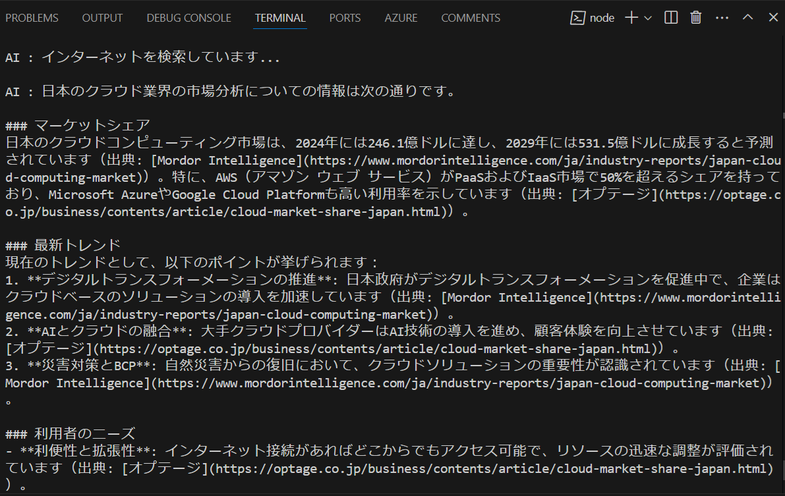

     キーボードの \[**Ctrl**\] + \[**C**\] キーを押下してプログラムを終了します。
    
ここまでの手順で、Bing Web Search の機能を使用して Web の検索能力ををチャットボット アプリケーションに追加することができました。

>[!CAUTION]
>これらの演習では言語モデルに関数を生成させて使用しましたが、実際の開発作業においては、生成されたコードをそのまま使用することはせず、必ず生成されたコードをベースに適切なエラーハンドリングやセキュリティの対策に問題がないか確認のうえ、ご自身の責任のもとで使用してください。

<br>

## まとめ

この演習では言語モデルの知識を拡張する手段として Web 検索機能を実装しました。

### 知識を参照する順番について

今回の演習では RAG の提供する知識、言語モデルの知識、Web 検索の結果をまんべんなく使用できように RAG → 言語モデル → Web 検索の順番で知識を参照するように実装しましたが用途にあわせて適切な順番を選択することができます。

たとえば言語モデルに知識量の少ない SLM(Small Language Model) 等を使用する場合には Web 検索の結果を先に参照させたほうが回答の精度が向上する可能性があります。

### 検索クエリーについて

Web 検索の精度については利用する検索エンジンの性能に依存しますが、検索クエリーを工夫するなどして改善できる余地があります。

Bing Search は自然言語での検索をサポートしているため、言語モデルの知識に回答がない場合は、ユーザーの質問をそのまま検索クエリとして使用することもできます。
しかし、ユーザーから送られるメッセージはあくまでも言語モデルとの会話のための内容であるため、かならずしも検索クエリとして適切な内容であるとは限りません。

検索とは異なる 意図 (intent) が含まれ、それが検索精度に影響を与える可能性があるため、この演習では言語モデルに検索に使用する文字列を生成させるようにしています。

この方法は、`言語モデルの知識に情報がなかったら(ユーザーからの問い合わせをいったん言語モデルに送信してから) Web 検索を行う`、という今回のような処理の流れではオーバーヘッドが発生しませんが、RAG のように、言語モデルにメッセージを送信する前に Web 検索を行いたい場合には、毎回、検索用のメッセージを生成するためだけにコストがかかる言語モデルに毎回メッセージを送信するのか?、という点も考慮する必要があります。

そういった場合には、より手軽に使用できる [Azure AI Language](https://learn.microsoft.com/ja-jp/azure/ai-services/language-service/) のキー フレーズ抽出等を使用して、ユーザーのメッセージからキーワードを抽出し、それを検索クエリとして使用しても良いかもしれません。

* [Azure AI Language のキー フレーズ抽出](https://learn.microsoft.com/ja-jp/azure/ai-services/language-service/key-phrase-extraction/overview)

Web 検索の結果の精度が芳しくない場合は Web 検索サービスの各設定を確認することはもちろんですが、検索を実施する前に最適な検索クエリーを生成するための前処理を追加することをお勧めします。

### Web コンテンツの信頼性について

Web 検索機能の良いところは回答内容のソースを確認できることですが、ユーザーがいちいちソースを確認することなく信頼性の高い回答を返せることが理想です。

今回の演習では URL から信頼性を測るように指示しています。URL に膨れるドメイン名は信頼性を測るための手がかりになりますが、それだけで信頼性を判断するのは難しい場合がありますので各自さまざまな工夫をされることをお勧めします。

これについては、[Microsoft Copilot](https://copilot.microsoft.com/) や [OpenAI ChatGPT](https://chatgpt.com/)、[Google Gemini](https://gemini.google.com/app)、[X grok](https://x.com/i/grok) といった言語モデルを使用した各アシスタントサービスに以下の質問をしてみるのも良いヒントが得られるかもしれません。(※ただし、その回答が本当かどうかを確認する手段はありませんが)

```text
あなたはユーザーの質問に対し、Web を検索し、その検索結果から回答をすることができますが、参照した Web コンテンツの信頼性はどのように担保していますか?
```
## 参考

* [Bing Search APIs, with your LLM](https://www.microsoft.com/bing/apis/llm)

* [Use and Display requirements of Bing Search APIs, with your LLM](https://learn.microsoft.com/bing/search-apis/bing-web-search/use-display-requirements-llm)

* [Bing Search API use and display requirements](https://learn.microsoft.com/bing/search-apis/bing-web-search/use-display-requirements)

<br>

## 次へ

👉 [**演習 3.7 : 言語モデルの応答に JSON を指定する**](Ex03-7.md)

<br>

<hr>

👈 [**演習 3. 5 : 画像認識機能の追加** ](Ex03-5.md)

🏚️ [README に戻る](README.md)
