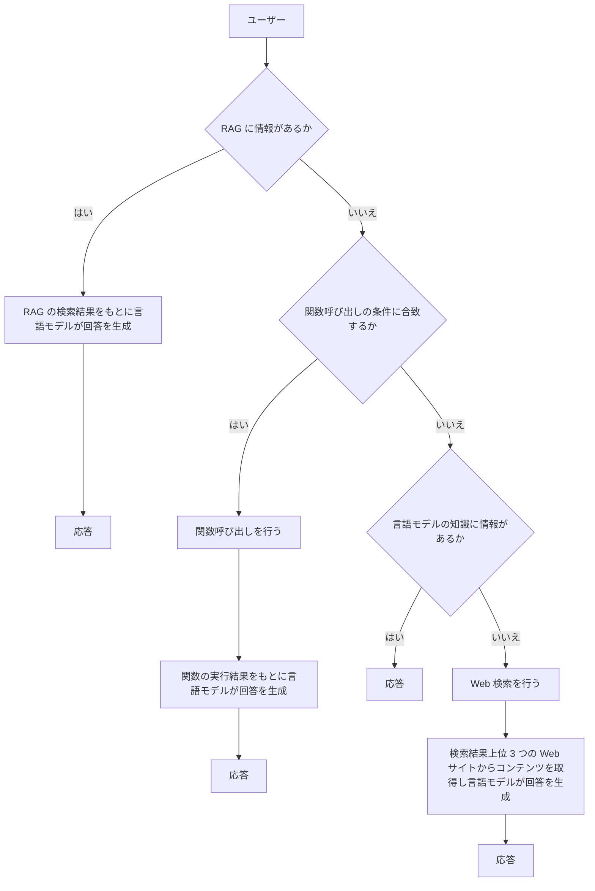

# 演習 3.オプション : Web の情報を検索する

演習で作成しているボット アプリケーションの知識の拡張として、Web の情報を検索する機能を追加します。

この演習では、ボットがユーザーの質問に答えるために Web 検索を使用する方法を学びます。

アプリケーションの処理の流れとしては、RAG のデータソースに情報がなく、関数呼び出し(Function Call) にも該当せず、言語モデルの知識にも情報が無かった場合はに Web 検索を行い、検索結果上位 3 件の Web ページのコンテンツを取得してその内容から回答を生成して返す仕様とします。

