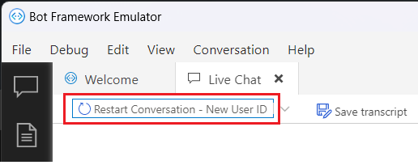
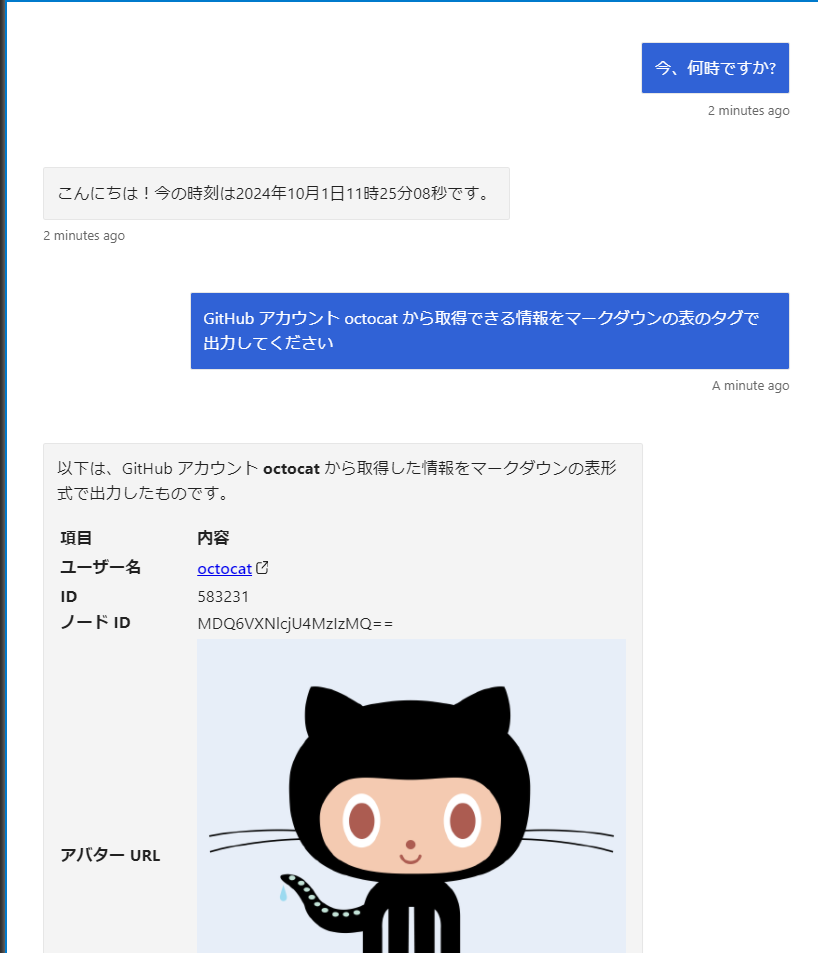
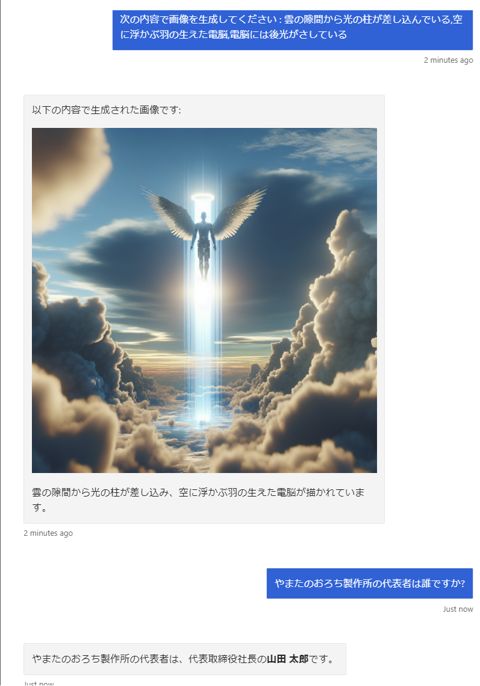

# 演習 4 : 演習用ボット アプリケーションのフレームワークへの移植

この演習ではこれまでの演習で作成したコンソール ボット アプリケーションのボット機能をアプリケーションフレームワークに移植します。

Node.js 用のアプリケーション フレームワークはたくさんありますが、今回のアプリケーションはボットここでは [Bot Framework](https://learn.microsoft.com/ja-jp/azure/bot-service/bot-service-overview?view=azure-bot-service-4.0) を使用します。

Bot Framework は、Microsoft が提供するボット アプリケーションの開発フレームワークで、Node.js だけでなく、C# や Python などの言語でも利用できます。

## 準備

Bot Framework をインストールする前に開発環境の Node.js のバージョンを確認します。

以下のコマンドを実行して、Node.js のバージョンが 2024 年 10 月 の最新の LTS である **v20.17.0** であることを確認します。

```bash
node -v
```

 バージョンがこれより低い場合、逆に v22.9.0 (Current) などの最新バージョンである場合は正しく動作しない可能性があります。

 その場合、Windows では [**nvm-windows**](https://github.com/coreybutler/nvm-windows) 、Mac では [**nvm**](https://github.com/nvm-sh/nvm) を使用して Node.js のバージョンを変更してください。

Bot Framework 用のプロジェクトを生成するための Node.js パッケージ generator-botbuilder をインストールします。

コマンドプロンプト(ターミナル画面)を開き、以下のコマンドを上から順に実行し、Node.js パッケージをインストールします。

```bash
npm install -g npm
```

```bash
npm install -g yo
```

```bash
npm install -g generator-botbuilder
```

Bot Framework アプリケーションでホストされるサービスをローカルでテストするための [**Bot Framework Emulator**](https://github.com/Microsoft/BotFramework-Emulator/releases/latest) インストールしてください。

* **[microsoft/BotFramework-Emulator**](https://github.com/Microsoft/BotFramework-Emulator/releases/tag/v4.14.1)

<br>

##　タスク 1: Bot Framework 用のプロジェクトの作成

botbuilder ジェネレーターを使用して、オウム返しボットのプロジェクトを生成します。

手順は以下の通りです。

\[**手順**\]

1. プロジェクトを格納するための任意のフォルダーをコマンドプロンプトで開きます

2. 以下のコマンドを実行します

    ```bash
    yo botbuilder
    ```
3. プロンプトが表示されるので、各プロンプトを以下のように入力します

    ここでは **handsonBot** という名前でプロジェクトを生成します。

    |プロンプト|入力値|
    |:--|:--|
    |? What's the name of your bot?|`handson-bot`|
    |? What will your bot do?|`既定のまま[Enter]キーを押下`|
    |? What programming language do you want to use?|**JavaScript**|
    |? Which template would you like to start with?|**Echo Bot**|
    |? Looking good. Shall I go ahead and create your new bot?|**Y**|

    プロジェクトの生成が完了するのを待ちます。

4. コマンド プロンプトで `ls` コマンドを実行し、前の手順で指定したボットの名前が付いたフォルダーが生成されていることを確認します

    ```bash
    ls
    ```

    続いて `cd` コマンドを使用して、生成された **handsonBot**プロジェクトのフォルダーに移動します

    ```bash
    cd handson-bot
    ```

5. 念のために、以下のコマンドを実行し、依存関係のあるモジュールをインストールします

    ```bash
    npm install
    ```
6. 以下のコマンドを実行し、ボットを起動します

    ```bash 
    npm start
    ```
    ボットが起動すると、以下のようなメッセージが表示されます

    ```bash
    restify listening to http://[::]:3978

    Get Bot Framework Emulator: https://aka.ms/botframework-emulator

    To talk to your bot, open the emulator select "Open Bot"
    ```
7. Bot Framework Emulator を起動します

    > \[メモ\]
    > Bot Framework Emulator は、Windows、macOS、Linux で使用することができます。
    
    もし起動方法が分からない場合には、お使いのコンピューターのデスクトップ、あるいはメニューで以下のアイコンを探し、マウスでダブルクリックしてください。

    

8. Bot Framework Emulator のメニュー \[**File**\] - \[**Open Bot**\]をクリックし、表示されたダイアログボックスの \[**Bot URL**\] に以下の URL を入力し、

    ```bash
    http://localhost:3978/api/messages
    ```

    

    \[**Connect**\] ボタンをクリックします。

    もし、Node.js のファイアーウォール設定のダイアログが表示された場合には、\[**許可**\]をクリックし、その後、Bot Framework エミュレーターの \[**Restart Conversaition - New User ID**\] ボタンをクリックし再接続してください。

    

9. 接続が成功すると Bot Framework Emulator のチャット画面に "Hello and welcome!" と表示されます

    (※)初回接続時は、ボットが起動するまでに数秒かかることがあります。その場合には、しばらく待ってからもう一度 \[**Send**\] ボタンをクリックしてください。

10. チャット画面の下部にあるテキストボックスになにがしかのメッセージを入力し、\[**Send**\] ボタンをクリックします

    

    ボットから入力した内容がそのまま返信されることを確認します。

    確認が済んだらコマンドプロンプト画面でキーボードの \[Ctrl\] + \[C\] キーを押下してボットを停止します。

ここまでの手順で Bot Framework SDK を使用したボットのプロジェクトを生成し、ローカルで起動することができました。

<br>


## タスク 2: コンソールボットからの機能の移植

演習 3 で作成したコンソール ボット アプリケーションの機能を Bot Framework プロジェクトに移植します。

具体的な手順は以下の通りです。

\[**手順**\]

1. この演習のタスク 1 で作成した **handson-bot** フォルダーに、演習 3 で作成したコンソール ボット アプリケーションの **AOAI** フォルダーをコピーします

    AOAI フォルダーをコピー後の **handson-bot** フォルダーは以下のようになります。

    

2. Visual Studio Code を使用してこのタスクで作成した **handson-bot** フォルダーを開きます

3. **.env** ファイルを開き、以下の内容を、演習 3 で作成したコンソール ボット アプリケーションの **.env** ファイルからコピーして追加します

    ```JavaScript
   
    AZURE_OPENAI_ENDPOINT=Azure OpenAI リソースのエンドポイントが記述されている
    AZURE_OPENAI_API_KEY=Azure OpenAI リソースの API キーが記述されている

    SEARCH_ENDPOINT=Azure AI Search リソースのエンドポイントが記述されている
    SEARCH_API_KEY=Azure AI Search リソースの API キーが記述されている
    ```

    コピー後の **handson-bot** フォルダの **.env** ファイルは以下のようになります。

    ```JavaScript
    MicrosoftAppType=
    MicrosoftAppId=
    MicrosoftAppPassword=
    MicrosoftAppTenantId=

    ## コンソールボットからコピーされた設定
    AZURE_OPENAI_ENDPOINT=Azure OpenAI リソースのエンドポイントが記述されている
    AZURE_OPENAI_API_KEY=Azure OpenAI リソースの API キーが記述されている

    SEARCH_ENDPOINT=Azure AI Search リソースのエンドポイントが記述されている
    SEARCH_API_KEY=Azure AI Search リソースの API キーが記述されている
    ```

4. Visual Studio Code のメニュー \[**View**\] - \[**Terminal**\] をクリックして、ターミナル画面を開き、以下のコマンドを実行して Azure OpenAI と Azure AI Search の Node.js パッケージをインストールします

    ```bash
    npm install openai
    ```
    ```bash
    npm install @azure/search-documents
    ```

5. **handson-bot** フォルダーの **bot.js** ファイルを開き、ファイルの先頭に以下のコードを追加します

    ```JavaScript
    const lm = require('./AOAI/lm.js');
    const rag = require('./AOAI/rag.js')
    ``` 

    次に `this.onMessage` イベントハンドラーの以下のコードを

    ```JavaScript
    await context.sendActivity(MessageFactory.text(replyText, replyText));
    // By calling next() you ensure that the next BotHandler is run.
    ```

    

    以下のコードに置き換えます

    ```JavaScript
    await context.sendActivity(MessageFactory.text(await lm.sendMessage(await rag.findIndex(replyText))));
    // By calling next() you ensure that the next BotHandler is run.
    ```
    キーボードの \[Ctrl\] + \[S\] キーを押下して保存します。

6. ボットサービスを起動して動作を確認します

    Visual Studio Code のターミナル画面で以下のコマンドを実行します

    ```bash
    npm start
    ```
    ボットが起動すると、以下のようなメッセージが表示されます

    ```bash
    restify listening to http://[::]:3978
    Get Bot Framework Emulator: https://aka.ms/botframework-emulator

    To talk to your bot, open the emulator select "Open Bot"
    ```

    上記のメッセージが表示されるのを確認し、Bot Framework Emulator を起動し、手順 1 で行ったようにボットと接続します。

7. ボットとのチャット画面で、コンソール ボット アプリケーションで入力した内容と同じ内容を入力し、ボットからの返信を確認します

    ボットからの返信がコンソール ボット アプリケーションと同じであれば、正常に機能が移植されたことを確認できます。

    
    
    |

    確認が済んだらコマンドプロンプト画面でキーボードの \[Ctrl\] + \[C\] キーを押下してボットを停止します。

ここまでの作業で Bot Framework アプリケーションにコンソール ボット アプリケーションの機能を移植することができました。

今回はボットアプリケーションということで、Bot Framework を使用しましたが、他の Node.js アプリケーションフレームワークでも同様の手順で機能を移植することができます。

また、この演習では Node.js で機能実装を行いましたが、他の開発言語でも同様の設計で機能を実装すれば、さまざまなアプリケーションに簡単に機能を移植することができます。