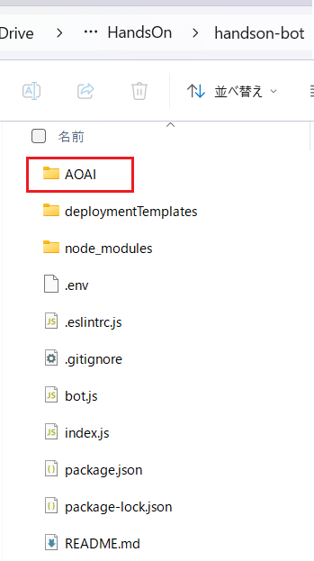
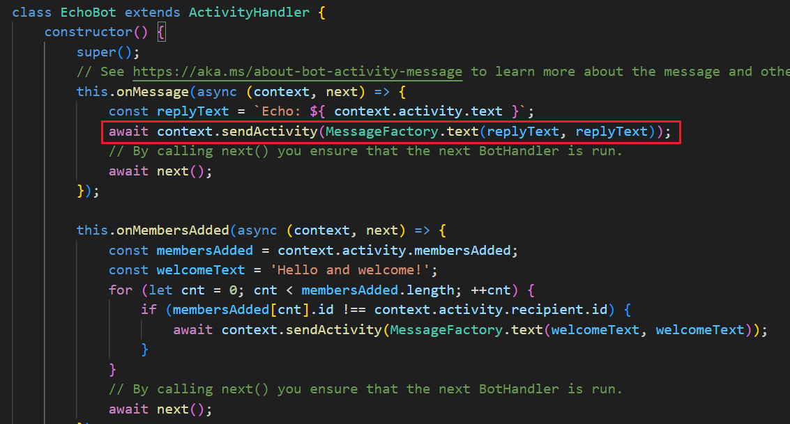
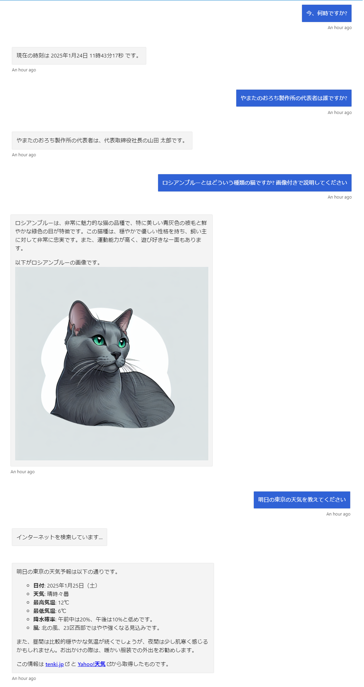

# 演習 4. 1 : コンソールボットからの機能の移植

演習 3 で作成したコンソール ボット アプリケーションの機能を Bot Framework プロジェクトに移植します。

具体的な手順は以下の通りです。

\[**手順**\]

1. この演習のタスク 1 で作成した **handson-bot** フォルダーに、[演習 3.2](Ex03-2.md) で作成したコンソール ボット アプリケーションの **AOAI** フォルダーをコピーします

    AOAI フォルダーをコピー後の **handson-bot** フォルダーは以下のようになります。

    

2. Visual Studio Code を使用してこのタスクで作成した **handson-bot** フォルダーを開きます

3. **.env** ファイルを開き、以下の内容を、演習 3 で作成したコンソール ボット アプリケーションの **.env** ファイルからコピーして追加します

    ```JavaScript
   
    AZURE_OPENAI_ENDPOINT=Azure OpenAI リソースのエンドポイントが記述されている
    AZURE_OPENAI_API_KEY=Azure OpenAI リソースの API キーが記述されている

    SEARCH_ENDPOINT=Azure AI Search リソースのエンドポイントが記述されている
    SEARCH_API_KEY=Azure AI Search リソースの API キーが記述されている
    ```

    コピー後の **handson-bot** フォルダの **.env** ファイルは以下のようになります。

    ```JavaScript
    MicrosoftAppType=
    MicrosoftAppId=
    MicrosoftAppPassword=
    MicrosoftAppTenantId=

    ## コンソールボットからコピーされた設定
    AZURE_OPENAI_ENDPOINT=Azure OpenAI リソースのエンドポイントが記述されている
    AZURE_OPENAI_API_KEY=Azure OpenAI リソースの API キーが記述されている

    SEARCH_ENDPOINT=Azure AI Search リソースのエンドポイントが記述されている
    SEARCH_API_KEY=Azure AI Search リソースの API キーが記述されている

    BING_SEARCH_ENDPOINT=Bing Web Search API のエンドポイントが記述されている
    BING_SEARCH_KEY==Bing Web Search API の API キーが記述されている
    ```

4. Visual Studio Code のメニュー \[**View**\] - \[**Terminal**\] をクリックして、ターミナル画面を開き、以下のコマンドを実行して Azure OpenAI と Azure AI Search の Node.js パッケージをインストールします

    ```bash
    npm install openai
    ```
    ```bash
    npm install @azure/search-documents
    ```

5. **handson-bot** フォルダーの **bot.js** ファイルを開き、ファイルの先頭に以下のコードを追加します

    ```JavaScript
    const lm = require('./AOAI/lm.js');
    const rag = require('./AOAI/rag.js');
    const webSearch = require('./AOAI/webSearch.js');
    ``` 

6. 同ファイルの最後に Web 検索を行うための以下のコードを追加します

    ```JavaScript
    async function if_Idontknow(context, queryString, assistantAnswer) {
        if (assistantAnswer == '■I_DONT_KNOW■') {
        await context.sendActivity(MessageFactory.text('インターネットを検索しています...'));
        const re_request = await webSearch.createRequestWithWebSearchResult(queryString);
        return await lm.sendMessage(re_request);
        } else {
            return assistantAnswer;
        }
    }
    ```

7.  同ファイルの `this.onMessage` イベントハンドラーの以下のコードを

    ```JavaScript
    await context.sendActivity(MessageFactory.text(replyText, replyText));
    ```

    

    以下のコードに置き換えます

    ```JavaScript
    await context.sendActivity(
        MessageFactory.text(
            await if_Idontknow(context,inputText,await lm.sendMessage(await rag.findIndex(inputText)))
        )
    );
    ```
    キーボードの \[**Ctrl**\] + \[**S**\] キーを押下して保存します。

8. ボットサービスを起動して動作を確認します

    Visual Studio Code のターミナル画面で以下のコマンドを実行します

    ```bash
    npm start
    ```
    ボットが起動すると、以下のようなメッセージが表示されます

    ```bash
    restify listening to http://[::]:3978
    Get Bot Framework Emulator: https://aka.ms/botframework-emulator

    To talk to your bot, open the emulator select "Open Bot"
    ```

    上記のメッセージが表示されるのを確認し、Bot Framework Emulator を起動し、手順 1 で行ったようにボットと接続します。

9. ボットとのチャット画面で、コンソール ボット アプリケーションで入力した内容と同じ内容を入力し、ボットからの返信を確認します

    ボットからの返信がコンソール ボット アプリケーションと同じであれば、正常に機能が移植されたことを確認できます。

  
    

    確認が済んだらコマンドプロンプト画面でキーボードの \[**Ctrl**\] + \[**C**\] キーを押下してボットを停止します。

ここまでの作業で Bot Framework アプリケーションにコンソール ボット アプリケーションの機能を移植することができました。

今回はボットアプリケーションということで、Bot Framework を使用しましたが、他の Node.js アプリケーションフレームワークでも同様の手順で機能を移植することができます。

また、この演習では Node.js で機能実装を行いましたが、他の開発言語でも同様の設計で機能を実装すれば、さまざまなアプリケーションに簡単に機能を移植することができます。

<br>

## 次へ

👉 [**4.2 : Azure リソースの作成とボットのデプロイ**](Ex04-2.md)

<br>

<hr>

👈 [**演習 4 : 演習用ボット アプリケーションのフレームワークへの移植** ](Ex04-0.md)

🏚️ [README に戻る](README.md)