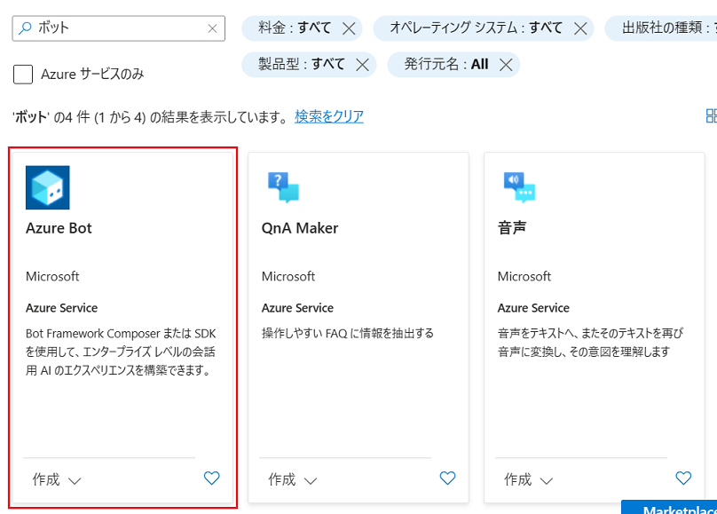
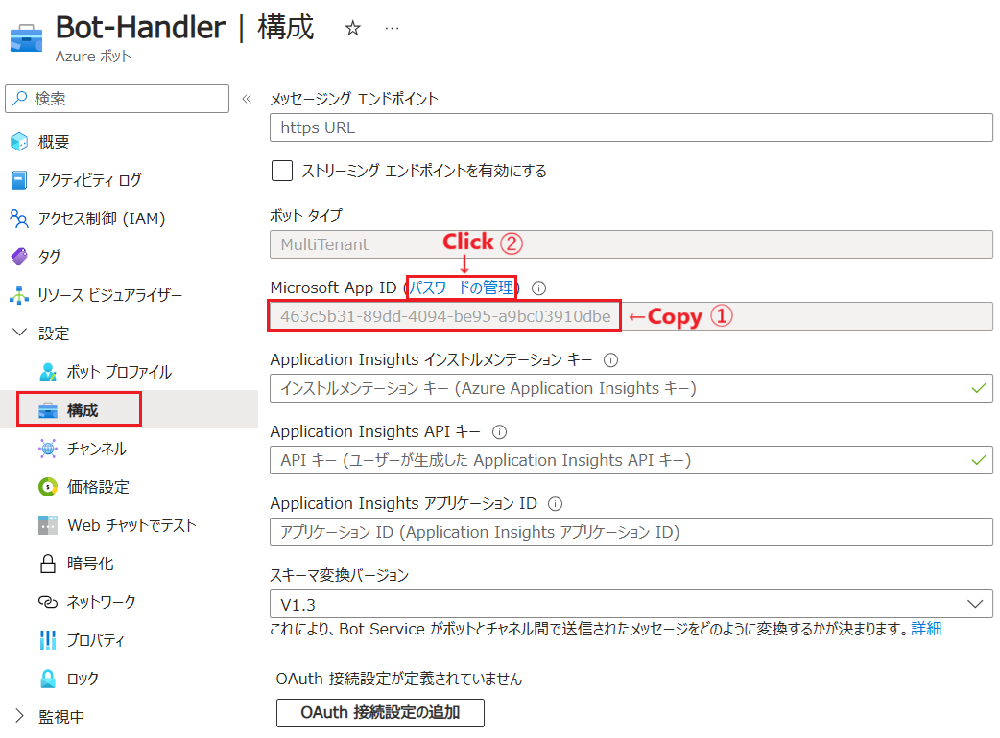
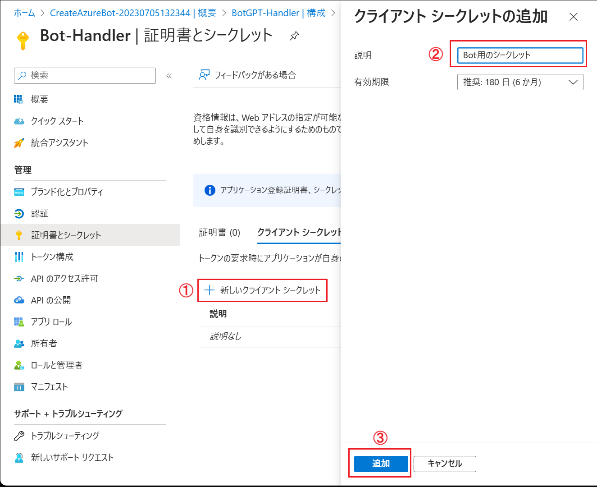
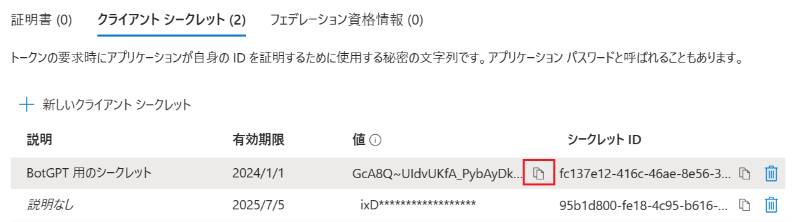
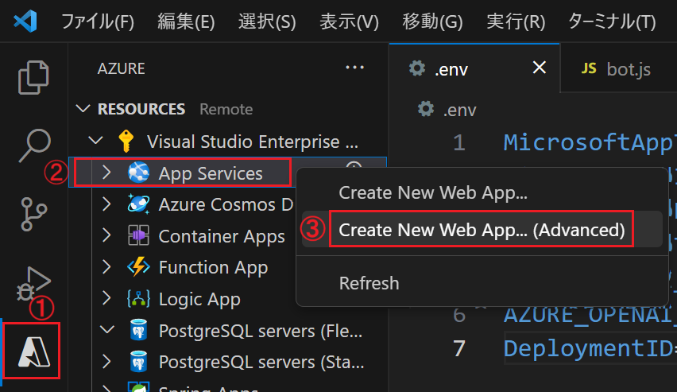
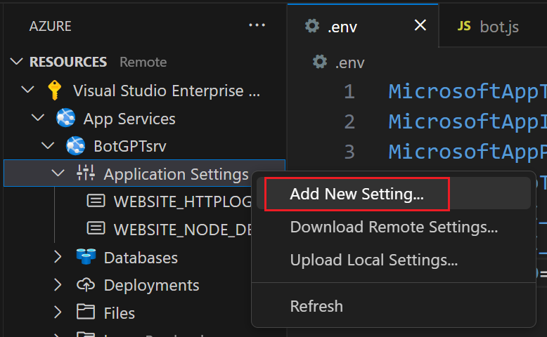

# 演習 4.2 : Azure リソースの作成とボットのデプロイ

## タスク 1 : Bot Service の作成

演習 2 で作成したボット アプリケーションをさまざまなメッセージングプラットフォームに接続可能なボットとして Bot Service にデプロイするために、Bot Service のインスタンスを作成します。

Bot Service の作成は Azure Portal から行います。

具体的な手順は以下の通りです。

\[**手順**\]

1. Azure Portal (<https://portal.azure.com>) にログインします

2. Azure Portal の左上にある「リソースの作成」をクリックします

3. "ボット"を検索し、検索結果の中から \[**Web App Bot**\] を選択します

    

4. プランの選択画面に遷移するで既定のまま \[**作成**\] ボタンをクリックします

5. \[**ボットの作成**\] 画面に遷移するので、各項目を以下のように設定します


    |項目|設定値|
    |:--|:--|
    |ボット ハンドル \*|`任意の名前`|
    |サブスクリプション \*|`任意のサブスクリプション`|
    |リソースグループ \*|`任意のリソースグループ`|
    |データ所在地 \*|**グローバル**|
    |価格レベル|**Standard**|
    |Microsoft App ID|**マルチテナント**| 
    |作成の種類|**新しい Microsoft アプリ ID の作成**|

    

    画面下部の \[**確認**\] ボタンをクリックし、その後 \[**作成**\] ボタンをクリックします

6. Azure Bot のデプロイが完了すると、\[**リソースに移動**\] ボタンが表示されるので、クリックして作成した Bot Service の概要画面に遷移します

7. 画面左側のメニュー ブレードから \[**構成**\] をクリックします

8. \[**構成**\] 画面に遷移するので、同画面の \[**Microsoft App ID**\] の GUID をコピー、メモ帳などに保持します、続けて \[**パスワードの管理**\] リンクをクリックします

    

9. \[**証明書とシークレット**\] に遷移するので、同画面の\[**+ 新しいクライアント シークレット**\]をクリックし、画面右側に表示される[**クライアント シークレットの追加**\]ブレードの各項目を以下のように設定します

    |項目|設定値|
    |:--|:--|
    |説明|`任意の説明`|
    |有効期限|`任意の期間`|

    \[**追加**\] ボタンをクリックします

    

10. クライアント シークレットが作成されると、\[**値**\] にシークレットの値が表示されるので、同画面のシークレットの値をコピーボタンを使用してコピーし、メモ帳などに保持します

    

    なお、生成されたシークレットはこの画面以降、二度と表示されないので、必ずこのタイミングで値をコピーしてください。

ここまでの作業で Azure Bot サービスの作成と App ID、シークレットの取得が完了しました。

<br>

## タスク 2 : ボット アプリケーションへの ID 設定と Azure App Service へのデプロイ

タスク 1 で作成したボット アプリケーションに、タスク 1 で取得した App ID とシークレットを設定し、Azure App Service にデプロイします。

具体的な手順は以下の通りです。

\[**手順**\]

1. 演習 2 で作成したボット アプリケーションのプロジェクトを Visual Studio Code で開きます

2. Visual Studio Code の左側ツリービューから **.env** ファイルを開き、内容を以下のように編集します

    |項目|設定値|
    |:--|:--|
    |MicrosoftAppId|`タスク 1 で取得した App ID`|
    |MicrosoftAppPassword|`タスク 1 で取得したシークレット`|
    |MicrosoftAppTenantId|**common**|

    キーボードの \[**Ctrl**\] + \[**S**\] キーを押下して設定を保存します
    
3. Visual Studio Code の左側ツリービューから **package.json** ファイルを開き、内容を以下のように編集します

    |項目|設定値|
    |:--|:--|
    |name|`任意の名前`|
    |version|`任意のバージョン`|
    |description|`任意の説明`|

    キーボードの \[**Ctrl**\] + \[**S**\] キーを押下して設定を保存します

    ここまでで、ボット アプリケーションの設定は完了です

4. ボットアプリケーションのデプロイ先となる Azure App Service を作成します

    この手順は Azure ポータル画面や Azure CLI などを使用して作成しても構いませんが、ここでは Visual Studio Code の Azure App Service 拡張機能を使用して作成します

    4-1. Visual Studio Code の画面左のツリービューから Azure アイコンをクリックします
    
    4-2. 表示された \[**RESOURCES**\] セクションの Azure ツリーから \[**App Service**\] を右クリックし、表示されたコンテキストメニューから \[**Create New Web App...(Advanced)**\] をクリックします

    

    4-3. \[**Create New Web App...**\] をクリックすると、コマンドパレットに作成に必要な情報を入力するためのプロンプトが表示されるので、以下のように入力します

    |項目|設定値|
    |:--|:--|
    |Enter a globally unique name for the new web app|`任意のユニークな名前`|
    |Select a resource group|`Bot Service をデプロイしたリソースグループ`|
    |Select a runtime stack|**Node 16 LTS**|
    |Select an OS|**Windows**|
    |Select new an Windows App Service plan|選択できるものがない場合は **+ Create new App Service plan** をクリックして作成|
    |Select an Application Insights resource for your app |**Skip for now**|
    |Select a pricing tier |**Free (F1)**|

    コマンド パレットの入力が完了すると、Azure App Service が作成されます

5. 作成した App Service に Node.js アプリケーションをホストするために必要な設定を追加します

    5-1. Visual Studio Code 画面左のツリービューの \[**RESOURCES**\] セクションの Azure ツリーから \[**App Service**\] をクリックして展開します

    5-2. 作成した App Service の名前が表示されるので、名前の前にある \[**>**\] マークをクリックしてツリーを展開します
    
    5-3. 展開されたツリーアイテムから \[**Application Settings**\] を右クリックし、表示されたコンテキストメニューから \[**Add New Setting...**\] をクリックします

    

    5-4. コマンドパレットに新しい設定を入力するためのプロンプトが表示されるので、以下のように入力します

    |項目|設定値|
    |:--|:--|
    |Enter new app setting name |**SCM_DO_BUILD_DURING_DEPLOYMENT**|
    |Enter value for "..."|**true**|

    コマンド パレットの入力が完了すると、新しい設定が追加されます

6.  作成した App Service にボット アプリケーションをデプロイします
    
    6-1. 画面左のツリービューからここまでの手順で作成した App Service の名前を右クリックし、表示されたコンテキストメニューから \[**Deploy to Web App...**\] をクリックします

    6-2. コマンドパレットに "**Select the folder to deploy**" というプロンプトが表示されるので、ボット アプリケーションのソースコードが格納されているフォルダを選択します

    上書きを警告するメッセージが表示された場合は、\[**Deploy**\] ボタンをクリックして続行します 

7. デプロイが完了するのを待ち、Web ブラウザーから以下の 名URL にアクセスします

    `https://App Service の名前.azurewebsites.net/api/messages`

    以下のようなメッセージが表示されれば、ボット アプリケーションのデプロイは成功です

    ```
    {
        "code": "MethodNotAllowed",
        "message": "GET is not allowed"
    }
    ```

ここまでの手順で、Bot Framework で作成したボット アプリケーションのデプロイは完了です。

次のタスクでは、デプロイした Bot Framework ボットアプリケーションのエンドポイントをタスク 1 で作成した Azure Bot に登録します。

<br>