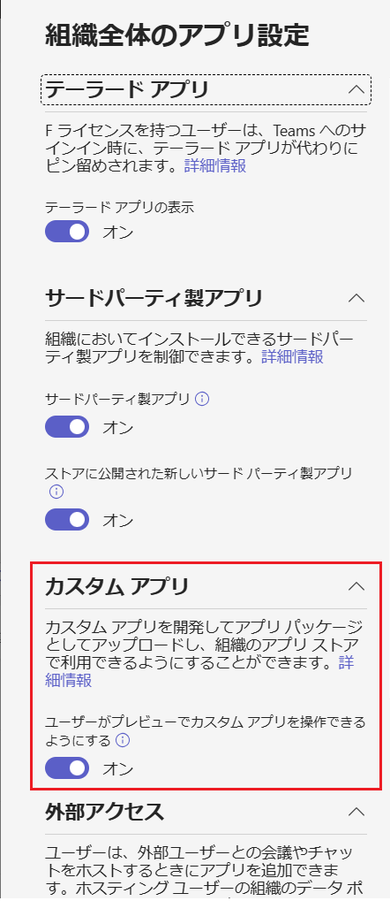
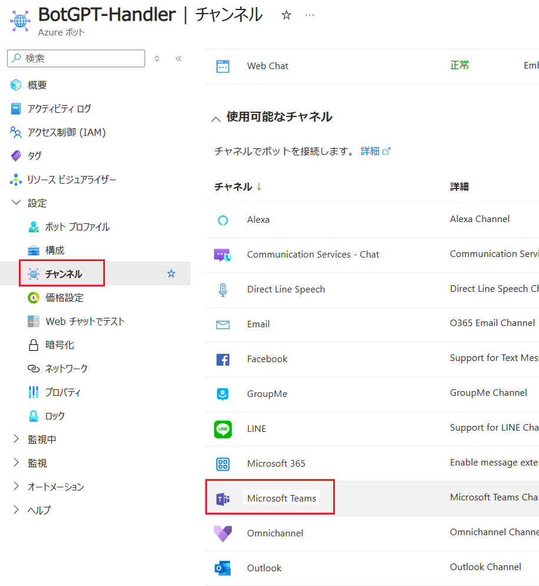
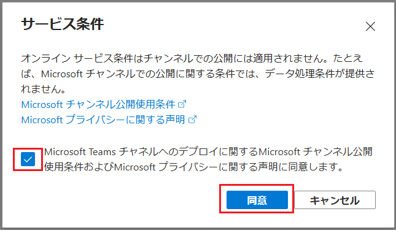
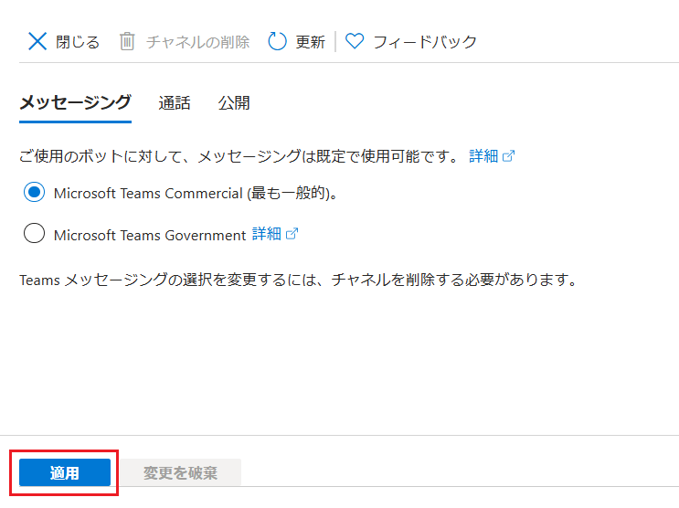
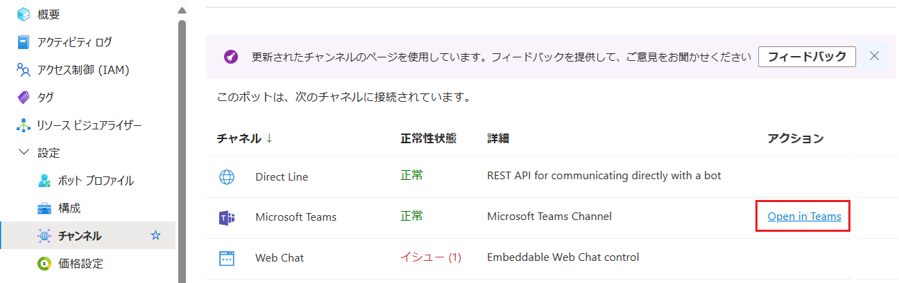
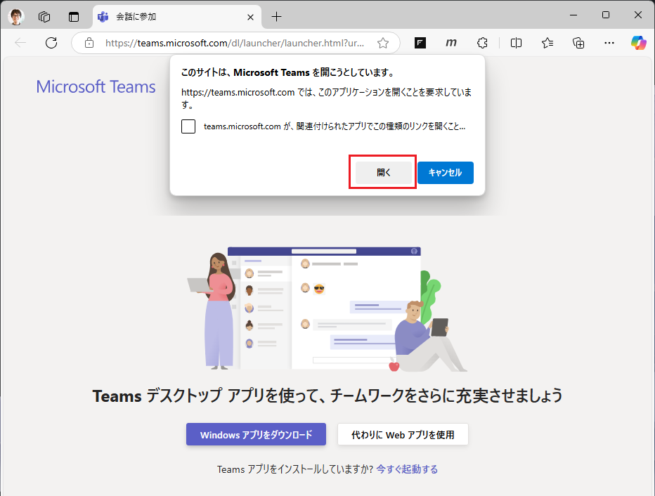
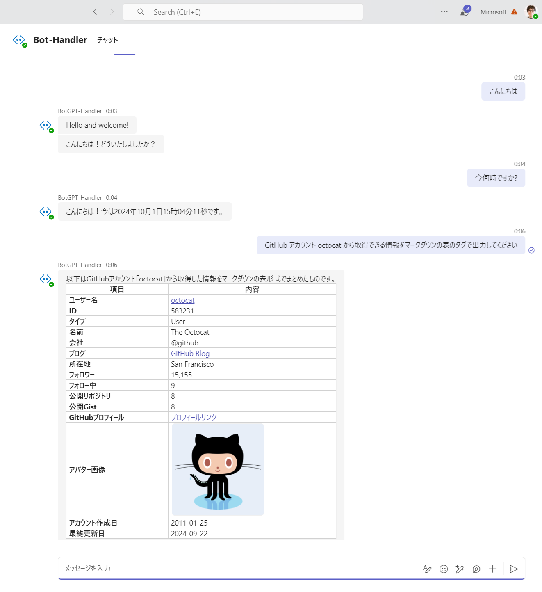

# 演習 4.オプション : Microsoft Teams へのインストール

演習 4 で Azure Bot Service に登録したボットを Microsoft Teams にインストールします。

## 要件

この演習を実施するには以下の環境が必要です。

* **Microsoft Office 365 Business Premium 以上の[ライセンス](https://products.office.com/ja-JP/compare-all-microsoft-office-products-b?tab=2)**

    ライセンスを持っていない開発者は [Office 365 開発者プログラム](https://developer.microsoft.com/ja-JP/office/dev-program
)に参加して開発者用の無料の Office 365 のサブスクリプションを入手することもできます。このサブスクリプションでは [Office 365 Enterprise E5 Developer](https://docs.microsoft.com/ja-jp/office/developer-program/office-365-developer-program-get-started) が 90 日間無償で使用することができます。このライセンスを開発に積極的に使用している場合は、90 日ごとにサブスクリプションが自動的に更新されます。

* **Microsoft Teams 管理センターでサイドローディングの許可**

    Microsoft Teams 管理センターにて、開発したアプリケーションがサイドローディングできるように許可されているか確認します。
    
    具体的には [Microsoft Teams 管理センター](https://admin.teams.microsoft.com/)のメニュー\[**Teams のアプリ**\] - \[**アプリの管理**\] の画面内にある \[**組織全体のアプリ設定**\] ボタンをクリックし、表示されたブレード内の 「**カスタム アプリとの対話**」をオンにします。

    

## Azure Bot からの Microsoft Teams へのボットのインストール

Azure Bot Service に登録したボットをチャネルの機能を利用して Microsoft Teams にインストールします。

このボットは自身の Teams アカウントとのチャットに追加され、パーソナルアシスタントのように利用できるようになります。

Bot Framework アプリケーションのインストールて手順は以下のとおりです。

\[**手順**\]

1. Azure Portal (<https://portal.azure.com>) にログインします

2. [演習 4.2](Ex04-2.md#%E3%82%BF%E3%82%B9%E3%82%AF-1--bot-service-%E3%81%AE%E4%BD%9C%E6%88%90) で作成した Azure Bot インスタンスの画面を開き、画面左のメニューブレードから \[**設定**\] - \[**チャンネル**\] をクリックします

    チャネルの一覧が表示されるので、一覧から \[**Microsoft Teams**\] をクリックします

    

3. \[**サービス条件**]\ ダイアログボックスが表示されるので同意声明のチェックボックスをにチェックをつけ \[**同意**\] ボタンをクリックします

    

4. \[**Microsoft Teams**\]チャンネルの設定画面が表示されるので、既定のまま \[**適用**\] ボタンをクリックします

    

    設定が保存されると画面上部に \[**閉じる**\] ボタンが表示されるのでクリックして画面を閉じます

5. チャネルの一覧画面に戻り、\[**Microsoft Teams**\] チャンネルの右側にある \[**Open in Teams**\] ボタンをクリックします

    

6. Web ブラウザーが開き 「**このサイトは、Microsoft Teams を開こうとしています。**」とメッセージボックスが表示されるので \[**開く**\] ボタンをクリックします

    

    インストールが完了するとボットとのチャット画面が表示されるので、これまでの演習で実装した機能が動作していることを確認します。

    

以上で、Azure Bot Service に登録したボットを Microsoft Teams にインストールする手順は完了です。

## まとめ

ここまでの演習で学んだ内容を活かして、ぜひ機能強化を行い、自分だけのボットを作成してみてください。

Microsoft Teams ボットアプリケーションのより詳しい開発方法については、以下のドキュメントを参照してください。

* [**Teams 用のボットを構築する**](https://learn.microsoft.com/ja-jp/microsoftteams/platform/bots/what-are-bots)

Teams アプリケーションの開発については、以下のドキュメントを参照してください。

* [**Teams プラットフォーム用アプリを構築する**](https://learn.microsoft.com/ja-jp/microsoftteams/platform/overview)

 

👈 [**演習 4.2 : Azure リソースの作成とボットのデプロイ** ](Ex04-2.md)

🏚️ [README に戻る](README.md)
