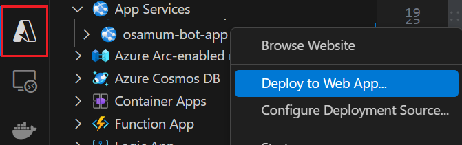
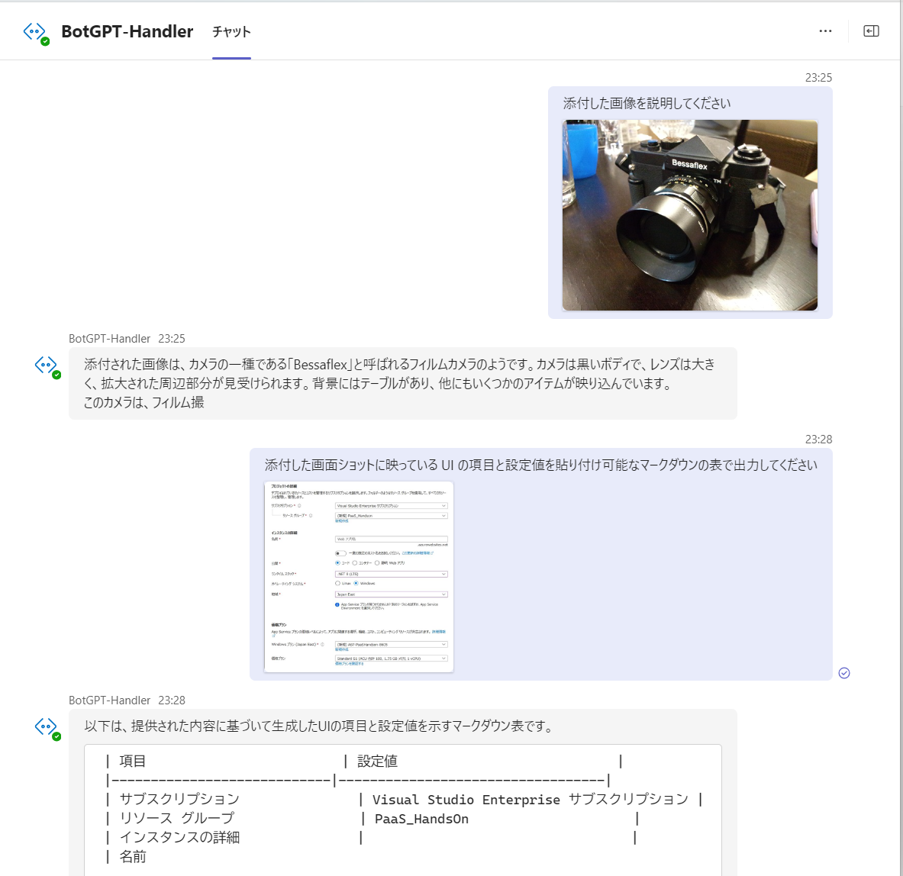

# 演習 4.オプション 2 : Teams ボットへの画像認識機能の追加

この演習では、[演習 3.オプション : GTP モデルを使用した画像認識](Ex03-op-1.md#%E6%BC%94%E7%BF%92-3%E3%82%AA%E3%83%97%E3%82%B7%E3%83%A7%E3%83%B3--gtp-%E3%83%A2%E3%83%87%E3%83%AB%E3%82%92%E4%BD%BF%E7%94%A8%E3%81%97%E3%81%9F%E7%94%BB%E5%83%8F%E8%AA%8D%E8%AD%98) で追加した画像認識機能を Teams ボットから利用できるようにします。

作業内容としては、ユーザーが Microsoft Teams にメッセージを投稿する際に添付された画像の URL を取得し、[演習 3.オプション : GTP モデルを使用した画像認識](Ex03-op-1.md#%E6%BC%94%E7%BF%92-3%E3%82%AA%E3%83%97%E3%82%B7%E3%83%A7%E3%83%B3--gtp-%E3%83%A2%E3%83%87%E3%83%AB%E3%82%92%E4%BD%BF%E7%94%A8%E3%81%97%E3%81%9F%E7%94%BB%E5%83%8F%E8%AA%8D%E8%AD%98) で変更した AOAI/lm.js の **sendMessage** 関数の第 2 引数にセットする処理を記述するだけです。

なお、この演習を行うには以下の 2 つの演習を完了している必要があります。

* [演習 3.オプション : GTP モデルを使用した画像認識](Ex03-op-1.md#%E6%BC%94%E7%BF%92-3%E3%82%AA%E3%83%97%E3%82%B7%E3%83%A7%E3%83%B3--gtp-%E3%83%A2%E3%83%87%E3%83%AB%E3%82%92%E4%BD%BF%E7%94%A8%E3%81%97%E3%81%9F%E7%94%BB%E5%83%8F%E8%AA%8D%E8%AD%98) 
* [演習 4.オプション 1 : Microsoft Teams へのインストール](Ex04-op-1.md)

## 作業内容の説明

### メッセージに添付された画像の URL の取得

ユーザーが Teams への投稿に添付したファイルの情報は、Bot Framework アプリケーション内では `context.activity.attachments` に配列として格納されます。この配列には添付ファイルのほかに、ユーザーが投稿した書式付きメッセージも含まれるため lenght が 0 になることはありません。そのため、添付ファイルがあるかどうかは `context.activity.attachments.length` が 1 より大きいかどうかで判定します。

```javascript
if (context.activity.attachments.length > 1) {
    // 添付ファイルがある場合の処理
}
```

また、書式付きメッセージは配列の最後に格納されるため、ループ処理で内容を取得する際には配列の最後の要素はスキップします。

```javascript
if (context.activity.attachments.length > 1) {
    // 添付ファイルがある場合の処理
    for(let cnt=0; cnt<attachments.length -1 ; cnt++) {
    // 添付ファイルの処理
    }
}
```

添付されているファイルへの URL は `contentUrl` プロパティに格納されていますが、この URL にアクセスするには Teams からのアクセス権限が必要なため、この URL をそのまま言語モデルに渡してもアクセスすることができません。本来であればボット アプリケーション内でアクセストークンを取得し、そのアクセストークンを使って画像のデータを取得し Baes64 エンコードして言語モデルに渡す必要がありますが、この演習ではその処理を省略するため非永続で認証が不要な `content.downloadUrl` プロパティを使用します。

```javascript
if (context.activity.attachments.length > 1) {
    // 添付ファイルがある場合の処理
    let files = []; 
    for(let cnt=0; cnt<attachments.length -1 ; cnt++) {
    // 添付ファイルの処理
        files.push(attachments[cnt].content.downloadUrl);
    }
}
```

`downloadUrl` プロパティに格納されている非永続性の URL 配列を **lm.js** の **sendMessage** 関数の第 2 引数にセットすることで、画像認識機能を Teams ボットから利用できるようになります。

だだし、この実装ではユーザーが Teams のメッセージ UI に添付したファイルに対しての処理は可能ですが、クリップ ボードから貼り付けた画像に対しては処理を行うことができません。クリップ ボードから貼り付けた画像に対しても処理を行いたい場合は認証処理を追加し、`contentUrl` プロパティを使用して画像データを取得する必要があります。

上記の内容を踏まえ、**bot.js** の **onMessage** ハンドラーの内容を以下のコードに置き換えます。

```javascript
//ユーザーから送信されたメッセージの attachments を取得
const attachments = context.activity.attachments;
//Teams ボットは attachments に書式付きの投稿メッセージが含まれるため
//ファイルが添付されている場合 length は 1 より大きくなる
if (attachments && attachments.length > 1) {              
    let files = [];  
    //Teams ボットは attachments の最後に書式付きの投稿メッセージが含まれるため、最後の要素は無視
    for(let cnt=0; cnt<attachments.length -1 ; cnt++) {
        /*
        一次的にファイルにアクセス出来れば良いので非永続で認証が不要な downloadUrl プロパティを使用
        そのため、投稿時に貼り付けた画像には対応しない
        */
        files.push(attachments[cnt].content.downloadUrl);
    }
    //ファイルだけ送信されてきた場合には無視
    if(inputText) await context.sendActivity(MessageFactory.text(await lm.sendMessage(await rag.findIndex(inputText),files)));
} else {
    await context.sendActivity(MessageFactory.text(await lm.sendMessage(await rag.findIndex(inputText))));
}
await next();
```

コードの変更が完了したらキーボードの \[Ctrl\] + \[S\] キーを押下して保存します。




